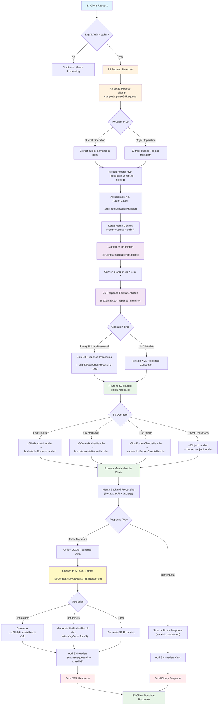

<!--
    This Source Code Form is subject to the terms of the Mozilla Public
    License, v. 2.0. If a copy of the MPL was not distributed with this
    file, You can obtain one at http://mozilla.org/MPL/2.0/.
-->

<!--
    Copyright 2020 Joyent, Inc.
    Copyright 2025 Edgecast Cloud LLC.
-->

# manta-buckets-api: The Manta Web API

This repository is part of the Joyent Manta project.  For contribution
guidelines, issues, and general documentation, visit the main
[Manta](http://github.com/TritonDataCenter/manta) project page.

manta-buckets-api holds the source code for the Manta API, otherwise known as
"the front door".  It is analogous to CloudAPI for SDC.  See the restdown
docs for API information, but effectively this is where you go to call
PUT/GET/DEL on your stuff, as well as to submit and control compute jobs.

API documentation is in [docs/index.md](./docs/index.md).  Some design
documentation (possibly quite dated) is in [docs/internal](./docs/internal).
Developer notes are in this README.


## Testing

Coming soon

## Deploying a buckets-api image

If you're changing anything about the way buckets-api is deployed, configured, or
started, you should definitely test creating a buckets-api image and deploying that
into your Manta.  This is always a good idea anyway.  To run tests against an
image, your configuration will be a bit different.  Your `MANTA_URL` will be the
manta network IP of a buckets-api instance, with a port number of a buckets-api process
inside a buckets-api zone (8081).  Your `SDC_URL` will be the external network IP of
the cloudapi0 zone.  You can find both of these IPs with the commands:

    $ vmadm get <buckets-api_zone_uuid> | json -a nics | json -a nic_tag ip
    $ vmadm lookup -j alias=cloudapi0 | json -a nics | json -a ip

There are various documents about deploying/updating a buckets-api image in
Manta. If you're doing this for the first time, and not sure what to
do, I had success with `make buildimage` which leaves you with an
image and manifest in `./bits`. You can then import this image and
follow this guide to upgrading manta components:
https://github.com/TritonDataCenter/manta/blob/master/docs/operator-guide/maintenance.md#upgrading-manta-components

## Metrics

Buckets-Api exposes metrics via [node-artedi](https://github.com/TritonDataCenter/node-artedi).
See the [design](./docs/internal/design.md) document for more information about
the metrics that are exposed, and how to access them. For development, it is
probably easiest to use `curl` to scrape metrics:

```
$ curl http://localhost:8881/metrics
```

Notably, some metadata labels are not being collected due to their potential
for high cardinality.  Specifically, remote IP address, object owner, and caller
username are not collected.  Metadata labels that have a large number of unique
values cause memory strain on metric client processes (buckets-api) as well as
metric servers (Prometheus).  It's important to understand what kind of an
effect on the entire system the addition of metrics and metadata labels can have
before adding them. This is an issue that would likely not appear in a
development or staging environment.

## Service registration

Like most other components in Triton and Manta, this service is configured to
use [Registrar](https://github.com/TritonDataCenter/registrar/). Each of the API server
ports are registered under a `SRV` record as described in the Registrar
documentation, and the registration type is `load\_balancer`.

The general mechanism is [documented in detail in the Registrar
README](https://github.com/TritonDataCenter/registrar/blob/master/README.md).

As with other services providing multiple ports per zone instance, the registrar
template is itself modified during setup via `boot/setup.sh` to populate the
list of ports. Consequently, querying DNS for `SRV` entries will show something
like (if we have two instances each with four API servers):

```
$ dig +nocmd +nocomments +noquestion +nostats -t SRV _http._tcp.buckets-api.manta.example.com
_http._tcp.buckets-api.manta.example.com. 60 IN SRV 0 10 8081 243844f9-8cc1-497d-99a0-627263524e7a.buckets-api.manta.example.com.
_http._tcp.buckets-api.manta.example.com. 60 IN SRV 0 10 8082 243844f9-8cc1-497d-99a0-627263524e7a.buckets-api.manta.example.com.
_http._tcp.buckets-api.manta.example.com. 60 IN SRV 0 10 8083 243844f9-8cc1-497d-99a0-627263524e7a.buckets-api.manta.example.com.
_http._tcp.buckets-api.manta.example.com. 60 IN SRV 0 10 8084 243844f9-8cc1-497d-99a0-627263524e7a.buckets-api.manta.example.com.
_http._tcp.buckets-api.manta.example.com. 60 IN SRV 0 10 8081 4a1af359-a671-47d1-bc8b-70e4ea81af7c.buckets-api.manta.example.com.
_http._tcp.buckets-api.manta.example.com. 60 IN SRV 0 10 8082 4a1af359-a671-47d1-bc8b-70e4ea81af7c.buckets-api.manta.example.com.
_http._tcp.buckets-api.manta.example.com. 60 IN SRV 0 10 8083 4a1af359-a671-47d1-bc8b-70e4ea81af7c.buckets-api.manta.example.com.
_http._tcp.buckets-api.manta.example.com. 60 IN SRV 0 10 8084 4a1af359-a671-47d1-bc8b-70e4ea81af7c.buckets-api.manta.example.com.
243844f9-8cc1-497d-99a0-627263524e7a.buckets-api.manta.example.com. 30 IN A 192.168.0.39
4a1af359-a671-47d1-bc8b-70e4ea81af7c.buckets-api.manta.example.com. 30 IN A 192.168.0.38
```

The `buckets-api` client, [muppet](https://github.com/TritonDataCenter/muppet), doesn't
directly use DNS lookups: instead the corresponding Zookeeper nodes are watched
for changes, updating its `haproxy` configuration as needed. This is partly for
historical reasons (both muppet and the old webapi registered themselves with a
service name of "manta"), and to reduce load on
[binder](https://github.com/TritonDataCenter/binder/).

## S3 Compatibility

Manta Buckets API provides S3-compatible endpoints that translate S3 API requests into Manta bucket operations. This compatibility layer enables S3 clients and tools to work with Manta's bucket storage.

### Architecture

The S3 compatibility is implemented through a middleware stack that:

1. **Detects S3 requests** using AWS Signature Version 4 (SigV4) authentication
2. **Translates S3 paths** to Manta bucket paths (e.g., `/bucket/object` → `/:account/buckets/:bucket/objects/:object`)
3. **Routes requests** to appropriate Manta bucket handlers
4. **Formats responses** from Manta JSON to S3 XML format

#### S3 Compatibility Flow



### Supported Operations

#### Bucket Operations
- **ListBuckets**: `GET /` → Lists all buckets for the authenticated account
- **CreateBucket**: `PUT /:bucket` → Creates a new bucket
- **ListBucketObjects**: `GET /:bucket` → Lists objects in a bucket (S3 API v1)
- **ListBucketObjectsV2**: `GET /:bucket?list-type=2` → Lists objects in a bucket (S3 API v2)
- **HeadBucket**: `HEAD /:bucket` → Checks if bucket exists
- **DeleteBucket**: `DELETE /:bucket` → Deletes an empty bucket

#### Object Operations
- **CreateBucketObject**: `PUT /:bucket/:object` → Uploads an object to a bucket
- **GetBucketObject**: `GET /:bucket/:object` → Downloads an object from a bucket
- **HeadBucketObject**: `HEAD /:bucket/:object` → Gets object metadata
- **DeleteBucketObject**: `DELETE /:bucket/:object` → Deletes an object from a bucket

### Addressing Styles

Both S3 addressing styles are supported:

- **Path-style**: `https://domain.com/bucket/object`
- **Virtual-hosted**: `https://bucket.domain.com/object`

The system automatically detects the addressing style based on the Host header and request path.

### Response Format Translation

#### Bucket Listings
Manta's JSON streaming format is converted to S3's XML format:
```xml
<ListAllMyBucketsResult xmlns="http://s3.amazonaws.com/doc/2006-03-01/">
  <Owner>
    <ID>account-uuid</ID>
    <DisplayName>account-login</DisplayName>
  </Owner>
  <Buckets>
    <Bucket>
      <Name>bucket-name</Name>
      <CreationDate>2023-01-01T00:00:00.000Z</CreationDate>
    </Bucket>
  </Buckets>
</ListAllMyBucketsResult>
```

#### Object Listings
Object lists are converted to S3 XML format with support for both v1 and v2 APIs:
```xml
<ListBucketResult xmlns="http://s3.amazonaws.com/doc/2006-03-01/">
  <Name>bucket-name</Name>
  <KeyCount>1</KeyCount>
  <Contents>
    <Key>object-key</Key>
    <LastModified>2023-01-01T00:00:00.000Z</LastModified>
    <ETag>"etag-value"</ETag>
    <Size>1024</Size>
    <StorageClass>STANDARD</StorageClass>
  </Contents>
</ListBucketResult>
```

#### Error Responses
Manta errors are translated to S3 XML error format:
```xml
<Error>
  <Code>NoSuchBucket</Code>
  <Message>The specified bucket does not exist.</Message>
  <RequestId>request-id</RequestId>
</Error>
```

### Header Translation

- **Metadata headers**: `m-*` → `x-amz-meta-*`
- **Standard headers**: `content-type`, `content-length`, `etag`, `last-modified` are preserved
- **S3-specific headers**: `x-amz-request-id`, `x-amz-id-2` are added automatically

### Authentication

S3 compatibility requires AWS Signature Version 4 (SigV4) authentication. Traditional Manta authentication methods are not supported for S3 endpoints.

### AWS CLI Compatibility

The S3 compatibility layer is fully compatible with the AWS CLI, enabling seamless integration with existing S3 workflows and tools.

#### Configuration

To use AWS CLI with Manta Buckets API, configure your endpoint and credentials:

```bash
# Set environment variables
export AWS_ACCESS_KEY_ID="your-manta-access-key"
export AWS_SECRET_ACCESS_KEY="your-manta-secret-key"
export AWS_DEFAULT_REGION="us-east-1"

# Use AWS CLI with custom endpoint
aws s3 --endpoint-url="https://your-manta-endpoint:8080" \
       --region="us-east-1" \
       --no-verify-ssl \
       ls

# Or use s3api commands
aws s3api --endpoint-url="https://your-manta-endpoint:8080" \
          --region="us-east-1" \
          --no-verify-ssl \
          list-buckets
```

#### Supported AWS CLI Commands

**Bucket Operations:**
```bash
# List all buckets
aws s3api list-buckets

# Create a bucket
aws s3api create-bucket --bucket my-bucket

# Check if bucket exists
aws s3api head-bucket --bucket my-bucket

# Delete bucket
aws s3api delete-bucket --bucket my-bucket
```

**Object Operations:**
```bash
# Upload object
aws s3api put-object --bucket my-bucket --key my-file.txt --body local-file.txt

# Download object
aws s3api get-object --bucket my-bucket --key my-file.txt downloaded-file.txt

# Get object metadata
aws s3api head-object --bucket my-bucket --key my-file.txt

# List objects
aws s3api list-objects-v2 --bucket my-bucket

# Delete object
aws s3api delete-object --bucket my-bucket --key my-file.txt
```

**High-level S3 Commands:**
```bash
# Copy files
aws s3 cp local-file.txt s3://my-bucket/remote-file.txt
aws s3 cp s3://my-bucket/remote-file.txt local-copy.txt

# Sync directories
aws s3 sync ./local-dir s3://my-bucket/remote-dir/

# List bucket contents
aws s3 ls s3://my-bucket/
```

### Testing

Comprehensive S3 compatibility testing is provided via the test script `test/s3-compat-test.sh`. This script validates:

#### Core Functionality Tests
- **Bucket Management**: Create, list, check existence, and delete buckets
- **Object Operations**: Upload, download, metadata retrieval, and deletion
- **Data Integrity**: MD5 and SHA256 checksum validation for uploads/downloads
- **Binary Data Support**: Mixed text and binary content handling
- **List Operations**: Both ListObjects (v1) and ListObjectsV2 APIs

#### Error Handling Tests
- **Non-existent Resources**: Proper error responses for missing buckets/objects
- **Access Control**: Authentication and authorization validation
- **Edge Cases**: Empty buckets, large objects, special characters in names

#### Running the Tests

```bash
# Basic test run with default configuration
./test/s3-compat-test.sh

# Custom endpoint and credentials
S3_ENDPOINT="https://manta.example.com:8080" \
AWS_ACCESS_KEY_ID="your-key" \
AWS_SECRET_ACCESS_KEY="your-secret" \
./test/s3-compat-test.sh

# View help and options
./test/s3-compat-test.sh --help
```

#### Test Features
- **Automated Setup/Cleanup**: Creates temporary buckets and cleans up after tests
- **Comprehensive Validation**: Checks response formats, status codes, and data integrity
- **Detailed Reporting**: Color-coded output with pass/fail statistics
- **Error Recovery**: Handles partial failures and continues testing
- **Checksum Verification**: Validates upload/download integrity with MD5/SHA256

The test suite ensures that standard S3 tools and workflows function correctly with Manta's bucket storage, providing confidence in S3 API compatibility.

### Implementation Files

- `lib/s3-compat.js` - Core S3 compatibility middleware and translation functions
- `lib/s3-routes.js` - S3 route handlers that bridge to Manta bucket operations
- `lib/buckets/` - Underlying Manta bucket operation handlers
- `test/s3-compat-test.sh` - Comprehensive S3 compatibility test suite

## Dtrace Probes

Buckets-Api has two dtrace providers. The first, `buckets-api`, has the following probes:
* `client_close`: `json`. Fires if a client uploading an object or part closes
  before data has been streamed to mako. Also fires if the client closes the
  connection while the stream is in progress. The argument json object has the
  following format:
  ```
  {
      id: restify uuid, or x-request-id/request-id http header (string)
      method: request http method (string)
      headers: http headers specified by the client (object)
      url: http request url (string)
      bytes_sent: number of bytes streamed to mako before client close (int)
      bytes_expected: number of bytes that should have been streamed (int)
  }
  ```
* `socket_timeout`: `json`. Fires when the timeout limit is reached on a
  connection to a client. This timeout can be configured either by setting the
  `SOCKET_TIMEOUT` environment variable. The default is 120 seconds. The object
  passed has the same fields to the `client_close` dtrace probe, except for the
  `bytes_sent` and `bytes_expected`. These parameters are only present if buckets-api
  is able to determine the last request sent on this socket.

The second provider, `buckets-api-throttle`, has the following probes, which will not
fire if the throttle is disabled:
* `request_throttled`: `int`, `int`, `char *`, `char *` - slots occupied, queued
  requests, url, method. Fires when a request has been throttled.
* `request_handled`: `int`, `int`, `char *`, `char *` - slots occupied, queued
  requests, url, method. Fires after a request has been handled.
Internally, the buckets-api throttle is implemented with a vasync-queue. A "slot"
in the above description refers to one of `concurrency` possible spaces
allotted for concurrently scheduled request-handling callbacks. If all slots are
occupied, incoming requests will be "queued", which indicates that they are
waiting for slots to free up.
* `queue_enter`: `char *` - restify request uuid. This probe fires as a request
enters the queue.
* `queue_leave`: `char *` - restify request uuid. This probe fires as a request
is dequeued, before it is handled. The purpose of these probes is to make it
easy to write d scripts that measure the latency impact the throttle has on
individual requests.

The script `bin/throttlestat.d` is implemented as an analog to `moraystat.d`
with the `queue_enter` and `queue_leave` probes. It is a good starting point for
gaining insight into both how actively a buckets-api process is being throttled and
how much stress it is under.

The throttle probes are provided in a separate provider to prevent coupling the
throttle implementation with buckets-api itself. Future work may involve making the
throttle a generic module that can be included in any service with minimal code
modification.
