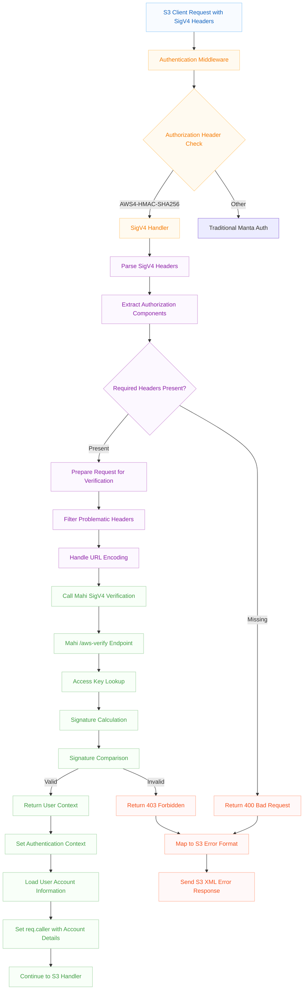

<!--
    This Source Code Form is subject to the terms of the Mozilla Public
    License, v. 2.0. If a copy of the MPL was not distributed with this
    file, You can obtain one at http://mozilla.org/MPL/2.0/.
-->

<!--
    Copyright 2020 Joyent, Inc.
    Copyright 2025 Edgecast Cloud LLC.
-->

# manta-buckets-api: The Manta Web API

This repository is part of the Joyent Manta project.  For contribution
guidelines, issues, and general documentation, visit the main
[Manta](http://github.com/TritonDataCenter/manta) project page.

manta-buckets-api holds the source code for the Manta API, otherwise known as
"the front door".  It is analogous to CloudAPI for SDC.  See the restdown
docs for API information, but effectively this is where you go to call
PUT/GET/DEL on your stuff, as well as to submit and control compute jobs.

API documentation is in [docs/index.md](./docs/index.md).  Some design
documentation (possibly quite dated) is in [docs/internal](./docs/internal).
Developer notes are in this README.


## Testing

Coming soon

## Deploying a buckets-api image

If you're changing anything about the way buckets-api is deployed, configured, or
started, you should definitely test creating a buckets-api image and deploying that
into your Manta.  This is always a good idea anyway.  To run tests against an
image, your configuration will be a bit different.  Your `MANTA_URL` will be the
manta network IP of a buckets-api instance, with a port number of a buckets-api process
inside a buckets-api zone (8081).  Your `SDC_URL` will be the external network IP of
the cloudapi0 zone.  You can find both of these IPs with the commands:

    $ vmadm get <buckets-api_zone_uuid> | json -a nics | json -a nic_tag ip
    $ vmadm lookup -j alias=cloudapi0 | json -a nics | json -a ip

There are various documents about deploying/updating a buckets-api image in
Manta. If you're doing this for the first time, and not sure what to
do, I had success with `make buildimage` which leaves you with an
image and manifest in `./bits`. You can then import this image and
follow this guide to upgrading manta components:
https://github.com/TritonDataCenter/manta/blob/master/docs/operator-guide/maintenance.md#upgrading-manta-components

## Metrics

Buckets-Api exposes metrics via [node-artedi](https://github.com/TritonDataCenter/node-artedi).
See the [design](./docs/internal/design.md) document for more information about
the metrics that are exposed, and how to access them. For development, it is
probably easiest to use `curl` to scrape metrics:

```
$ curl http://localhost:8881/metrics
```

Notably, some metadata labels are not being collected due to their potential
for high cardinality.  Specifically, remote IP address, object owner, and caller
username are not collected.  Metadata labels that have a large number of unique
values cause memory strain on metric client processes (buckets-api) as well as
metric servers (Prometheus).  It's important to understand what kind of an
effect on the entire system the addition of metrics and metadata labels can have
before adding them. This is an issue that would likely not appear in a
development or staging environment.

## Service registration

Like most other components in Triton and Manta, this service is configured to
use [Registrar](https://github.com/TritonDataCenter/registrar/). Each of the API server
ports are registered under a `SRV` record as described in the Registrar
documentation, and the registration type is `load\_balancer`.

The general mechanism is [documented in detail in the Registrar
README](https://github.com/TritonDataCenter/registrar/blob/master/README.md).

As with other services providing multiple ports per zone instance, the registrar
template is itself modified during setup via `boot/setup.sh` to populate the
list of ports. Consequently, querying DNS for `SRV` entries will show something
like (if we have two instances each with four API servers):

```
$ dig +nocmd +nocomments +noquestion +nostats -t SRV _http._tcp.buckets-api.manta.example.com
_http._tcp.buckets-api.manta.example.com. 60 IN SRV 0 10 8081 243844f9-8cc1-497d-99a0-627263524e7a.buckets-api.manta.example.com.
_http._tcp.buckets-api.manta.example.com. 60 IN SRV 0 10 8082 243844f9-8cc1-497d-99a0-627263524e7a.buckets-api.manta.example.com.
_http._tcp.buckets-api.manta.example.com. 60 IN SRV 0 10 8083 243844f9-8cc1-497d-99a0-627263524e7a.buckets-api.manta.example.com.
_http._tcp.buckets-api.manta.example.com. 60 IN SRV 0 10 8084 243844f9-8cc1-497d-99a0-627263524e7a.buckets-api.manta.example.com.
_http._tcp.buckets-api.manta.example.com. 60 IN SRV 0 10 8081 4a1af359-a671-47d1-bc8b-70e4ea81af7c.buckets-api.manta.example.com.
_http._tcp.buckets-api.manta.example.com. 60 IN SRV 0 10 8082 4a1af359-a671-47d1-bc8b-70e4ea81af7c.buckets-api.manta.example.com.
_http._tcp.buckets-api.manta.example.com. 60 IN SRV 0 10 8083 4a1af359-a671-47d1-bc8b-70e4ea81af7c.buckets-api.manta.example.com.
_http._tcp.buckets-api.manta.example.com. 60 IN SRV 0 10 8084 4a1af359-a671-47d1-bc8b-70e4ea81af7c.buckets-api.manta.example.com.
243844f9-8cc1-497d-99a0-627263524e7a.buckets-api.manta.example.com. 30 IN A 192.168.0.39
4a1af359-a671-47d1-bc8b-70e4ea81af7c.buckets-api.manta.example.com. 30 IN A 192.168.0.38
```

The `buckets-api` client, [muppet](https://github.com/TritonDataCenter/muppet), doesn't
directly use DNS lookups: instead the corresponding Zookeeper nodes are watched
for changes, updating its `haproxy` configuration as needed. This is partly for
historical reasons (both muppet and the old webapi registered themselves with a
service name of "manta"), and to reduce load on
[binder](https://github.com/TritonDataCenter/binder/).

## S3 Compatibility

Manta Buckets API provides S3-compatible endpoints that translate S3 API requests into Manta bucket operations. This compatibility layer enables S3 clients and tools to work with Manta's bucket storage.
[!NOTE]
Only Path-Style URL is supported, Virtual-Hosted style is in development.
  

### Architecture

The S3 compatibility is implemented through a middleware stack that:

1. **Detects S3 requests** using AWS Signature Version 4 (SigV4) authentication
2. **Translates S3 paths** to Manta bucket paths (e.g., `/bucket/object` → `/:account/buckets/:bucket/objects/:object`)
3. **Routes requests** to appropriate Manta bucket handlers
4. **Formats responses** from Manta JSON to S3 XML format

#### S3 Compatibility Flow

```mermaid
graph TD
    A[S3 Client Request] --> B{SigV4 Auth Header?}
    B -->|No| C[Traditional Manta Processing]
    B -->|Yes| D[S3 Request Detection]
    
    D --> E["Parse S3 Request
    (lib/s3-compat.js:parseS3Request)"]
    E --> F{Request Type}
    
    F -->|Bucket Operation| G[Extract bucket name from path]
    F -->|Object Operation| H[Extract bucket + object from path]
    
    G --> I["Set addressing style
    (path-style vs virtual-hosted)"]
    H --> I
    
    I --> J["Authentication & Authorization
    (auth.authenticationHandler)"]
    J --> K["Setup Manta Context
    (common.setupHandler)"]
    
    K --> L["S3 Header Translation
    (s3Compat.s3HeaderTranslator)"]
    L --> M[Convert x-amz-meta-* to m-*]
    
    M --> N["S3 Response Formatter Setup
    (s3Compat.s3ResponseFormatter)"]
    N --> O{Operation Type}
    
    O -->|Binary Upload/Download| P["Skip S3 Response Processing
    (_skipS3ResponseProcessing = true)"]
    O -->|List/Metadata| Q[Enable XML Response Conversion]
    
    P --> R["Route to S3 Handler
    (lib/s3-routes.js)"]
    Q --> R
    
    R --> S{S3 Operation}
    
    S -->|ListBuckets| T["s3ListBucketsHandler
    → buckets.listBucketsHandler"]
    S -->|CreateBucket| U["s3CreateBucketHandler
    → buckets.createBucketHandler"]
    S -->|ListObjects| V["s3ListBucketObjectsHandler
    → buckets.listBucketObjectsHandler"]
    S -->|Object Operations| W["s3ObjectHandler
    → buckets.objectHandler"]
    
    T --> X[Execute Manta Handler Chain]
    U --> X
    V --> X
    W --> X
    
    X --> Y["Manta Backend Processing
    (MetadataAPI + Storage)"]
    
    Y --> Z{Response Type}
    
    Z -->|Binary Data| AA["Stream Binary Response
    (No XML conversion)"]
    Z -->|JSON Metadata| BB[Collect JSON Response Data]
    
    BB --> CC["Convert to S3 XML Format
    (s3Compat.convertMantaToS3Response)"]
    
    CC --> DD{Operation}
    DD -->|ListBuckets| EE[Generate ListAllMyBucketsResult XML]
    DD -->|ListObjects| FF["Generate ListBucketResult XML
    (with KeyCount for V2)"]
    DD -->|Error| GG[Generate S3 Error XML]
    
    EE --> HH["Add S3 Headers
    (x-amz-request-id, x-amz-id-2)"]
    FF --> HH
    GG --> HH
    AA --> II[Add S3 Headers Only]
    
    HH --> JJ[Send XML Response]
    II --> KK[Send Binary Response]
    
    JJ --> LL[S3 Client Receives Response]
    KK --> LL
    
    classDef clientNode fill:#F8FBFF,stroke:#90CAF9,stroke-width:1px,color:#1565C0
    classDef authNode fill:#FFFAF0,stroke:#FFCC80,stroke-width:1px,color:#F57C00
    classDef processNode fill:#FCF8FF,stroke:#CE93D8,stroke-width:1px,color:#8E24AA
    classDef mahiNode fill:#F8FFF8,stroke:#A5D6A7,stroke-width:1px,color:#43A047
    classDef errorNode fill:#FFF8F8,stroke:#FFAB91,stroke-width:1px,color:#F4511E
    classDef successNode fill:#F8FFF8,stroke:#A5D6A7,stroke-width:1px,color:#43A047
    
    class A clientNode
    class B,C authNode
    class D,E authNode
    class F,G,H,I,J,K,L,M,N,O,P,Q processNode
    class R,S,T,U,V,W,X,Y,Z,AA,BB,CC,DD,EE,FF,GG mahiNode
    class HH,II,JJ,KK errorNode
    class LL successNode
```



### Supported Operations

#### Bucket Operations
- **ListBuckets**: `GET /` → Lists all buckets for the authenticated account
- **CreateBucket**: `PUT /:bucket` → Creates a new bucket
- **ListBucketObjects**: `GET /:bucket` → Lists objects in a bucket (S3 API v1)
- **ListBucketObjectsV2**: `GET /:bucket?list-type=2` → Lists objects in a bucket (S3 API v2)
- **HeadBucket**: `HEAD /:bucket` → Checks if bucket exists
- **DeleteBucket**: `DELETE /:bucket` → Deletes an empty bucket

#### Object Operations
- **CreateBucketObject**: `PUT /:bucket/:object` → Uploads an object to a bucket
- **GetBucketObject**: `GET /:bucket/:object` → Downloads an object from a bucket
- **HeadBucketObject**: `HEAD /:bucket/:object` → Gets object metadata
- **DeleteBucketObject**: `DELETE /:bucket/:object` → Deletes an object from a bucket

### Addressing Styles

Currently only S3 Path-style addressing is supported:

- **Path-style**: `https://domain.com/bucket/object`
- **Virtual-hosted**: `https://bucket.domain.com/object`

The system automatically detects the addressing style based on the Host header and request path,
but currently virtual-hosted style is disabled.

### Response Format Translation

#### Bucket Listings
Manta's JSON streaming format is converted to S3's XML format:
```xml
<ListAllMyBucketsResult xmlns="http://s3.amazonaws.com/doc/2006-03-01/">
  <Owner>
    <ID>account-uuid</ID>
    <DisplayName>account-login</DisplayName>
  </Owner>
  <Buckets>
    <Bucket>
      <Name>bucket-name</Name>
      <CreationDate>2023-01-01T00:00:00.000Z</CreationDate>
    </Bucket>
  </Buckets>
</ListAllMyBucketsResult>
```

#### Object Listings
Object lists are converted to S3 XML format with support for both v1 and v2 APIs:
```xml
<ListBucketResult xmlns="http://s3.amazonaws.com/doc/2006-03-01/">
  <Name>bucket-name</Name>
  <KeyCount>1</KeyCount>
  <Contents>
    <Key>object-key</Key>
    <LastModified>2023-01-01T00:00:00.000Z</LastModified>
    <ETag>"etag-value"</ETag>
    <Size>1024</Size>
    <StorageClass>STANDARD</StorageClass>
  </Contents>
</ListBucketResult>
```

#### Error Responses
Manta errors are translated to S3 XML error format:
```xml
<Error>
  <Code>NoSuchBucket</Code>
  <Message>The specified bucket does not exist.</Message>
  <RequestId>request-id</RequestId>
</Error>
```

### Header Translation

- **Metadata headers**: `m-*` → `x-amz-meta-*`
- **Standard headers**: `content-type`, `content-length`, `etag`, `last-modified` are preserved
- **S3-specific headers**: `x-amz-request-id`, `x-amz-id-2` are added automatically

### Authentication

S3 compatibility requires AWS Signature Version 4 (SigV4) authentication. Traditional Manta authentication methods are not supported for S3 endpoints.

#### AWS Signature Version 4 (SigV4) Authentication

The Manta Buckets API implements full AWS SigV4 authentication compatibility through integration with the Mahi authentication service. This enables standard AWS tools and SDKs to authenticate seamlessly with Manta's bucket storage.

##### SigV4 Authentication Flow



##### Implementation Details

**Key Components:**

1. **SigV4 Detection** (`lib/auth.js:sigv4Handler`)
   - Identifies requests with `AWS4-HMAC-SHA256` authorization scheme
   - Validates presence of required headers (`Authorization`, `x-amz-date`)
   - Filters problematic headers that cause verification issues

2. **Mahi Integration** (`node_modules/mahi/lib/client.js`)
   - **Signature Verification**: `verifySigV4()` calls `/aws-verify` endpoint
   - **Access Key Lookup**: `getUserByAccessKey()` retrieves user credentials
   - **Account Resolution**: Maps AWS access keys to Manta accounts

3. **Authentication Context** (`lib/auth.js:loadCaller`)
   ```javascript
   req.auth = {
       accountid: result.userUuid,
       accessKeyId: result.accessKeyId,
       method: 'sigv4',
       signature: {
           verified: true,
           keyId: result.accessKeyId
       }
   };
   ```

**Required SigV4 Headers:**
- `Authorization: AWS4-HMAC-SHA256 Credential=...`
- `x-amz-date: 20231201T120000Z` (or standard `Date` header)
- `x-amz-content-sha256: <payload-hash>` (for POST/PUT requests)
- `Host: <endpoint-hostname>`

**Signature Calculation Process:**
1. **Canonical Request**: Normalize HTTP method, URI, query parameters, headers, and payload
2. **String to Sign**: Create standardized string with algorithm, timestamp, scope, and canonical request hash
3. **Signing Key**: Derive signing key from secret access key, date, region, and service
4. **Signature**: Calculate HMAC-SHA256 of string-to-sign using signing key

**Error Handling:**
- `InvalidSignature` → 403 Forbidden with S3 XML error format
- `AccessKeyNotFound` → 403 Forbidden (mapped to InvalidSignature for security)
- `RequestTimeTooSkewed` → 403 Forbidden with time skew error
- `MissingHeaders` → 400 Bad Request

**Security Features:**
- **Time-based Validation**: Requests must be within acceptable time window
- **Replay Protection**: Signatures include timestamp and are single-use
- **Secure Key Storage**: Access keys managed through Mahi service
- **Audit Logging**: All authentication attempts are logged for security monitoring

##### Configuration

SigV4 authentication is configured through the Mahi client setup:

```javascript
// main.js - Mahi client configuration
var mahiClient = mahi.createClient({
    url: 'http://mahi.service.consul:8080',
    log: bunyan.createLogger({name: 'mahi'}),
    typeTable: apertureConfig.typeTable
});
```

**Environment Variables:**
- `MAHI_URL` - Mahi authentication service endpoint
- `APERTURE_URL` - Aperture authorization service endpoint  
- `KEYAPI_URL` - Key management service endpoint

##### Testing SigV4 Authentication

The test suite (`test/s3-compat-test.sh`) validates SigV4 authentication with:
- **AWS CLI Integration**: Standard AWS CLI commands with custom endpoint
- **Credential Validation**: Access key and secret key verification
- **Error Scenarios**: Invalid signatures, missing headers, time skew
- **Multi-operation Flows**: End-to-end workflows with authentication

### AWS CLI Compatibility

The S3 compatibility layer is fully compatible with the AWS CLI, enabling seamless integration with existing S3 workflows and tools.

#### Configuration

To use AWS CLI with Manta Buckets API, configure your endpoint and credentials:

```bash
# Set environment variables
export AWS_ACCESS_KEY_ID="your-manta-access-key"
export AWS_SECRET_ACCESS_KEY="your-manta-secret-key"
export AWS_DEFAULT_REGION="us-east-1"

# Sample credentials file 

``` shell
[default]
aws_access_key_id = "your-manta-access-key"
aws_secret_access_key = "your-manta-secret-key"
region = us-east-1
```

# Use AWS CLI with custom endpoint
aws s3 --endpoint-url="https://your-manta-endpoint:8080" \
    --region="us-east-1" \
    --no-verify-ssl  ls

aws s3  ls s3://yourbucketname \
    --endpoint-url="https://your-manta-endpoint" \
    --region=us-east-1 --no-verify-ssl
 
# Or use s3api commands
         
aws --no-verify-ssl s3api list-objects-v2 \
    --bucket test5  --region us-east-1 \ 
    --endpoint-url=https://your-manta-endpoint:8080 --output json

```

#### Supported AWS CLI Commands

**Bucket Operations:**
```bash
# List all buckets
aws s3api list-buckets

# Create a bucket
aws s3api create-bucket --bucket my-bucket

# Check if bucket exists
aws s3api head-bucket --bucket my-bucket

# Delete bucket
aws s3api delete-bucket --bucket my-bucket
```

**Object Operations:**
```bash
# Upload object
aws s3api put-object --bucket my-bucket --key my-file.txt --body local-file.txt

# Download object
aws s3api get-object --bucket my-bucket --key my-file.txt downloaded-file.txt

# Get object metadata
aws s3api head-object --bucket my-bucket --key my-file.txt

# List objects
aws s3api list-objects-v2 --bucket my-bucket

# Delete object
aws s3api delete-object --bucket my-bucket --key my-file.txt
```

**High-level S3 Commands:**
```bash
# Copy files
aws s3 cp local-file.txt s3://my-bucket/remote-file.txt
aws s3 cp s3://my-bucket/remote-file.txt local-copy.txt

# Sync directories
aws s3 sync ./local-dir s3://my-bucket/remote-dir/

# List bucket contents
aws s3 ls s3://my-bucket/
```
### S3 Clients configuration

#### Minio mc 

``` shell
mc alias set local  https://your-manta-endpoint\
    AWS_ACCESS_KEY AWS_ACCESS_SECRET_KEY --insecure --api S3v4 --path=off
```

Minio mc example alias configuration

``` shell
{
	"version": "10",
	"aliases": {
	"local": {
			"url": "https://your-manta-endpoint-bucket",
			"accessKey": "your-manta-access-key",
			"secretKey": "your-manta-secret-key",
			"api": "S3v4",
			"path": "off"
		}
  }
}

```

List objects in bucket test5

``` shell
mc  ls local/test5  --insecure
[2025-07-17 14:40:52 -04] 1.4KiB STANDARD Jenkinsfile
[2025-07-15 19:28:02 -04] 1.9KiB STANDARD package.json
```
#### s5cmd 

First setup the following environment variables

``` shell
AWS_ACCESS_KEY_ID=your-manta-access-key
AWS_SECRET_ACCESS_KEY=your-manta-secret-access-key
MC_REGION=us-east-1
S3_ENDPOINT_URL=https://your-manta-endpoint
AWS_INSECURE_SKIP_VERIFY=true
AWS_REGION=us-east-1
```
List objects in bucket 

``` shell
$ s5cmd  --no-verify-ssl  ls s3://test5
2025/07/17 18:40:52              1424  Jenkinsfile
2025/07/17 18:41:20              1424  Jenkinsfile2
2025/07/15 23:28:02              1909  package.json


$ mc  cp Jenkinsfile  local/test5/Jenkinsfile2   --insecure
mc: <ERROR> Failed to copy `/Users/carlosneira/Projects/S3/S3-MANTA/manta-buckets-api/Jenkinsfile`. 204 No Content
$ mc  ls local/test5  --insecure
[2025-07-17 14:40:52 -04] 1.4KiB STANDARD Jenkinsfile
[2025-07-17 14:41:20 -04] 1.4KiB STANDARD Jenkinsfile2
[2025-07-15 19:28:02 -04] 1.9KiB STANDARD package.json

$ mc  get  local/test5/package.json  /tmp/package.json  --insecure
.../test5/package.json: 1.86 KiB / 1.86 KiB  ▓▓▓▓▓▓▓▓▓▓▓▓▓▓▓▓▓▓▓▓▓▓▓▓▓▓▓▓▓▓▓▓▓▓▓▓▓▓▓▓▓▓▓▓▓▓▓▓▓▓▓▓▓▓▓▓▓▓▓▓▓▓▓▓▓▓▓▓▓▓▓  24.65 KiB/s 0s
$ diff package.json /tmp/package.json
$
```

#### s3cmd 

A sample configuration to start using s3cmd is the following 

``` sh
[default]
access_key = your-access-key
secret_key = your-secret-key
host_base = your-manta-endpoint
host_bucket = your-manta-endpoint
use_https = True
signature_v2 = False

```
The reason that host_base and host_bucket has the same value is to force
path-style buckets instead of virtual buckets. 

Pushing large objects require at this point to disable multipart-uploads.

``` shell
$ s3cmd --no-check-certificate put --disable-multipart --multipart-chunk-size=5   somefile.tar.gz   s3://test5/somefile.tar.gz
```


### Testing

Comprehensive S3 compatibility testing is provided via the test script `test/s3-compat-test.sh`. This script validates:

#### Core Functionality Tests
- **Bucket Management**: Create, list, check existence, and delete buckets
- **Object Operations**: Upload, download, metadata retrieval, and deletion
- **Data Integrity**: MD5 and SHA256 checksum validation for uploads/downloads
- **Binary Data Support**: Mixed text and binary content handling
- **List Operations**: Both ListObjects (v1) and ListObjectsV2 APIs

#### Error Handling Tests
- **Non-existent Resources**: Proper error responses for missing buckets/objects
- **Access Control**: Authentication and authorization validation
- **Edge Cases**: Empty buckets, large objects, special characters in names

#### Running the Tests

```bash
# Basic test run with default configuration
./test/s3-compat-test.sh

# Custom endpoint and credentials
S3_ENDPOINT="https://manta.example.com:8080" \
AWS_ACCESS_KEY_ID="your-key" \
AWS_SECRET_ACCESS_KEY="your-secret" \
./test/s3-compat-test.sh

# View help and options
./test/s3-compat-test.sh --help
```

#### Test Features
- **Automated Setup/Cleanup**: Creates temporary buckets and cleans up after tests
- **Comprehensive Validation**: Checks response formats, status codes, and data integrity
- **Detailed Reporting**: Color-coded output with pass/fail statistics
- **Error Recovery**: Handles partial failures and continues testing
- **Checksum Verification**: Validates upload/download integrity with MD5/SHA256

The test suite ensures that standard S3 tools and workflows function correctly with Manta's bucket storage, providing confidence in S3 API compatibility.

### Supported S3 Object Properties

The manta-buckets-api supports the following S3 object properties and metadata:

#### Core Object Properties
- **Key** - Object name/path (`lib/s3-compat.js:673,744`)
- **Size** - Object size in bytes (`lib/s3-compat.js:679,749`)
- **ETag** - Entity tag using Manta object ID (`lib/s3-compat.js:677-678,747-748`)
- **LastModified** - ISO 8601 timestamp (`lib/s3-compat.js:675-676,745-746`)
- **StorageClass** - Always "STANDARD" (`lib/s3-compat.js:680,750`)

#### HTTP Headers
- **Content-Type** - MIME type, defaults to "application/octet-stream" (`lib/s3-compat.js:470`)
- **Content-Length** - Object size in bytes (`lib/buckets/objects/head.js:89`)
- **Content-MD5** - MD5 hash for integrity checking (`lib/buckets/objects/head.js:90`)
- **Last-Modified** - HTTP header for caching (`lib/buckets/objects/head.js:87`)

#### Custom Metadata
- **x-amz-meta-*** - User-defined metadata headers with 4KB total limit
  - Conversion: `x-amz-meta-*` ↔ `m-*` (`lib/s3-compat.js:484-487,1291-1298`)
  - Maximum size: 4KB total (`lib/common.js:89`)

#### S3-Specific Response Headers
- **x-amz-request-id** - Request identifier (`lib/s3-compat.js:493-494,822-824`)
- **x-amz-id-2** - Extended request identifier (`lib/s3-compat.js:495,826-829`)

#### Additional Properties
- **Durability-Level** - Manta-specific durability information (`lib/buckets/objects/head.js:88`)
- **CORS Headers** - Cross-origin resource sharing headers (`lib/common.js:42-48`)
- **Cache-Control** - HTTP caching directives (`lib/buckets/buckets.js:198-199`)
- **Surrogate-Key** - CDN cache invalidation key (`lib/buckets/buckets.js:201-202`)

#### XML Response Format
Object listings return S3-compatible XML with these properties:
```xml
<Contents>
  <Key>object-name</Key>
  <LastModified>2023-01-01T00:00:00.000Z</LastModified>
  <ETag>"etag-value"</ETag>
  <Size>1024</Size>
  <StorageClass>STANDARD</StorageClass>
</Contents>
```

#### Limitations
- **StorageClass**: Only "STANDARD" supported (hardcoded)
- **ETag**: Uses Manta object ID instead of MD5 hash for performance
- **Metadata Size**: User metadata limited to 4KB total for all `x-amz-meta-*` headers
- **Custom Headers**: Only `m-*` pattern headers preserved as user metadata

### S3 to Manta Object Property Mapping

The following table shows how S3 object properties are translated to Manta object properties during upload operations:

| **S3 Property** | **S3 Example** | **Manta Property** | **Manta Example** | **Transformation** | **Default Value** |
|---|---|---|---|---|---|
| **Object Key** | `my-folder/file.txt` | `name` | `my-folder/file.txt` | Direct mapping | N/A |
| **Content-Type** | `image/jpeg` | `contentType` | `image/jpeg` | Direct mapping | `application/octet-stream` |
| **Content-Length** | `1024` | `contentLength` | `1024` | Direct mapping | Calculated from stream |
| **Content-MD5** | `"d41d8cd98f00b204e9800998ecf8427e"` | `contentMD5` | `"d41d8cd98f00b204e9800998ecf8427e"` | Direct mapping or computed | Computed during upload |
| **x-amz-meta-author** | `"John Doe"` | `m-author` | `"John Doe"` | Prefix conversion (`x-amz-meta-*` → `m-*`) | N/A |
| **x-amz-meta-category** | `"documents"` | `m-category` | `"documents"` | Prefix conversion | N/A |
| **ETag** | `"abc123def456"` | `objectId` (used as ETag) | `"550e8400-e29b-41d4-a716-446655440000"` | Generated UUID v4 | Generated UUID |
| **LastModified** | `2023-01-01T12:00:00Z` | `mtime` | `2023-01-01T12:00:00Z` | Set during creation | Current timestamp |
| **StorageClass** | `STANDARD` | N/A (implicit) | N/A | Always "STANDARD" | `STANDARD` |
| **Cache-Control** | `max-age=3600` | `headers['Cache-Control']` | `max-age=3600` | Direct mapping | N/A |
| **Surrogate-Key** | `cache-key-123` | `headers['Surrogate-Key']` | `cache-key-123` | Direct mapping | N/A |
| **durability-level** | `3` | `req._copies` | `3` | Direct mapping | `2` |
| **role-tag** | `admin,user` | `roles` | `[uuid1, uuid2]` | Converted to role UUIDs | `[]` |
| **x-amz-decoded-content-length** | `2048` | `contentLength` | `2048` | Used for chunked uploads | N/A |

#### Properties Added by Manta (Not Present in S3)

| **Manta Property** | **Example** | **Purpose** | **How Generated** |
|---|---|---|---|
| `sharks` | `["1.stor.domain.com", "2.stor.domain.com"]` | Storage node locations | Computed by storage info service |
| `type` | `"bucketobject"` | Object type identifier | Fixed value |
| `objectId` | `"550e8400-e29b-41d4-a716-446655440000"` | Unique object identifier | Generated UUID v4 |
| `storageLayoutVersion` | `2` | Storage layout version | Current version (default: 2) |
| `name_hash` | `"d41d8cd98f00b204e9800998ecf8427e"` | MD5 of object name | Computed for metadata placement |
| `owner` | `"550e8400-e29b-41d4-a716-446655440001"` | Account UUID | From authenticated user |
| `bucketId` | `"550e8400-e29b-41d4-a716-446655440002"` | Bucket UUID | From bucket lookup |

#### Key Transformation Rules

1. **Metadata Headers**: `x-amz-meta-*` → `m-*` (prefix change)
2. **ETag Handling**: S3 ETag becomes Manta `objectId` (UUID instead of MD5)
3. **Size Limits**: Custom metadata limited to 4KB total
4. **Durability**: S3 doesn't specify, Manta defaults to 2 copies
5. **Storage Class**: S3 supports multiple classes, Manta always uses "STANDARD"

#### Example: S3 PUT Object Request → Manta Object

**S3 Request:**
```http
PUT /my-bucket/documents/report.pdf HTTP/1.1
Content-Type: application/pdf
Content-Length: 2048
Content-MD5: d41d8cd98f00b204e9800998ecf8427e
x-amz-meta-author: John Doe
x-amz-meta-department: Engineering
durability-level: 3
```

**Resulting Manta Object:**
```javascript
{
  name: "documents/report.pdf",
  contentType: "application/pdf",
  contentLength: 2048,
  contentMD5: "d41d8cd98f00b204e9800998ecf8427e",
  objectId: "550e8400-e29b-41d4-a716-446655440000",
  mtime: "2023-01-01T12:00:00.000Z",
  type: "bucketobject",
  sharks: ["1.stor.domain.com", "2.stor.domain.com", "3.stor.domain.com"],
  headers: {
    "m-author": "John Doe",
    "m-department": "Engineering"
  },
  owner: "550e8400-e29b-41d4-a716-446655440001",
  bucketId: "550e8400-e29b-41d4-a716-446655440002"
}
```

This mapping enables seamless S3 API compatibility while leveraging Manta's distributed storage architecture and metadata system.

### Creating Public Buckets for Anonymous Access

Manta Buckets API supports public bucket access that allows anonymous (unauthenticated) browser access to bucket contents. This enables use cases like static website hosting, public content distribution, and CDN-style access.

#### AWS ACL to Manta Role Mapping

The S3 compatibility layer translates AWS Access Control Lists (ACLs) to Manta's role-based access control system. The following table shows the mapping between S3 ACLs used in s3cmd and the corresponding Manta roles:

| **S3 ACL** | **s3cmd Usage** | **Manta Roles** | **Access Permissions** | **Browser Access** |
|---|---|---|---|---|
| `private` | `--acl-private` | `[]` (empty) | Owner only | ❌ No |
| `public-read` | `--acl-public` | `["public-reader"]` | Anonymous read access | ✅ Yes |
| `public-read-write` | `--acl-public-read-write` | `["public-reader", "public-writer"]` | Anonymous read/write access | ✅ Yes |
| `authenticated-read` | `--acl-authenticated-read` | `["authenticated-reader"]` | Authenticated users read | ❌ No |
| `bucket-owner-read` | `--acl-bucket-owner-read` | `["owner-reader"]` | Bucket owner read access | ❌ No |
| `bucket-owner-full-control` | `--acl-bucket-owner-full-control` | `["owner-full-control"]` | Bucket owner full control | ❌ No |
| `log-delivery-write` | `--acl-log-delivery-write` | `["log-writer"]` | Log delivery write access | ❌ No |


## Anonymous Access (Browser Access)

The Manta Buckets API supports anonymous access for public buckets and objects, allowing direct browser access without authentication.

### Anonymous Access Rules

#### Bucket Access

- **Public Buckets**: Only buckets named exactly `"public"` (lowercase) allow anonymous listing
- **Non-public Buckets**: All other bucket names require authentication for listing operations
- **Operations**: Anonymous users can only perform GET and HEAD operations (read-only)

```bash
# ✅ Allowed - bucket named "public"
curl https://your-manta-endpoint/user/buckets/public/objects

# ❌ Forbidden - bucket not named "public"
curl https://your-manta-endpoint/user/buckets/my-bucket/objects
# Returns: {"code":"AuthorizationFailed","message":"Anonymous access not allowed for this bucket"}
```

#### Object Access

Objects can be accessed anonymously in two ways:

1. **Objects in "public" bucket**: All objects in the `"public"` bucket are accessible
2. **Objects with public-reader role**: Objects with explicit public-reader role in any bucket
3. **Objects in buckets/objects with "public" in name**: Heuristic-based access for ACL operations

```bash
# ✅ Allowed - object in "public" bucket
curl https://your-manta-endpoint/user/buckets/public/objects/image.jpg

# ✅ Allowed - bucket name contains "public"
curl https://your-manta-endpoint/user/buckets/public-images/objects/logo.png

# ✅ Allowed - object name contains "public"
curl https://your-manta-endpoint/user/buckets/my-bucket/objects/public-doc.pdf

# ❌ Forbidden - neither bucket nor object name contains "public" and no public-reader role
curl https://your-manta-endpoint/user/buckets/private-bucket/objects/secret.txt
# Returns: {"code":"AuthorizationFailed","message":"Anonymous access not allowed for this object"}
```

### Setting Object ACL for Anonymous Access

To make individual objects in non-public buckets accessible anonymously:

#### Method 1: Upload with Public ACL
```bash
# Upload object with public-read ACL
s3cmd --no-check-certificate --acl-public put local-file.txt s3://my-bucket/public-file.txt

# Using AWS CLI
aws s3api put-object --bucket my-bucket --key public-file.txt \
    --body local-file.txt --acl public-read \
    --endpoint-url https://your-manta-endpoint
```

#### Method 2: Set ACL on Existing Object
```bash
# Make existing object public
s3cmd --no-check-certificate --acl-public setacl s3://my-bucket/existing-file.txt

# Using AWS CLI
aws s3api put-object-acl --bucket my-bucket --key existing-file.txt \
    --acl public-read \
    --endpoint-url https://your-manta-endpoint
```

#### Method 3: Use Object Names with "public"
```bash
# Objects with "public" in the name are accessible (heuristic approach)
s3cmd --no-check-certificate put local-file.txt s3://my-bucket/public-document.pdf
```

### Browser Access Examples

Once buckets or objects are public, browsers can access content directly:

```html
<!-- ✅ Object in "public" bucket -->


<!-- ✅ Object in bucket with "public" in name -->


<!-- ✅ Object with "public" in name -->
<a href="https://your-manta-endpoint/user/buckets/docs/objects/public-manual.pdf">
    Download Public Manual
</a>

<!-- ✅ Static website hosting from "public" bucket -->
<iframe src="https://your-manta-endpoint/user/buckets/public/objects/index.html"></iframe>
```

### Checking Object Access

#### Test Anonymous Access
```bash
# Test if object is publicly accessible
curl -I https://your-manta-endpoint/user/buckets/my-bucket/objects/test-file.txt

# 200 OK = Public access granted
# 403 Forbidden = Authentication required
```

#### Check Object ACL
```bash
# Check object ACL (requires authentication)
s3cmd --no-check-certificate getacl s3://my-bucket/test-file.txt

# Using AWS CLI
aws s3api get-object-acl --bucket my-bucket --key test-file.txt \
    --endpoint-url https://your-manta-endpoint
```

### Security Considerations

- **Read-only access**: Anonymous users can only perform GET and HEAD operations
- **No write operations**: Anonymous users cannot upload, modify, or delete content
- **Bucket restrictions**: Only buckets named exactly "public" allow anonymous listing
- **Object-level control**: Individual objects can be made public regardless of bucket name
- **Audit logging**: All anonymous access attempts are logged for security monitoring
- **CORS support**: Public resources automatically include CORS headers for browser compatibility

### Troubleshooting Anonymous Access

#### Common Issues

1. **"AuthorizationFailed: Anonymous access not allowed for this bucket"**
   - Solution: Rename bucket to exactly "public" or access objects directly

2. **"AuthorizationFailed: Anonymous access not allowed for this object"** 
   - Solution: Set object ACL to public-read or include "public" in object/bucket name

3. **"AccountBlocked: undefined is not an active account"**
   - This was a previous error - should now show proper authorization errors

4. **Object accessible via s3cmd but not browser**
   - Verify object has public-reader role or is in "public" bucket
   - Clear browser cache and ensure no authentication headers

5. **s3cmd setacl not working on objects**
   - ACL operations are currently simulated for objects
   - Use naming conventions (include "public" in name) as workaround

#### Debug Steps

```bash
# 1. Test bucket listing (only works for "public" bucket)
curl https://your-manta-endpoint/user/buckets/public/objects

# 2. Test direct object access
curl https://your-manta-endpoint/user/buckets/any-bucket/objects/public-file.txt

# 3. Check server logs for detailed error information
# Look for "Anonymous access" debug messages

# 4. Verify object was uploaded correctly
s3cmd --no-check-certificate ls s3://my-bucket/
```

### Implementation Files

- `lib/s3-compat.js` - Core S3 compatibility middleware and translation functions
- `lib/s3-routes.js` - S3 route handlers that bridge to Manta bucket operations
- `lib/buckets/` - Underlying Manta bucket operation handlers
- `test/s3-compat-test.sh` - Comprehensive S3 compatibility test suite
- `lib/anonymous-auth.js` - Anonymous access support for public buckets
- `docs/anonymous-access.md` - Detailed anonymous access documentation

## S3 Access Control Lists (ACL) and Anonymous Access

The Manta Buckets API supports S3-compatible Access Control Lists (ACL) operations and anonymous access for public objects. This enables fine-grained access control using standard S3 commands and tools.

### Overview

S3 ACL operations in Manta work by translating S3 ACL permissions to Manta roles, which are stored in object metadata. The system supports both setting and retrieving ACLs using standard S3 tools like `s3cmd`, AWS CLI, or any S3-compatible client.

### Prerequisites

Before using ACL operations, the following roles must be created in your Manta account:

#### Required Roles

| Role Name | Purpose | S3 ACL Mapping |
|-----------|---------|----------------|
| `public-read` | Allows anonymous read access to objects | `public-read` |
| `public-writer` | Allows public write access (future use) | `public-read-write` |
| `authenticated-reader` | Allows authenticated users to read | `authenticated-read` |

To create the required roles, use the Manta CLI:

```bash
# Create the public-read role for anonymous access
manta-create-role --name public-read --description "Public read access for anonymous users"

# Optional: Create additional roles for more granular control
manta-create-role --name public-writer --description "Public write access"
manta-create-role --name authenticated-reader --description "Authenticated user read access"
```

### Setting Object ACLs

Use standard S3 tools to set ACLs on objects:

#### Making an Object Public

```bash
# Using s3cmd
s3cmd --no-check-certificate --acl-public setacl s3://bucket-name/object-name

# Using AWS CLI
aws s3api put-object-acl --bucket bucket-name --key object-name --acl public-read --endpoint-url https://your-manta-endpoint

# Using curl with S3 API
curl -X PUT "https://your-manta-endpoint/bucket-name/object-name?acl" \
  -H "Authorization: AWS4-HMAC-SHA256 ..." \
  -d '<?xml version="1.0" encoding="UTF-8"?>
<AccessControlPolicy>
  <Owner><ID>owner-id</ID></Owner>
  <AccessControlList>
    <Grant>
      <Grantee xmlns:xsi="http://www.w3.org/2001/XMLSchema-instance" xsi:type="CanonicalUser">
        <ID>owner-id</ID>
      </Grantee>
      <Permission>FULL_CONTROL</Permission>
    </Grant>
    <Grant>
      <Grantee xmlns:xsi="http://www.w3.org/2001/XMLSchema-instance" xsi:type="Group">
        <URI>http://acs.amazonaws.com/groups/global/AllUsers</URI>
      </Grantee>
      <Permission>READ</Permission>
    </Grant>
  </AccessControlList>
</AccessControlPolicy>'
```

#### Making an Object Private

```bash
# Using s3cmd
s3cmd --no-check-certificate --acl-private setacl s3://bucket-name/object-name

# Using AWS CLI
aws s3api put-object-acl --bucket bucket-name --key object-name --acl private --endpoint-url https://your-manta-endpoint
```

### Retrieving Object ACLs

Check the current ACL settings for an object:

```bash
# Using s3cmd
s3cmd --no-check-certificate getacl s3://bucket-name/object-name

# Using AWS CLI
aws s3api get-object-acl --bucket bucket-name --key object-name --endpoint-url https://your-manta-endpoint
```

### Anonymous Access

Objects with `public-read` ACL can be accessed anonymously through HTTP GET requests without authentication.

#### Anonymous Object Access

Once an object is made public, it can be accessed directly via HTTP:

```bash
# Direct HTTP access (no authentication required)
curl http://your-manta-endpoint/account-name/buckets/bucket-name/objects/object-name

# Browser access
open http://your-manta-endpoint/account-name/buckets/bucket-name/objects/object-name
```

#### Anonymous Bucket Listing

For bucket listing without authentication, only buckets named exactly `"public"` (lowercase) allow anonymous access:

```bash
# This works for anonymous access
curl http://your-manta-endpoint/account-name/buckets/public/objects

# This requires authentication
curl http://your-manta-endpoint/account-name/buckets/my-bucket/objects
```

### S3 ACL to Manta Role Mapping

The system translates S3 ACL permissions to Manta roles as follows:

| S3 ACL | Manta Roles | Description |
|--------|-------------|-------------|
| `private` | `[]` (empty) | Only owner can access |
| `public-read` | `["public-read"]` | Anonymous read access |
| `public-read-write` | `["public-read", "public-writer"]` | Anonymous read/write access |
| `authenticated-read` | `["authenticated-reader"]` | Authenticated users can read |

### Implementation Details

#### How ACL Operations Work

1. **Setting ACLs**: 
   - Client sends PUT request with `?acl` query parameter
   - System parses XML ACL body to extract permissions
   - S3 permissions are translated to Manta role names
   - Role names are resolved to UUIDs using Mahi
   - Object metadata is updated with role UUIDs

2. **Getting ACLs**:
   - Client sends GET request with `?acl` query parameter
   - System retrieves object metadata with role UUIDs
   - Role UUIDs are resolved back to role names using Mahi
   - Role names are converted to S3 ACL format
   - XML ACL response is generated

3. **Anonymous Access**:
   - Requests without authentication headers are detected
   - Object metadata is checked for role UUIDs
   - Role UUIDs are resolved to check for `public-read` role
   - Access is granted if object has public-read role

#### Technical Components

- **`lib/s3-routes.js`**: Handles ACL set/get operations and role management
- **`lib/s3-compat.js`**: S3 to Manta role translation and XML parsing
- **`lib/anonymous-auth.js`**: Anonymous access validation and role resolution
- **Mahi Integration**: Role name ↔ UUID resolution for account roles

### Troubleshooting

#### Common Issues

1. **"Role tag 'public-read' is invalid"**
   - The `public-read` role doesn't exist in your account
   - Create the role using `manta-create-role --name public-read`

2. **Object still requires authentication after setting public-read**
   - Check that the role was properly set: `s3cmd getacl s3://bucket/object`
   - Verify role exists: `manta-list-roles`
   - Check server logs for role resolution errors

3. **Anonymous access returns 403 Forbidden**
   - Ensure object has `public-read` role set
   - For buckets, only buckets named `"public"` allow anonymous listing
   - Check that the request doesn't include authentication headers

#### Debugging

Enable debug logging to troubleshoot ACL operations:

```bash
# Set LOG_LEVEL=debug to see detailed ACL processing
LOG_LEVEL=debug node bin/buckets-api

# Look for these log messages:
# - "S3_DEBUG: PUT Object ACL operation detected"
# - "parseS3ACLFromXML: parsing XML ACL body"
# - "updateObjectRoles: resolved role names to UUIDs"
# - "validateAnonymousObjectAccess: resolved role UUIDs to names"
```

### Security Considerations

- **Public access**: Objects with `public-read` ACL are accessible to anyone on the internet
- **Role management**: Only account administrators should create/manage roles
- **Anonymous listing**: Limited to buckets named exactly `"public"` to prevent accidental exposure
- **Authentication bypass**: Anonymous access bypasses all authentication - ensure objects are intended to be public

## Dtrace Probes

Buckets-Api has two dtrace providers. The first, `buckets-api`, has the following probes:
* `client_close`: `json`. Fires if a client uploading an object or part closes
  before data has been streamed to mako. Also fires if the client closes the
  connection while the stream is in progress. The argument json object has the
  following format:
  ```
  {
      id: restify uuid, or x-request-id/request-id http header (string)
      method: request http method (string)
      headers: http headers specified by the client (object)
      url: http request url (string)
      bytes_sent: number of bytes streamed to mako before client close (int)
      bytes_expected: number of bytes that should have been streamed (int)
  }
  ```
* `socket_timeout`: `json`. Fires when the timeout limit is reached on a
  connection to a client. This timeout can be configured either by setting the
  `SOCKET_TIMEOUT` environment variable. The default is 120 seconds. The object
  passed has the same fields to the `client_close` dtrace probe, except for the
  `bytes_sent` and `bytes_expected`. These parameters are only present if buckets-api
  is able to determine the last request sent on this socket.

The second provider, `buckets-api-throttle`, has the following probes, which will not
fire if the throttle is disabled:
* `request_throttled`: `int`, `int`, `char *`, `char *` - slots occupied, queued
  requests, url, method. Fires when a request has been throttled.
* `request_handled`: `int`, `int`, `char *`, `char *` - slots occupied, queued
  requests, url, method. Fires after a request has been handled.
Internally, the buckets-api throttle is implemented with a vasync-queue. A "slot"
in the above description refers to one of `concurrency` possible spaces
allotted for concurrently scheduled request-handling callbacks. If all slots are
occupied, incoming requests will be "queued", which indicates that they are
waiting for slots to free up.
* `queue_enter`: `char *` - restify request uuid. This probe fires as a request
enters the queue.
* `queue_leave`: `char *` - restify request uuid. This probe fires as a request
is dequeued, before it is handled. The purpose of these probes is to make it
easy to write d scripts that measure the latency impact the throttle has on
individual requests.

The script `bin/throttlestat.d` is implemented as an analog to `moraystat.d`
with the `queue_enter` and `queue_leave` probes. It is a good starting point for
gaining insight into both how actively a buckets-api process is being throttled and
how much stress it is under.

The throttle probes are provided in a separate provider to prevent coupling the
throttle implementation with buckets-api itself. Future work may involve making the
throttle a generic module that can be included in any service with minimal code
modification.
