# S3-to-Manta Architecture

This document explains how S3 requests are processed and translated to Manta operations in the manta-buckets-api.

## Overview

The manta-buckets-api serves as a bridge between S3 clients and Manta storage, translating S3 API calls into equivalent Manta bucket operations. The system handles authentication, request routing, header translation, and response formatting to provide S3 compatibility.

## High-Level Architecture

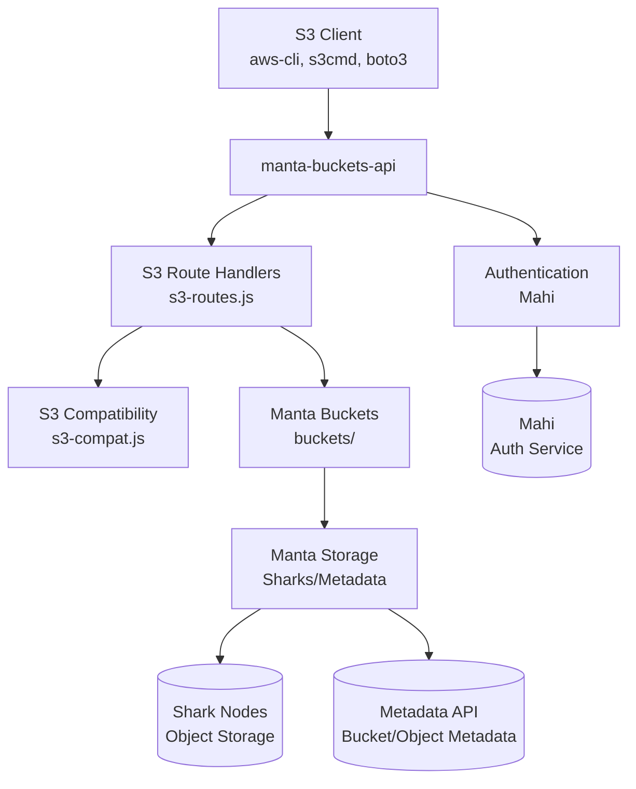
```mermaid
graph TB
    S3Client[S3 Client<br/>aws-cli, s3cmd, boto3] --> API[manta-buckets-api]
    API --> Auth[Authentication<br/>Mahi]
    API --> Routes[S3 Route Handlers<br/>s3-routes.js]
    Routes --> Compat[S3 Compatibility<br/>s3-compat.js]
    Routes --> Buckets[Manta Buckets<br/>buckets/]
    Buckets --> Storage[Manta Storage<br/>Sharks/Metadata]
    
    Auth --> Mahi[(Mahi<br/>Auth Service)]
    Storage --> Sharks[(Shark Nodes<br/>Object Storage)]
    Storage --> Metadata[(Metadata API<br/>Bucket/Object Metadata)]
```

## Request Processing Flow

### 1. S3 Request Lifecycle

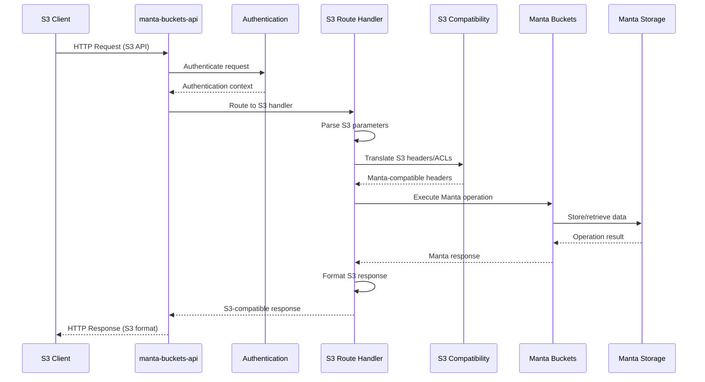
```mermaid
sequenceDiagram
    participant Client as S3 Client
    participant API as manta-buckets-api
    participant Auth as Authentication
    participant S3Routes as S3 Route Handler
    participant S3Compat as S3 Compatibility
    participant Buckets as Manta Buckets
    participant Storage as Manta Storage
    
    Client->>API: HTTP Request (S3 API)
    API->>Auth: Authenticate request
    Auth-->>API: Authentication context
    API->>S3Routes: Route to S3 handler
    S3Routes->>S3Routes: Parse S3 parameters
    S3Routes->>S3Compat: Translate S3 headers/ACLs
    S3Compat-->>S3Routes: Manta-compatible headers
    S3Routes->>Buckets: Execute Manta operation
    Buckets->>Storage: Store/retrieve data
    Storage-->>Buckets: Operation result
    Buckets-->>S3Routes: Manta response
    S3Routes->>S3Routes: Format S3 response
    S3Routes-->>API: S3-compatible response
    API-->>Client: HTTP Response (S3 format)
```

### 2. Detailed Request Processing Steps

#### Step 1: Request Routing
- Incoming HTTP requests are routed based on method and path
- S3-specific routes are handled by functions in `s3-routes.js`
- Each S3 operation has a dedicated handler function

#### Step 2: Parameter Translation
S3 parameters are converted to Manta format:
```javascript
// S3 format
req.params.bucket -> req.params.bucket_name
req.params['*'] -> req.params.object_name
req.caller.account.login -> req.params.account
```

#### Step 3: Header Translation
S3 headers are translated to Manta equivalents:
- `x-amz-acl` → `role-tag` (via s3RoleTranslator)
- `x-amz-meta-*` → `m-*` (metadata headers)

#### Step 4: Middleware Chain Execution
Each operation executes a chain of middleware functions:

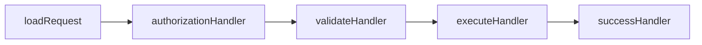
```mermaid
graph LR
    Load[loadRequest] --> Auth[authorizationHandler]
    Auth --> Validate[validateHandler]
    Validate --> Execute[executeHandler]
    Execute --> Success[successHandler]
```

## Component Details

### S3 Route Handlers (`s3-routes.js`)

The main S3 route handlers include:

#### Bucket Operations
- `s3ListBucketsHandler()` - List all buckets
- `s3CreateBucketHandler()` - Create bucket
- `s3HeadBucketHandler()` - Get bucket metadata  
- `s3DeleteBucketHandler()` - Delete bucket
- `s3ListBucketObjectsHandler()` - List objects in bucket
- `s3ListBucketObjectsV2Handler()` - List objects (API v2)

#### Object Operations
- `s3CreateBucketObjectHandler()` - Upload object
- `s3GetBucketObjectHandler()` - Download object
- `s3HeadBucketObjectHandler()` - Get object metadata
- `s3DeleteBucketObjectHandler()` - Delete object
- `s3DeleteBucketObjectsHandler()` - Bulk delete objects

#### ACL Operations
- `s3SetBucketACLHandler()` - Set bucket ACL
- `s3GetBucketACLHandler()` - Get bucket ACL
- `s3SetObjectACLHandler()` - Set object ACL
- `s3GetObjectACLHandler()` - Get object ACL

### S3 Compatibility Layer (`s3-compat.js`)

Handles translation between S3 and Manta concepts:

#### Role Translation
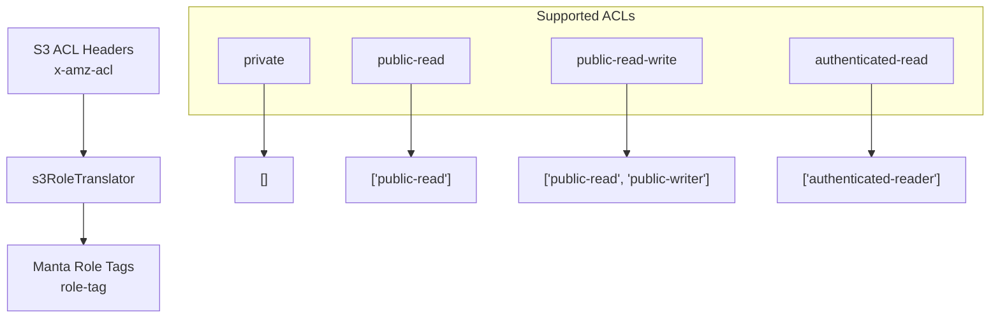
```mermaid
graph TB
    S3ACL[S3 ACL Headers<br/>x-amz-acl] --> Translator[s3RoleTranslator]
    Translator --> MantaRoles[Manta Role Tags<br/>role-tag]
    
    subgraph "Supported ACLs"
        Private[private]
        PublicRead[public-read] 
        PublicWrite[public-read-write]
        AuthRead[authenticated-read]
    end
    
    Private --> EmptyRoles["[]"]
    PublicRead --> PublicReadRole["['public-read']"]
    PublicWrite --> PublicWriteRoles["['public-read', 'public-writer']"]
    AuthRead --> AuthRoles["['authenticated-reader']"]
```

#### Metadata Translation
- S3 `x-amz-meta-*` headers ↔ Manta `m-*` headers
- Content-Type preservation
- ETag generation

### ACL Processing Flow

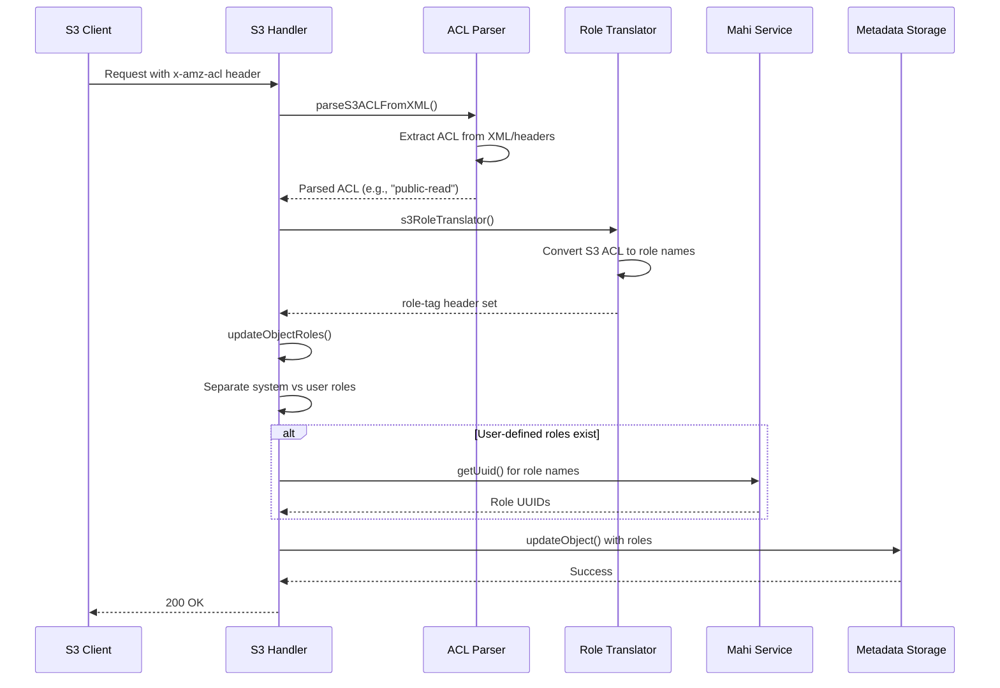
```mermaid
sequenceDiagram
    participant Client as S3 Client
    participant Handler as S3 Handler
    participant Parser as ACL Parser
    participant Translator as Role Translator
    participant Mahi as Mahi Service
    participant Storage as Metadata Storage
    
    Client->>Handler: Request with x-amz-acl header
    Handler->>Parser: parseS3ACLFromXML()
    Parser->>Parser: Extract ACL from XML/headers
    Parser-->>Handler: Parsed ACL (e.g., "public-read")
    
    Handler->>Translator: s3RoleTranslator()
    Translator->>Translator: Convert S3 ACL to role names
    Translator-->>Handler: role-tag header set
    
    Handler->>Handler: updateObjectRoles()
    Handler->>Handler: Separate system vs user roles
    
    alt User-defined roles exist
        Handler->>Mahi: getUuid() for role names
        Mahi-->>Handler: Role UUIDs
    end
    
    Handler->>Storage: updateObject() with roles
    Storage-->>Handler: Success
    Handler-->>Client: 200 OK
```

## Data Flow Examples

### Example 1: S3 Object Upload with Public Read ACL

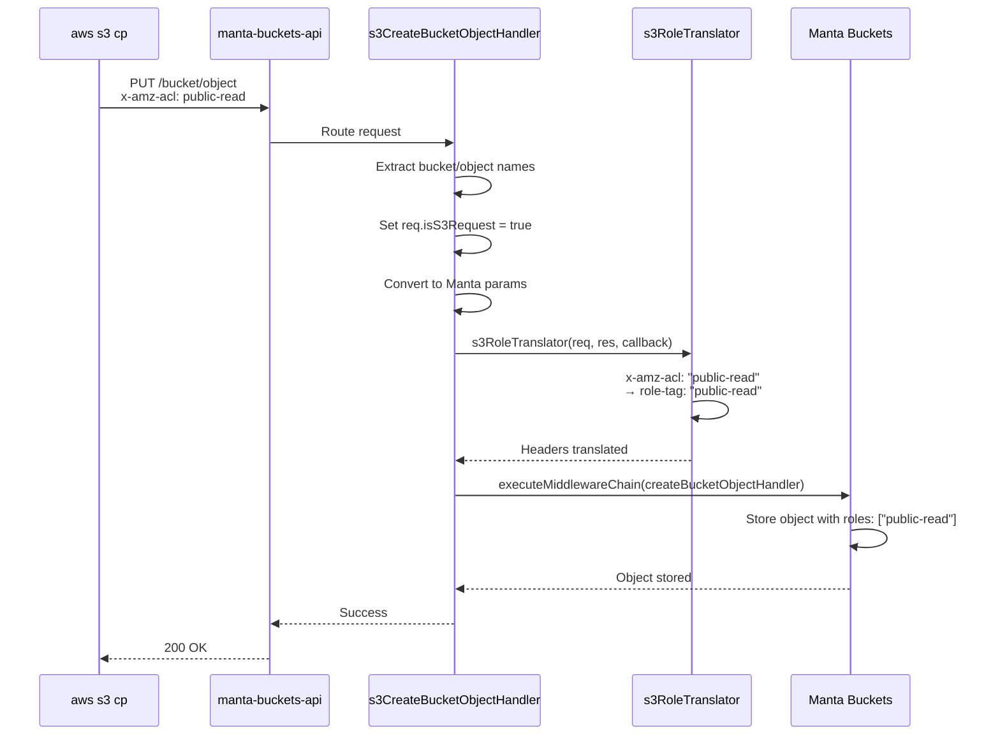
```mermaid
sequenceDiagram
    participant AWS as aws s3 cp
    participant API as manta-buckets-api
    participant S3Handler as s3CreateBucketObjectHandler
    participant S3Compat as s3RoleTranslator
    participant Buckets as Manta Buckets
    
    AWS->>API: PUT /bucket/object<br/>x-amz-acl: public-read
    API->>S3Handler: Route request
    
    S3Handler->>S3Handler: Extract bucket/object names
    S3Handler->>S3Handler: Set req.isS3Request = true
    S3Handler->>S3Handler: Convert to Manta params
    
    S3Handler->>S3Compat: s3RoleTranslator(req, res, callback)
    S3Compat->>S3Compat: x-amz-acl: "public-read"<br/>→ role-tag: "public-read"
    S3Compat-->>S3Handler: Headers translated
    
    S3Handler->>Buckets: executeMiddlewareChain(createBucketObjectHandler)
    Buckets->>Buckets: Store object with roles: ["public-read"]
    Buckets-->>S3Handler: Object stored
    
    S3Handler-->>API: Success
    API-->>AWS: 200 OK
```

### Example 2: S3 Bulk Delete Objects

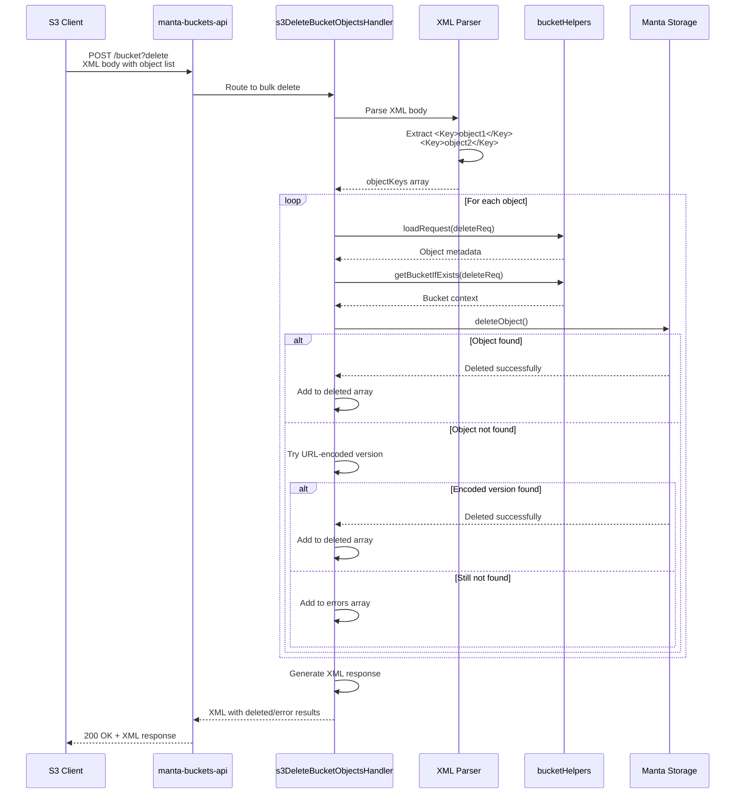
```mermaid
sequenceDiagram
    participant Client as S3 Client
    participant API as manta-buckets-api
    participant Handler as s3DeleteBucketObjectsHandler
    participant Parser as XML Parser
    participant Buckets as bucketHelpers
    participant Storage as Manta Storage
    
    Client->>API: POST /bucket?delete<br/>XML body with object list
    API->>Handler: Route to bulk delete
    
    Handler->>Parser: Parse XML body
    Parser->>Parser: Extract <Key>object1</Key><br/><Key>object2</Key>
    Parser-->>Handler: objectKeys array
    
    loop For each object
        Handler->>Buckets: loadRequest(deleteReq)
        Buckets-->>Handler: Object metadata
        Handler->>Buckets: getBucketIfExists(deleteReq)
        Buckets-->>Handler: Bucket context
        Handler->>Storage: deleteObject()
        
        alt Object found
            Storage-->>Handler: Deleted successfully
            Handler->>Handler: Add to deleted array
        else Object not found
            Handler->>Handler: Try URL-encoded version
            alt Encoded version found
                Storage-->>Handler: Deleted successfully
                Handler->>Handler: Add to deleted array
            else Still not found
                Handler->>Handler: Add to errors array
            end
        end
    end
    
    Handler->>Handler: Generate XML response
    Handler-->>API: XML with deleted/error results
    API-->>Client: 200 OK + XML response
```

## Error Handling

### Authentication Errors
- Missing or invalid authentication → 401 Unauthorized
- Insufficient permissions → 403 Forbidden

### S3-specific Error Handling
- Invalid bucket names → InvalidBucketName error
- Object not found → NoSuchKey error (with encoding fallbacks)
- Bucket already exists → BucketAlreadyExists (handled specially for ACL updates)

### Error Response Format
Errors are converted to S3-compatible XML format:
```xml
<?xml version="1.0" encoding="UTF-8"?>
<Error>
  <Code>NoSuchKey</Code>
  <Message>The specified key does not exist.</Message>
  <RequestId>...</RequestId>
</Error>
```

## Key Features

### 1. Header Translation
- Bidirectional conversion between S3 and Manta headers
- Metadata preservation and format conversion
- Content-Type handling

### 2. ACL System Integration
- S3 canned ACLs mapped to Manta roles
- Support for both system and user-defined roles
- XML ACL parsing for complex permissions

### 3. Encoding Handling
- Multiple encoding attempts for object keys
- URL encoding/decoding for special characters
- Space and parentheses handling

### 4. Response Formatting
- XML response generation for S3 compatibility
- Proper HTTP status codes
- S3-compatible error messages

### Supported Operations

#### Bucket Operations
- **ListBuckets**: `GET /` → Lists all buckets for the authenticated account
- **CreateBucket**: `PUT /:bucket` → Creates a new bucket
- **ListBucketObjects**: `GET /:bucket` → Lists objects in a bucket (S3 API v1)
- **ListBucketObjectsV2**: `GET /:bucket?list-type=2` → Lists objects in a bucket (S3 API v2)
- **HeadBucket**: `HEAD /:bucket` → Checks if bucket exists
- **DeleteBucket**: `DELETE /:bucket` → Deletes an empty bucket

#### Object Operations
- **CreateBucketObject**: `PUT /:bucket/:object` → Uploads an object to a bucket
- **GetBucketObject**: `GET /:bucket/:object` → Downloads an object from a bucket
- **HeadBucketObject**: `HEAD /:bucket/:object` → Gets object metadata
- **DeleteBucketObject**: `DELETE /:bucket/:object` → Deletes an object from a bucket

### Addressing Styles

Currently only S3 Path-style addressing is supported:

- **Path-style**: `https://domain.com/bucket/object`
- **Virtual-hosted**: `https://bucket.domain.com/object`

The system automatically detects the addressing style based on the Host header and request path,
but currently virtual-hosted style is disabled.

### Response Format Translation

#### Bucket Listings
Manta's JSON streaming format is converted to S3's XML format:
```xml
<ListAllMyBucketsResult xmlns="http://s3.amazonaws.com/doc/2006-03-01/">
  <Owner>
    <ID>account-uuid</ID>
    <DisplayName>account-login</DisplayName>
  </Owner>
  <Buckets>
    <Bucket>
      <Name>bucket-name</Name>
      <CreationDate>2023-01-01T00:00:00.000Z</CreationDate>
    </Bucket>
  </Buckets>
</ListAllMyBucketsResult>
```

#### Object Listings
Object lists are converted to S3 XML format with support for both v1 and v2 APIs:
```xml
<ListBucketResult xmlns="http://s3.amazonaws.com/doc/2006-03-01/">
  <Name>bucket-name</Name>
  <KeyCount>1</KeyCount>
  <Contents>
    <Key>object-key</Key>
    <LastModified>2023-01-01T00:00:00.000Z</LastModified>
    <ETag>"etag-value"</ETag>
    <Size>1024</Size>
    <StorageClass>STANDARD</StorageClass>
  </Contents>
</ListBucketResult>
```

#### Error Responses
Manta errors are translated to S3 XML error format:
```xml
<Error>
  <Code>NoSuchBucket</Code>
  <Message>The specified bucket does not exist.</Message>
  <RequestId>request-id</RequestId>
</Error>
```

### Header Translation

- **Metadata headers**: `m-*` → `x-amz-meta-*`
- **Standard headers**: `content-type`, `content-length`, `etag`, `last-modified` are preserved
- **S3-specific headers**: `x-amz-request-id`, `x-amz-id-2` are added automatically

### Authentication

S3 compatibility requires AWS Signature Version 4 (SigV4) authentication. Traditional Manta authentication methods are not supported for S3 endpoints.

#### AWS Signature Version 4 (SigV4) Authentication

The Manta Buckets API implements full AWS SigV4 authentication compatibility through integration with the Mahi authentication service. This enables standard AWS tools and SDKs to authenticate seamlessly with Manta's bucket storage.

##### SigV4 Authentication Flow

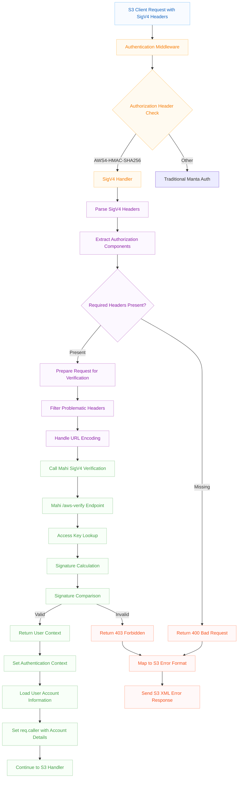
```mermaid
graph TD
    A[S3 Client Request with SigV4 Headers] --> B[Authentication Middleware]
    B --> C{Authorization Header Check}
    C -->|AWS4-HMAC-SHA256| D[SigV4 Handler]
    C -->|Other| E[Traditional Manta Auth]
    
    D --> F[Parse SigV4 Headers]
    F --> G[Extract Authorization Components]
    G --> H{Required Headers Present?}
    
    H -->|Missing| I[Return 400 Bad Request]
    H -->|Present| J[Prepare Request for Verification]
    
    J --> K[Filter Problematic Headers]
    K --> L[Handle URL Encoding]
    L --> M[Call Mahi SigV4 Verification]
    
    M --> N[Mahi /aws-verify Endpoint]
    N --> O[Access Key Lookup]
    O --> P[Signature Calculation]
    P --> Q[Signature Comparison]
    
    Q -->|Invalid| R[Return 403 Forbidden]
    Q -->|Valid| S[Return User Context]
    
    S --> T[Set Authentication Context]
    T --> U[Load User Account Information]
    U --> V[Set req.caller with Account Details]
    V --> W[Continue to S3 Handler]
    
    R --> X[Map to S3 Error Format]
    I --> X
    X --> Y[Send S3 XML Error Response]
    
    classDef clientNode fill:#F8FBFF,stroke:#90CAF9,stroke-width:1px,color:#1565C0
    classDef authNode fill:#FFFAF0,stroke:#FFCC80,stroke-width:1px,color:#F57C00
    classDef processNode fill:#FCF8FF,stroke:#CE93D8,stroke-width:1px,color:#8E24AA
    classDef mahiNode fill:#F8FFF8,stroke:#A5D6A7,stroke-width:1px,color:#43A047
    classDef errorNode fill:#FFF8F8,stroke:#FFAB91,stroke-width:1px,color:#F4511E
    classDef successNode fill:#F8FFF8,stroke:#A5D6A7,stroke-width:1px,color:#43A047
    
    class A clientNode
    class B,C,D authNode
    class F,G,H,J,K,L processNode
    class M,N,O,P,Q,S mahiNode
    class I,R,X,Y errorNode
    class T,U,V,W successNode
```

##### Implementation Details

**Key Components:**

1. **SigV4 Detection** (`lib/auth.js:sigv4Handler`)
   - Identifies requests with `AWS4-HMAC-SHA256` authorization scheme
   - Validates presence of required headers (`Authorization`, `x-amz-date`)
   - Filters problematic headers that cause verification issues

2. **Mahi Integration** (`node_modules/mahi/lib/client.js`)
   - **Signature Verification**: `verifySigV4()` calls `/aws-verify` endpoint
   - **Access Key Lookup**: `getUserByAccessKey()` retrieves user credentials
   - **Account Resolution**: Maps AWS access keys to Manta accounts

3. **Authentication Context** (`lib/auth.js:loadCaller`)
   ```javascript
   req.auth = {
       accountid: result.userUuid,
       accessKeyId: result.accessKeyId,
       method: 'sigv4',
       signature: {
           verified: true,
           keyId: result.accessKeyId
       }
   };
   ```

**Required SigV4 Headers:**
- `Authorization: AWS4-HMAC-SHA256 Credential=...`
- `x-amz-date: 20231201T120000Z` (or standard `Date` header)
- `x-amz-content-sha256: <payload-hash>` (for POST/PUT requests)
- `Host: <endpoint-hostname>`

**Signature Calculation Process:**
1. **Canonical Request**: Normalize HTTP method, URI, query parameters, headers, and payload
2. **String to Sign**: Create standardized string with algorithm, timestamp, scope, and canonical request hash
3. **Signing Key**: Derive signing key from secret access key, date, region, and service
4. **Signature**: Calculate HMAC-SHA256 of string-to-sign using signing key

**Error Handling:**
- `InvalidSignature` → 403 Forbidden with S3 XML error format
- `AccessKeyNotFound` → 403 Forbidden (mapped to InvalidSignature for security)
- `RequestTimeTooSkewed` → 403 Forbidden with time skew error
- `MissingHeaders` → 400 Bad Request

**Security Features:**
- **Time-based Validation**: Requests must be within acceptable time window
- **Replay Protection**: Signatures include timestamp and are single-use
- **Secure Key Storage**: Access keys managed through Mahi service
- **Audit Logging**: All authentication attempts are logged for security monitoring

##### Configuration

SigV4 authentication is configured through the Mahi client setup:

```javascript
// main.js - Mahi client configuration
var mahiClient = mahi.createClient({
    url: 'http://mahi.service.consul:8080',
    log: bunyan.createLogger({name: 'mahi'}),
    typeTable: apertureConfig.typeTable
});
```

**Environment Variables:**
- `MAHI_URL` - Mahi authentication service endpoint
- `APERTURE_URL` - Aperture authorization service endpoint  
- `KEYAPI_URL` - Key management service endpoint

##### Testing SigV4 Authentication

The test suite (`test/s3-compat-test.sh`) validates SigV4 authentication with:
- **AWS CLI Integration**: Standard AWS CLI commands with custom endpoint
- **Credential Validation**: Access key and secret key verification
- **Error Scenarios**: Invalid signatures, missing headers, time skew
- **Multi-operation Flows**: End-to-end workflows with authentication

## S3 Presigned URLs

The Manta Buckets API supports S3 presigned URLs, providing secure, time-limited access to objects without requiring AWS credentials in the client. This feature enables use cases like temporary file sharing, web browser uploads/downloads, and serverless application integrations.

### Overview

S3 presigned URLs embed authentication information directly in the URL query parameters, allowing temporary access to specific objects. The system validates these URLs by reconstructing the original signed request and verifying the cryptographic signature against the embedded credentials.

### Architecture

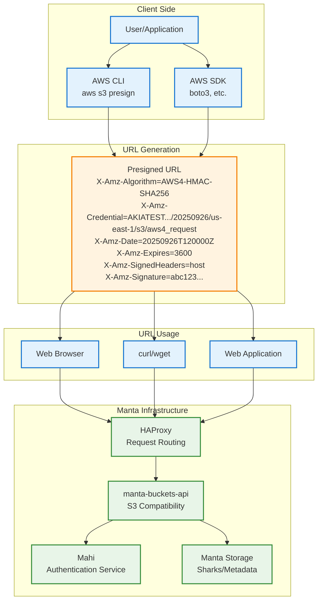
```mermaid
graph TB
    subgraph "Client Side"
        User[User/Application]
        AWSCLI[AWS CLI<br/>aws s3 presign]
        SDK[AWS SDK<br/>boto3, etc.]
    end
    
    subgraph "URL Generation"
        User --> AWSCLI
        User --> SDK
        AWSCLI --> PresignedURL[Presigned URL<br/>X-Amz-Algorithm=AWS4-HMAC-SHA256<br/>X-Amz-Credential=AKIATEST.../20250926/us-east-1/s3/aws4_request<br/>X-Amz-Date=20250926T120000Z<br/>X-Amz-Expires=3600<br/>X-Amz-SignedHeaders=host<br/>X-Amz-Signature=abc123...]
        SDK --> PresignedURL
    end
    
    subgraph "URL Usage"
        Browser[Web Browser]
        CURL[curl/wget]
        WebApp[Web Application]
        PresignedURL --> Browser
        PresignedURL --> CURL
        PresignedURL --> WebApp
    end
    
    subgraph "Manta Infrastructure"
        HAProxy[HAProxy<br/>Request Routing]
        BucketsAPI[manta-buckets-api<br/>S3 Compatibility]
        MahiAuth[Mahi<br/>Authentication Service]
        MantaStorage[Manta Storage<br/>Sharks/Metadata]
    end
    
    Browser --> HAProxy
    CURL --> HAProxy
    WebApp --> HAProxy
    
    HAProxy --> BucketsAPI
    BucketsAPI --> MahiAuth
    BucketsAPI --> MantaStorage
    
    classDef clientNode fill:#E3F2FD,stroke:#1976D2,stroke-width:2px
    classDef urlNode fill:#FFF3E0,stroke:#F57C00,stroke-width:2px
    classDef infraNode fill:#E8F5E8,stroke:#388E3C,stroke-width:2px
    
    class User,AWSCLI,SDK,Browser,CURL,WebApp clientNode
    class PresignedURL urlNode
    class HAProxy,BucketsAPI,MahiAuth,MantaStorage infraNode
```

### Request Flow

#### 1. Presigned URL Detection and Routing

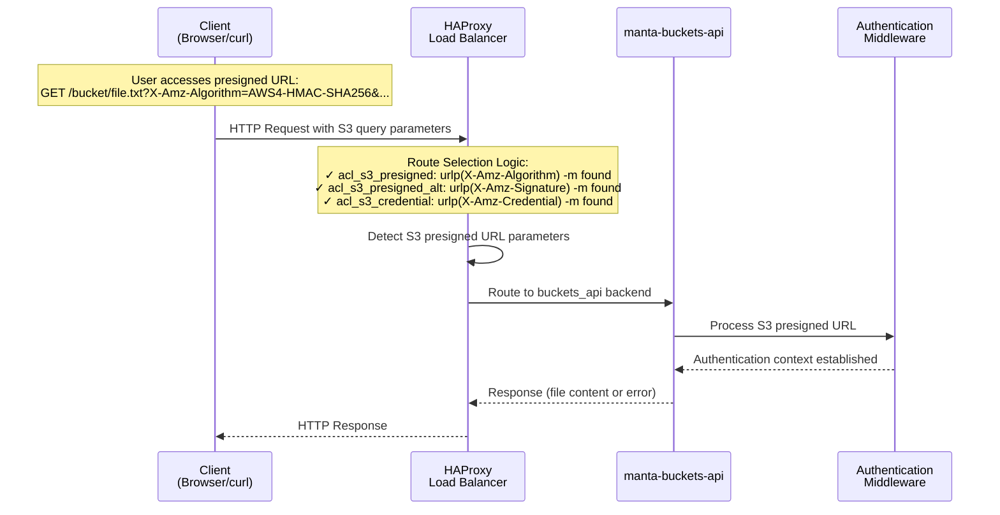
```mermaid
sequenceDiagram
    participant Client as Client<br/>(Browser/curl)
    participant HAProxy as HAProxy<br/>Load Balancer
    participant BucketsAPI as manta-buckets-api
    participant Auth as Authentication<br/>Middleware
    
    Note over Client: User accesses presigned URL:<br/>GET /bucket/file.txt?X-Amz-Algorithm=AWS4-HMAC-SHA256&...
    
    Client->>HAProxy: HTTP Request with S3 query parameters
    
    Note over HAProxy: Route Selection Logic:<br/>✓ acl_s3_presigned: urlp(X-Amz-Algorithm) -m found<br/>✓ acl_s3_presigned_alt: urlp(X-Amz-Signature) -m found<br/>✓ acl_s3_credential: urlp(X-Amz-Credential) -m found
    
    HAProxy->>HAProxy: Detect S3 presigned URL parameters
    HAProxy->>BucketsAPI: Route to buckets_api backend
    
    BucketsAPI->>Auth: Process S3 presigned URL
    Auth-->>BucketsAPI: Authentication context established
    BucketsAPI-->>HAProxy: Response (file content or error)
    HAProxy-->>Client: HTTP Response
```

#### 2. S3 Presigned URL Processing Pipeline

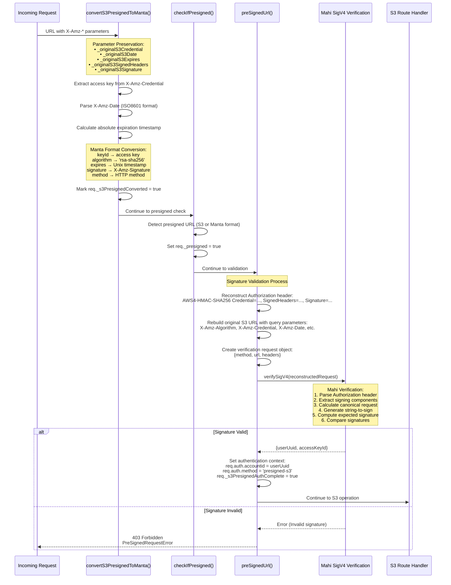
```mermaid
sequenceDiagram
    participant Request as Incoming Request
    participant Converter as convertS3PresignedToManta()
    participant Checker as checkIfPresigned()
    participant Validator as preSignedUrl()
    participant Mahi as Mahi SigV4 Verification
    participant Handler as S3 Route Handler
    
    Request->>Converter: URL with X-Amz-* parameters
    
    Note over Converter: Parameter Preservation:<br/>• _originalS3Credential<br/>• _originalS3Date<br/>• _originalS3Expires<br/>• _originalS3SignedHeaders<br/>• _originalS3Signature
    
    Converter->>Converter: Extract access key from X-Amz-Credential
    Converter->>Converter: Parse X-Amz-Date (ISO8601 format)
    Converter->>Converter: Calculate absolute expiration timestamp
    
    Note over Converter: Manta Format Conversion:<br/>keyId → access key<br/>algorithm → 'rsa-sha256'<br/>expires → Unix timestamp<br/>signature → X-Amz-Signature<br/>method → HTTP method
    
    Converter->>Converter: Mark req._s3PresignedConverted = true
    Converter->>Checker: Continue to presigned check
    
    Checker->>Checker: Detect presigned URL (S3 or Manta format)
    Checker->>Checker: Set req._presigned = true
    Checker->>Validator: Continue to validation
    
    Note over Validator: Signature Validation Process
    
    Validator->>Validator: Reconstruct Authorization header:<br/>AWS4-HMAC-SHA256 Credential=..., SignedHeaders=..., Signature=...
    
    Validator->>Validator: Rebuild original S3 URL with query parameters:<br/>X-Amz-Algorithm, X-Amz-Credential, X-Amz-Date, etc.
    
    Validator->>Validator: Create verification request object:<br/>{method, url, headers}
    
    Validator->>Mahi: verifySigV4(reconstructedRequest)
    
    Note over Mahi: Mahi Verification:<br/>1. Parse Authorization header<br/>2. Extract signing components<br/>3. Calculate canonical request<br/>4. Generate string-to-sign<br/>5. Compute expected signature<br/>6. Compare signatures
    
    alt Signature Valid
        Mahi-->>Validator: {userUuid, accessKeyId}
        Validator->>Validator: Set authentication context:<br/>req.auth.accountid = userUuid<br/>req.auth.method = 'presigned-s3'<br/>req._s3PresignedAuthComplete = true
        Validator->>Handler: Continue to S3 operation
    else Signature Invalid
        Mahi-->>Validator: Error (Invalid signature)
        Validator-->>Request: 403 Forbidden<br/>PreSignedRequestError
    end
```

### Implementation Details

#### Query Parameter Conversion

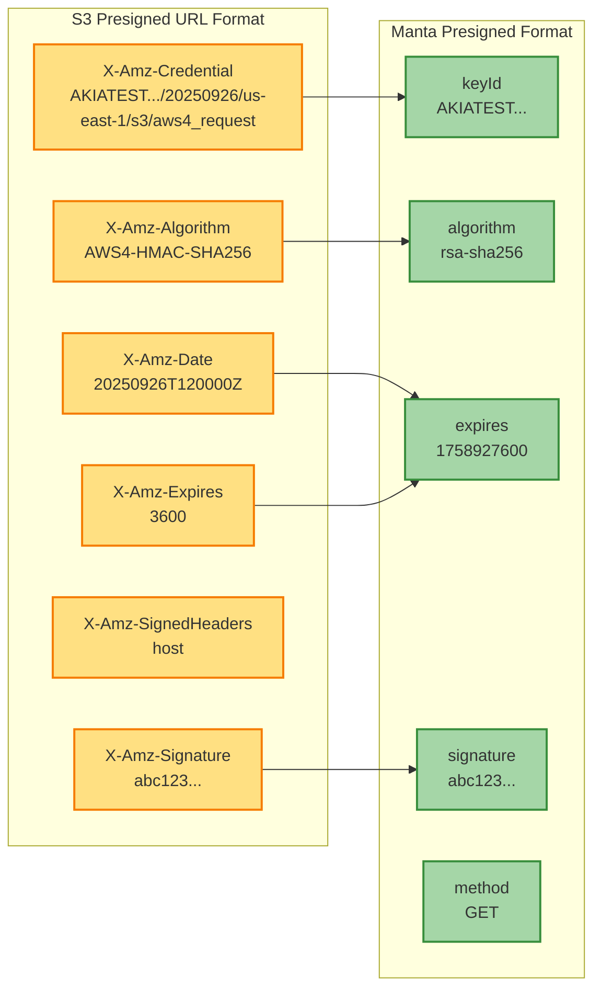
```mermaid
graph LR
    subgraph "S3 Presigned URL Format"
        S3Algo["X-Amz-Algorithm<br/>AWS4-HMAC-SHA256"]
        S3Cred["X-Amz-Credential<br/>AKIATEST.../20250926/us-east-1/s3/aws4_request"]
        S3Date["X-Amz-Date<br/>20250926T120000Z"]
        S3Expires["X-Amz-Expires<br/>3600"]
        S3Headers["X-Amz-SignedHeaders<br/>host"]
        S3Sig["X-Amz-Signature<br/>abc123..."]
    end
    
    subgraph "Manta Presigned Format"
        MantaKeyId["keyId<br/>AKIATEST..."]
        MantaAlgo["algorithm<br/>rsa-sha256"]
        MantaExpires["expires<br/>1758927600"]
        MantaSig["signature<br/>abc123..."]
        MantaMethod["method<br/>GET"]
    end
    
    S3Cred --> MantaKeyId
    S3Algo --> MantaAlgo
    S3Date --> MantaExpires
    S3Expires --> MantaExpires
    S3Sig --> MantaSig
    
    classDef s3Style fill:#FFE082,stroke:#F57C00,stroke-width:2px
    classDef mantaStyle fill:#A5D6A7,stroke:#388E3C,stroke-width:2px
    
    class S3Algo,S3Cred,S3Date,S3Expires,S3Headers,S3Sig s3Style
    class MantaKeyId,MantaAlgo,MantaExpires,MantaSig,MantaMethod mantaStyle
```

#### Signature Verification Process

The signature verification reconstructs the exact request that was signed by the client:

```javascript
// 1. Reconstruct Authorization header
var authHeader = 'AWS4-HMAC-SHA256 Credential=' + credential + 
               ', SignedHeaders=' + signedHeaders + 
               ', Signature=' + signature;

// 2. Rebuild original URL with S3 query parameters  
var originalQueryParams = [
    'X-Amz-Algorithm=AWS4-HMAC-SHA256',
    'X-Amz-Credential=' + encodeURIComponent(credential),
    'X-Amz-Date=' + amzDate,
    'X-Amz-Expires=' + expires,
    'X-Amz-SignedHeaders=' + signedHeaders
];

// 3. Create verification request
var requestForVerification = {
    method: req.method,
    url: pathPart + '?' + originalQueryParams.join('&'),
    headers: {
        'authorization': authHeader,
        'x-amz-date': amzDate,
        'host': req.headers.host
    }
};

// 4. Verify with Mahi
req.mahi.verifySigV4(requestForVerification, callback);
```

### Security Model

#### Time-based Validation
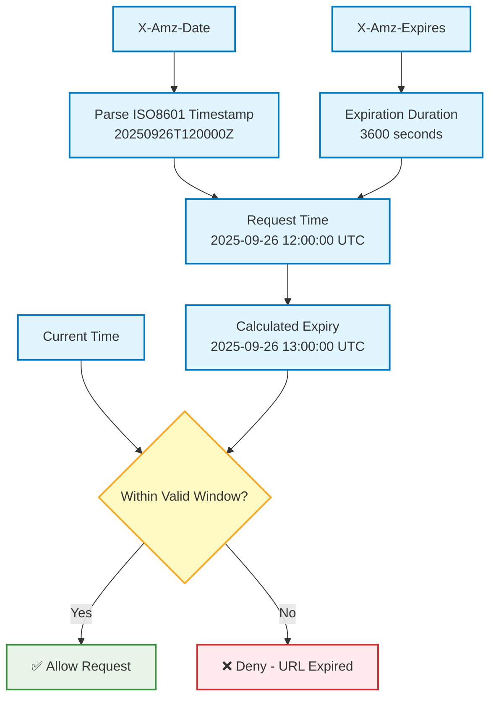
```mermaid
graph TD
    A[X-Amz-Date] --> B[Parse ISO8601 Timestamp<br/>20250926T120000Z]
    C[X-Amz-Expires] --> D[Expiration Duration<br/>3600 seconds]
    
    B --> E[Request Time<br/>2025-09-26 12:00:00 UTC]
    D --> E
    E --> F[Calculated Expiry<br/>2025-09-26 13:00:00 UTC]
    
    G[Current Time] --> H{Within Valid Window?}
    F --> H
    
    H -->|Yes| I[✅ Allow Request]
    H -->|No| J[❌ Deny - URL Expired]
    
    classDef timeNode fill:#E1F5FE,stroke:#0277BD,stroke-width:2px
    classDef checkNode fill:#FFF9C4,stroke:#F9A825,stroke-width:2px
    classDef successNode fill:#E8F5E8,stroke:#388E3C,stroke-width:2px
    classDef errorNode fill:#FFEBEE,stroke:#D32F2F,stroke-width:2px
    
    class A,B,C,D,E,F,G timeNode
    class H checkNode
    class I successNode
    class J errorNode
```

#### Cryptographic Validation
- **Algorithm**: AWS SigV4 (HMAC-SHA256)
- **Signature Scope**: Method + URL + Headers + Timestamp
- **Tamper Detection**: Any URL modification invalidates signature
- **Replay Protection**: Time window limits reuse

#### Permission Model

```mermaid
graph TB
    subgraph "Access Control Flow"
        A[Presigned URL Request] --> B[Signature Validation]
        B --> C[Extract Access Key]
        C --> D[Mahi User Lookup]
        D --> E[Manta Authorization]
        E --> F[Resource Access Check]
        
        F --> G{Permission Check}
        G -->|Authorized| H[✅ Grant Access]
        G -->|Denied| I[❌ Access Denied]
    end
    
    subgraph "Permission Inheritance"
        J[Signer's Permissions] --> K[URL Access Level]
        K --> L[Scoped to Specific Object]
        L --> M[Limited by Expiration Time]
    end
    
    classDef processNode fill:#E3F2FD,stroke:#1976D2,stroke-width:2px
    classDef permNode fill:#F3E5F5,stroke:#7B1FA2,stroke-width:2px
    classDef successNode fill:#E8F5E8,stroke:#388E3C,stroke-width:2px
    classDef errorNode fill:#FFEBEE,stroke:#D32F2F,stroke-width:2px
    
    class A,B,C,D,E,F,G processNode
    class J,K,L,M permNode
    class H successNode
    class I errorNode
```


### Error Handling and Diagnostics

#### Common Error Scenarios

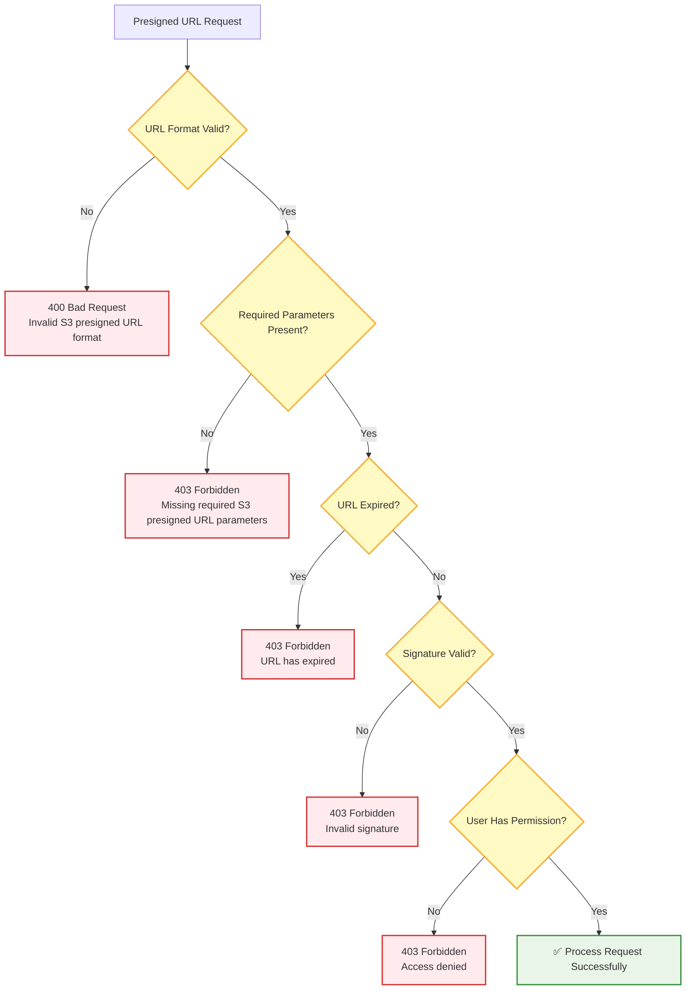
```mermaid
graph TD
    A[Presigned URL Request] --> B{URL Format Valid?}
    B -->|No| C[400 Bad Request<br/>Invalid S3 presigned URL format]
    
    B -->|Yes| D{Required Parameters Present?}
    D -->|No| E[403 Forbidden<br/>Missing required S3 presigned URL parameters]
    
    D -->|Yes| F{URL Expired?}
    F -->|Yes| G[403 Forbidden<br/>URL has expired]
    
    F -->|No| H{Signature Valid?}
    H -->|No| I[403 Forbidden<br/>Invalid signature]
    
    H -->|Yes| J{User Has Permission?}
    J -->|No| K[403 Forbidden<br/>Access denied]
    
    J -->|Yes| L[✅ Process Request Successfully]
    
    classDef errorNode fill:#FFEBEE,stroke:#D32F2F,stroke-width:2px
    classDef checkNode fill:#FFF9C4,stroke:#F9A825,stroke-width:2px
    classDef successNode fill:#E8F5E8,stroke:#388E3C,stroke-width:2px
    
    class C,E,G,I,K errorNode
    class B,D,F,H,J checkNode
    class L successNode
```

#### Debugging Information

The system provides detailed logging for troubleshooting presigned URL issues:

```javascript
// Authentication flow logging
log.debug({
    originalUrl: req.url,
    verificationUrl: urlForVerification,
    authHeader: authHeader.substring(0, 100) + '...',
    signedHeaders: signedHeaders
}, 'S3_PRESIGNED_DEBUG: Constructed verification request');

// Signature validation results
log.debug({
    accessKeyId: result.accessKeyId,
    userUuid: result.userUuid
}, 'S3_PRESIGNED_DEBUG: Signature validation successful');
```

### Performance Considerations

#### HAProxy Routing Efficiency
- **Parameter Detection**: Fast ACL checks on query parameters
- **Minimal Overhead**: Direct routing without complex pattern matching
- **Load Balancing**: Distributes presigned URL requests across buckets-api instances

#### Signature Validation Optimization
- **Cached Results**: Mahi may cache signature validation results
- **Connection Pooling**: Reuse connections to Mahi service
- **Parallel Processing**: Multiple presigned URL requests processed concurrently

#### Monitoring and Metrics
- **Request Latency**: Track time from URL request to signature validation
- **Error Rates**: Monitor signature validation failures and expiration errors
- **Usage Patterns**: Analyze presigned URL generation and access patterns

### Configuration

#### HAProxy Rules
```haproxy
# S3 presigned URL detection in /home/build/S3-MANTA/muppet/etc/haproxy.cfg.in
acl acl_s3_presigned urlp(X-Amz-Algorithm) -m found
acl acl_s3_presigned_alt urlp(X-Amz-Signature) -m found  
acl acl_s3_credential urlp(X-Amz-Credential) -m found

# Route presigned URLs to buckets-api
use_backend buckets_api if acl_s3_presigned
use_backend buckets_api if acl_s3_presigned_alt
use_backend buckets_api if acl_s3_credential
```

#### Manta Buckets API Middleware
```javascript
// Authentication pipeline in lib/server.js
server.use(auth.convertS3PresignedToManta);  // Convert S3 to Manta format
server.use(auth.checkIfPresigned);           // Detect presigned requests  
server.use(auth.preSignedUrl);               // Validate signatures
```

#### Security Settings
- **Maximum Expiration**: URLs can be valid for up to 7 days (604800 seconds)
- **Minimum Expiration**: URLs must be valid for at least 1 second
- **Time Skew Tolerance**: Configurable time window for clock differences
- **Algorithm Support**: Only AWS4-HMAC-SHA256 is supported

## Role-Based Access Control (RBAC) for S3 Compatibility

The Manta Buckets API implements Role-Based Access Control (RBAC) to provide fine-grained access control for S3 operations. This system allows administrators to create subusers with specific permissions for individual buckets and objects.

### RBAC Architecture Overview

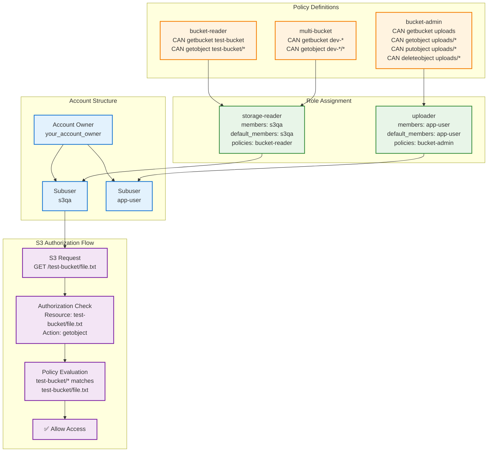
```mermaid
graph TB
    subgraph "Account Structure"
        Account["Account Owner<br/>your_account_owner"]
        Subuser1["Subuser<br/>s3qa"]
        Subuser2["Subuser<br/>app-user"]
        Account --> Subuser1
        Account --> Subuser2
    end
    
    subgraph "Policy Definitions"
        Policy1["bucket-reader<br/>CAN getbucket test-bucket<br/>CAN getobject test-bucket/*"]
        Policy2["bucket-admin<br/>CAN getbucket uploads<br/>CAN getobject uploads/*<br/>CAN putobject uploads/*<br/>CAN deleteobject uploads/*"]
        Policy3["multi-bucket<br/>CAN getbucket dev-*<br/>CAN getobject dev-*/*"]
    end
    
    subgraph "Role Assignment"
        Role1["storage-reader<br/>members: s3qa<br/>default_members: s3qa<br/>policies: bucket-reader"]
        Role2["uploader<br/>members: app-user<br/>default_members: app-user<br/>policies: bucket-admin"]
    end
    
    subgraph "S3 Authorization Flow"
        S3Request["S3 Request<br/>GET /test-bucket/file.txt"]
        AuthCheck["Authorization Check<br/>Resource: test-bucket/file.txt<br/>Action: getobject"]
        PolicyEval["Policy Evaluation<br/>test-bucket/* matches<br/>test-bucket/file.txt"]
        Decision["✅ Allow Access"]
    end
    
    Policy1 --> Role1
    Policy2 --> Role2
    Policy3 --> Role1
    
    Role1 --> Subuser1
    Role2 --> Subuser2
    
    Subuser1 --> S3Request
    S3Request --> AuthCheck
    AuthCheck --> PolicyEval
    PolicyEval --> Decision
    
    classDef accountNode fill:#E3F2FD,stroke:#1976D2,stroke-width:2px
    classDef policyNode fill:#FFF3E0,stroke:#F57C00,stroke-width:2px
    classDef roleNode fill:#E8F5E8,stroke:#388E3C,stroke-width:2px
    classDef authNode fill:#F3E5F5,stroke:#7B1FA2,stroke-width:2px
    
    class Account,Subuser1,Subuser2 accountNode
    class Policy1,Policy2,Policy3 policyNode
    class Role1,Role2 roleNode
    class S3Request,AuthCheck,PolicyEval,Decision authNode
```

### Default Role Activation for S3 Compatibility

A critical requirement for S3 compatibility is that subusers must be in the `default_members` array of their roles. This ensures automatic role activation since S3 clients cannot send explicit role headers.

#### Authentication Flow with Default Roles

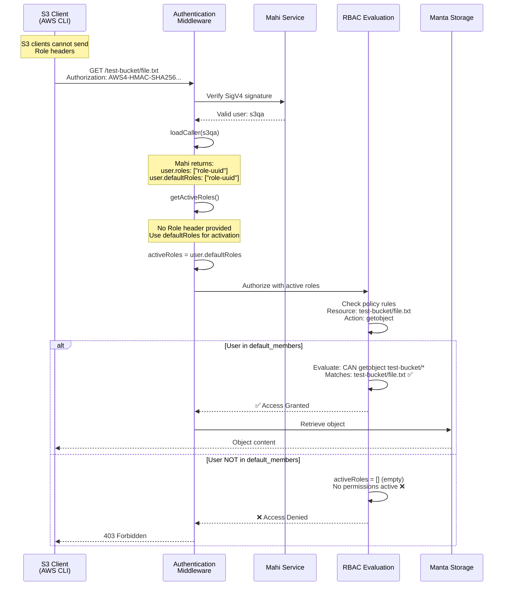
```mermaid
sequenceDiagram
    participant S3Client as S3 Client<br/>(AWS CLI)
    participant Auth as Authentication<br/>Middleware
    participant Mahi as Mahi Service
    participant RBAC as RBAC Evaluation
    participant Storage as Manta Storage
    
    Note over S3Client: S3 clients cannot send<br/>Role headers
    
    S3Client->>Auth: GET /test-bucket/file.txt<br/>Authorization: AWS4-HMAC-SHA256...
    Auth->>Mahi: Verify SigV4 signature
    Mahi-->>Auth: Valid user: s3qa
    
    Auth->>Auth: loadCaller(s3qa)
    Note over Auth: Mahi returns:<br/>user.roles: ["role-uuid"]<br/>user.defaultRoles: ["role-uuid"]
    
    Auth->>Auth: getActiveRoles()
    Note over Auth: No Role header provided<br/>Use defaultRoles for activation
    
    Auth->>Auth: activeRoles = user.defaultRoles
    Auth->>RBAC: Authorize with active roles
    
    RBAC->>RBAC: Check policy rules<br/>Resource: test-bucket/file.txt<br/>Action: getobject
    
    alt User in default_members
        RBAC->>RBAC: Evaluate: CAN getobject test-bucket/*<br/>Matches: test-bucket/file.txt ✅
        RBAC-->>Auth: ✅ Access Granted
        Auth->>Storage: Retrieve object
        Storage-->>S3Client: Object content
    else User NOT in default_members
        RBAC->>RBAC: activeRoles = [] (empty)<br/>No permissions active ❌
        RBAC-->>Auth: ❌ Access Denied
        Auth-->>S3Client: 403 Forbidden
    end
```

### Resource Naming and Bucket-Scoped Permissions

The system supports bucket-scoped object permissions using hierarchical resource names. This enables fine-grained access control at the bucket level.

#### Resource Name Resolution

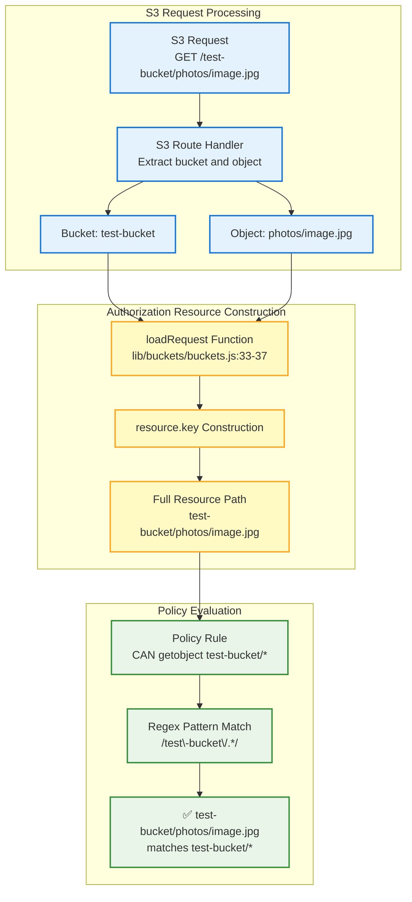
```mermaid
graph TB
    subgraph "S3 Request Processing"
        Request[S3 Request<br/>GET /test-bucket/photos/image.jpg]
        RouteHandler[S3 Route Handler<br/>Extract bucket and object]
        BucketName[Bucket: test-bucket]
        ObjectName[Object: photos/image.jpg]
    end
    
    subgraph "Authorization Resource Construction"
        LoadRequest[loadRequest Function<br/>lib/buckets/buckets.js:33-37]
        ResourceKey[resource.key Construction]
        FullPath[Full Resource Path<br/>test-bucket/photos/image.jpg]
    end
    
    subgraph "Policy Evaluation"
        PolicyRule[Policy Rule<br/>CAN getobject test-bucket/*]
        RegexMatch[Regex Pattern Match<br/>/test\-bucket\/.*/]
        MatchResult[✅ test-bucket/photos/image.jpg<br/>matches test-bucket/*]
    end
    
    Request --> RouteHandler
    RouteHandler --> BucketName
    RouteHandler --> ObjectName
    
    BucketName --> LoadRequest
    ObjectName --> LoadRequest
    LoadRequest --> ResourceKey
    ResourceKey --> FullPath
    
    FullPath --> PolicyRule
    PolicyRule --> RegexMatch
    RegexMatch --> MatchResult
    
    classDef requestNode fill:#E3F2FD,stroke:#1976D2,stroke-width:2px
    classDef processNode fill:#FFF9C4,stroke:#F9A825,stroke-width:2px
    classDef policyNode fill:#E8F5E8,stroke:#388E3C,stroke-width:2px
    
    class Request,RouteHandler,BucketName,ObjectName requestNode
    class LoadRequest,ResourceKey,FullPath processNode
    class PolicyRule,RegexMatch,MatchResult policyNode
```

### Policy Examples and Use Cases

#### Granular Bucket Access Policies

```javascript
// Read-only access to specific bucket
{
  "name": "bucket-reader",
  "rules": [
    "CAN getbucket test-bucket",      // List bucket contents
    "CAN getobject test-bucket/*"     // Download any object in bucket
  ]
}

// Full access to specific bucket
{
  "name": "bucket-admin", 
  "rules": [
    "CAN getbucket uploads",          // List bucket contents
    "CAN getobject uploads/*",        // Download objects
    "CAN putobject uploads/*",        // Upload objects
    "CAN deleteobject uploads/*"      // Delete objects
  ]
}

// Multi-bucket access with patterns
{
  "name": "dev-environment",
  "rules": [
    "CAN getbucket dev-*",            // Access all dev buckets
    "CAN getobject dev-*/*",          // Download from dev buckets
    "CAN putobject dev-*/*"           // Upload to dev buckets
  ]
}

// Environment-based access
{
  "name": "developer-access",
  "rules": [
    "CAN getbucket dev-*",            // Full dev access
    "CAN getobject dev-*/*",
    "CAN putobject dev-*/*", 
    "CAN deleteobject dev-*/*",
    "CAN getbucket prod-*",           // Read-only prod access
    "CAN getobject prod-*/*"
  ]
}
```

#### Role Configuration for S3 Compatibility

```javascript
// Critical: User must be in BOTH members and default_members
{
  "name": "storage-reader",
  "members": ["s3qa"],                // User can assume this role
  "default_members": ["s3qa"],        // Role activates automatically
  "policies": ["bucket-reader"]       // Policy provides permissions
}

// Multiple users with automatic activation
{
  "name": "uploader-team",
  "members": ["user1", "user2", "user3"],
  "default_members": ["user1", "user2", "user3"],  // All get auto-activation
  "policies": ["bucket-admin"]
}

// Mixed activation (some users auto, others manual)
{
  "name": "developer-role",
  "members": ["dev1", "dev2", "admin1"],
  "default_members": ["dev1", "dev2"],             // Only devs get auto-activation
  "policies": ["dev-environment"]                   // admin1 must send Role header
}
```

### Authorization Action Mapping

S3 operations map to specific authorization actions that must be granted in policies:

| S3 Operation | Authorization Action | Required Permission Example |
|--------------|---------------------|----------------------------|
| **List Bucket** | `getbucket` | `CAN getbucket test-bucket` |
| **Get Object** | `getobject` | `CAN getobject test-bucket/*` |
| **Put Object** | `putobject` | `CAN putobject test-bucket/*` |
| **Delete Object** | `deleteobject` | `CAN deleteobject test-bucket/*` |
| **Head Bucket** | `getbucket` | `CAN getbucket test-bucket` |
| **Head Object** | `getobject` | `CAN getobject test-bucket/file.txt` |
| **Create Bucket** | `putbucket` | `CAN putbucket *` |

**Important Note**: Unlike traditional Manta routes that use separate `listbucket` permissions, S3 routes consolidate bucket operations under `getbucket` to align with AWS S3's permission model.


### Permission Scope and Wildcards

#### Bucket-Level Permissions

```javascript
// Specific bucket access
"CAN getbucket mybucket"              // Only mybucket
"CAN getobject mybucket/*"            // All objects in mybucket

// Pattern-based bucket access  
"CAN getbucket dev-*"                 // All buckets starting with dev-
"CAN getobject dev-*/*"               // All objects in dev-* buckets
// Can create buckets 
"CAN putbucket *"

// Multiple specific buckets
"CAN getbucket bucket1"               // Access bucket1
"CAN getbucket bucket2"               // Access bucket2
"CAN getobject bucket1/*"             // Objects in bucket1
"CAN getobject bucket2/*"             // Objects in bucket2
```

#### Object-Level Permissions

```javascript
// Specific object access
"CAN getobject mybucket/file.txt"     // Only specific file
"CAN getobject mybucket/folder/*"     // All files in folder

// Path-based restrictions
"CAN getobject uploads/public/*"      // Public files only
"CAN putobject uploads/user-123/*"    // User's folder only

// File type restrictions
"CAN getobject assets/*.jpg"          // Only JPEG files
"CAN getobject docs/*.pdf"            // Only PDF files
```

### Security Considerations

#### Least Privilege Principle

- Grant minimum required permissions for specific use cases
- Use bucket-scoped patterns instead of global wildcards
- Regularly audit and review user permissions

#### Access Key Management

- Generate separate access keys for each subuser
- Rotate access keys regularly
- Monitor access key usage and deactivate unused keys

#### Role Inheritance and Conflicts

- Users can have multiple roles with overlapping permissions
- Permission evaluation follows allow-first policy
- More specific permissions take precedence over wildcards

### Troubleshooting RBAC Issues

#### Common Permission Problems

1. **Empty activeRoles**
   ```
   Problem: User not in default_members
   Solution: Add user to role's default_members array
   ```

2. **Bucket-scoped permissions not working**
   ```
   Problem: Resource name mismatch
   Solution: Ensure patterns use bucket/object format
   ```

3. **403 Forbidden despite correct permissions**
   ```
   Problem: Role/policy propagation delay
   Solution: Wait 5-10 seconds after changes
   ```

#### Debugging Authorization

The system provides detailed logging for authorization decisions:

```javascript
// Example authorization log output
{
  "activeRoles": ["100db4d0-67e3-44ba-a104-db53081d9b61"],
  "action": "getobject", 
  "resource": "test-bucket/file.txt",
  "caller": "s3qa",
  "decision": "allow",
  "matchedRule": "CAN getobject test-bucket/*"
}
```

### Performance and Scalability

#### Role Evaluation Efficiency

- Mahi caches role and policy information
- Authorization decisions are cached temporarily
- Bulk operations benefit from shared authorization context

#### Large-Scale Deployments

- Use role templates for consistent permission patterns
- Implement automated role provisioning for new users
- Monitor authorization performance with detailed logging

This RBAC system provides the foundation for secure, scalable multi-tenant S3 access while maintaining compatibility with standard AWS tools and SDKs.
