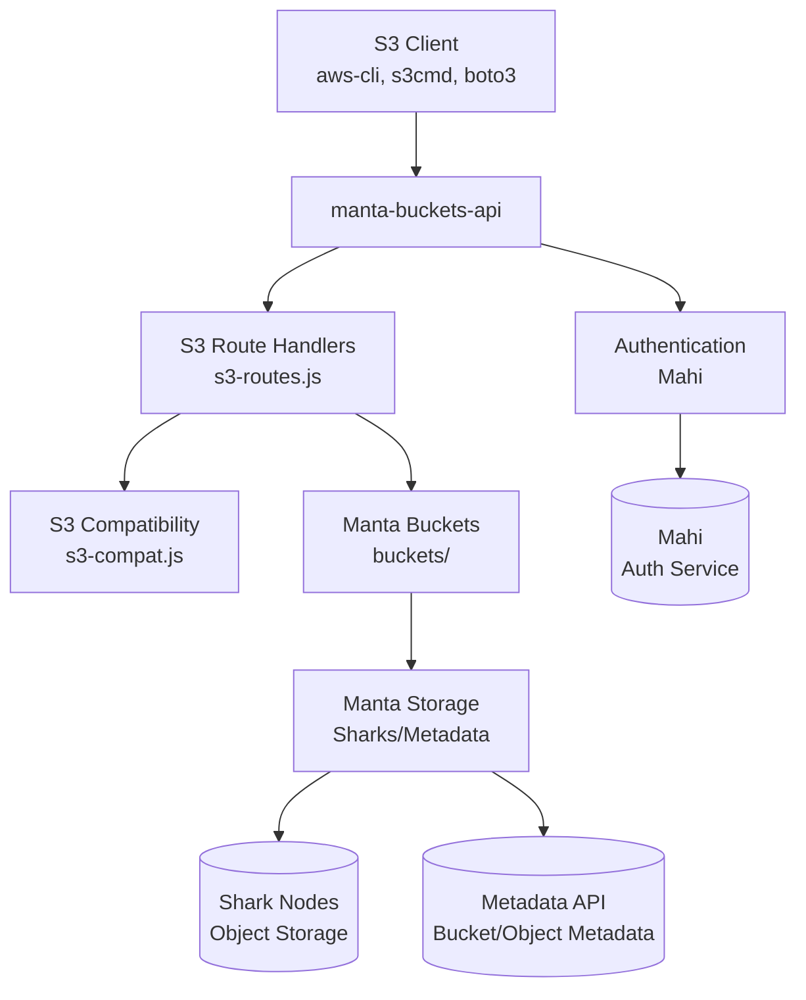
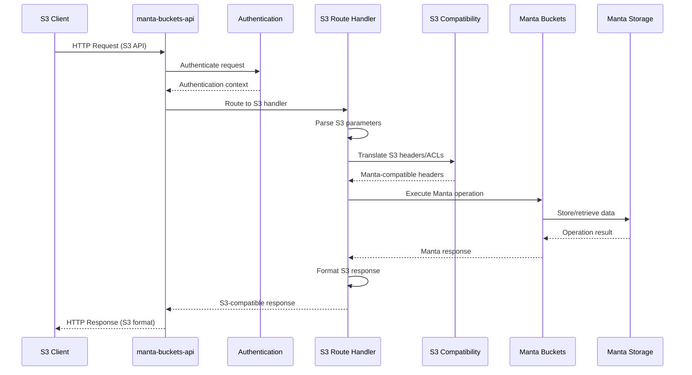
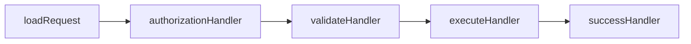
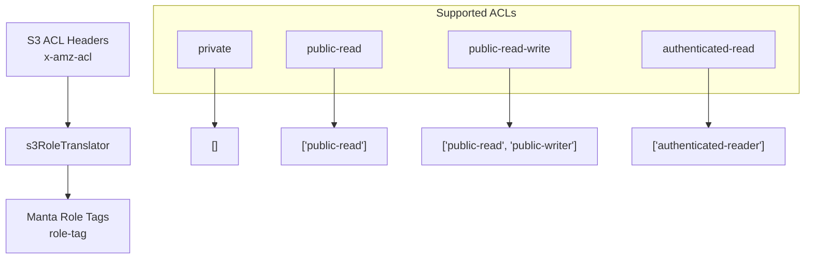
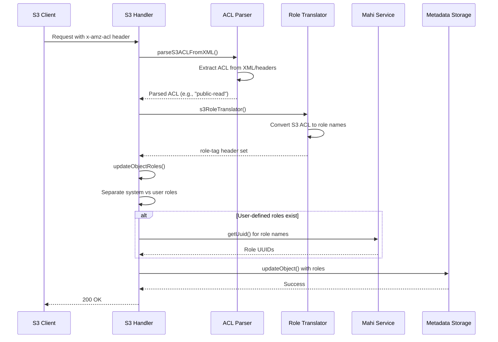
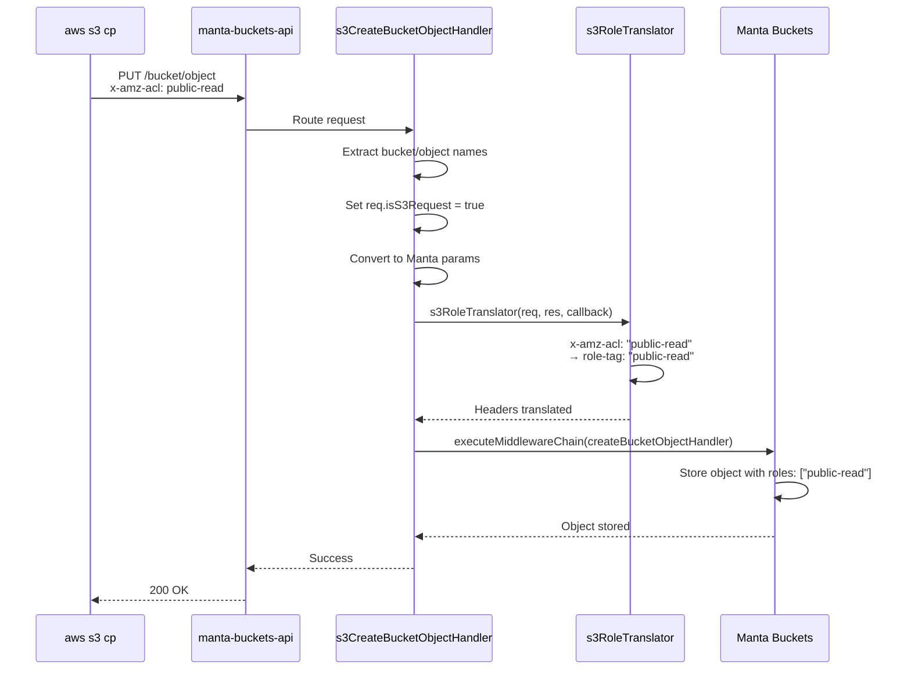
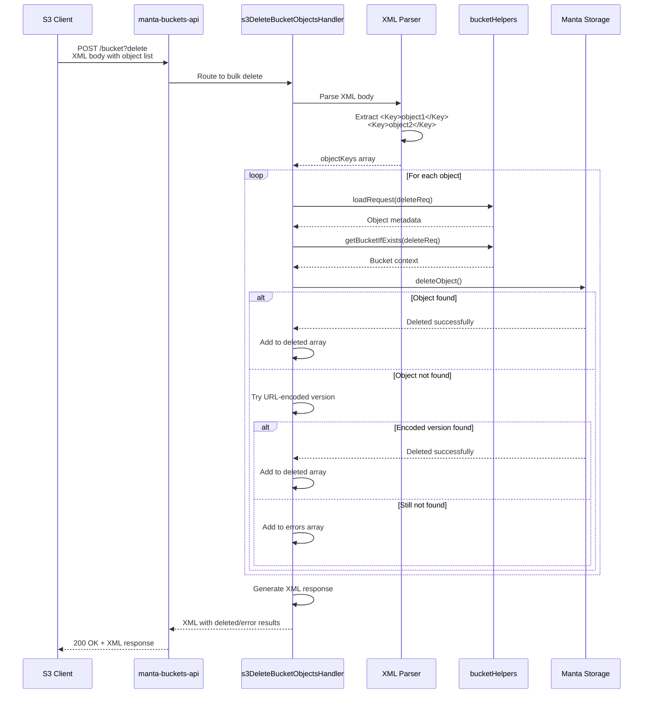

# S3-to-Manta Architecture

This document explains how S3 requests are processed and translated to Manta operations in the manta-buckets-api.

## Overview

The manta-buckets-api serves as a bridge between S3 clients and Manta storage, translating S3 API calls into equivalent Manta bucket operations. The system handles authentication, request routing, header translation, and response formatting to provide S3 compatibility.

## High-Level Architecture



## Request Processing Flow

### 1. S3 Request Lifecycle



### 2. Detailed Request Processing Steps

#### Step 1: Request Routing
- Incoming HTTP requests are routed based on method and path
- S3-specific routes are handled by functions in `s3-routes.js`
- Each S3 operation has a dedicated handler function

#### Step 2: Parameter Translation
S3 parameters are converted to Manta format:
```javascript
// S3 format
req.params.bucket -> req.params.bucket_name
req.params['*'] -> req.params.object_name
req.caller.account.login -> req.params.account
```

#### Step 3: Header Translation
S3 headers are translated to Manta equivalents:
- `x-amz-acl` → `role-tag` (via s3RoleTranslator)
- `x-amz-meta-*` → `m-*` (metadata headers)

#### Step 4: Middleware Chain Execution
Each operation executes a chain of middleware functions:



## Component Details

### S3 Route Handlers (`s3-routes.js`)

The main S3 route handlers include:

#### Bucket Operations
- `s3ListBucketsHandler()` - List all buckets
- `s3CreateBucketHandler()` - Create bucket
- `s3HeadBucketHandler()` - Get bucket metadata  
- `s3DeleteBucketHandler()` - Delete bucket
- `s3ListBucketObjectsHandler()` - List objects in bucket
- `s3ListBucketObjectsV2Handler()` - List objects (API v2)

#### Object Operations
- `s3CreateBucketObjectHandler()` - Upload object
- `s3GetBucketObjectHandler()` - Download object
- `s3HeadBucketObjectHandler()` - Get object metadata
- `s3DeleteBucketObjectHandler()` - Delete object
- `s3DeleteBucketObjectsHandler()` - Bulk delete objects

#### ACL Operations
- `s3SetBucketACLHandler()` - Set bucket ACL
- `s3GetBucketACLHandler()` - Get bucket ACL
- `s3SetObjectACLHandler()` - Set object ACL
- `s3GetObjectACLHandler()` - Get object ACL

### S3 Compatibility Layer (`s3-compat.js`)

Handles translation between S3 and Manta concepts:

#### Role Translation


#### Metadata Translation
- S3 `x-amz-meta-*` headers ↔ Manta `m-*` headers
- Content-Type preservation
- ETag generation

### ACL Processing Flow



## Data Flow Examples

### Example 1: S3 Object Upload with Public Read ACL



### Example 2: S3 Bulk Delete Objects



## Error Handling

### Authentication Errors
- Missing or invalid authentication → 401 Unauthorized
- Insufficient permissions → 403 Forbidden

### S3-specific Error Handling
- Invalid bucket names → InvalidBucketName error
- Object not found → NoSuchKey error (with encoding fallbacks)
- Bucket already exists → BucketAlreadyExists (handled specially for ACL updates)

### Error Response Format
Errors are converted to S3-compatible XML format:
```xml
<?xml version="1.0" encoding="UTF-8"?>
<Error>
  <Code>NoSuchKey</Code>
  <Message>The specified key does not exist.</Message>
  <RequestId>...</RequestId>
</Error>
```

## Key Features

### 1. Header Translation
- Bidirectional conversion between S3 and Manta headers
- Metadata preservation and format conversion
- Content-Type handling

### 2. ACL System Integration
- S3 canned ACLs mapped to Manta roles
- Support for both system and user-defined roles
- XML ACL parsing for complex permissions

### 3. Encoding Handling
- Multiple encoding attempts for object keys
- URL encoding/decoding for special characters
- Space and parentheses handling

### 4. Response Formatting
- XML response generation for S3 compatibility
- Proper HTTP status codes
- S3-compatible error messages
