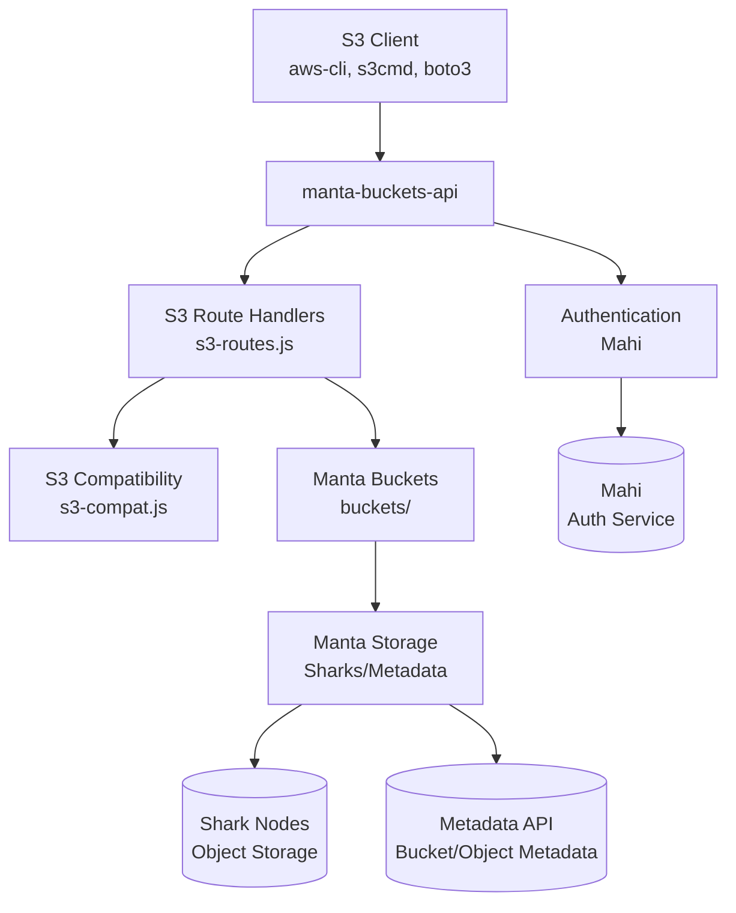
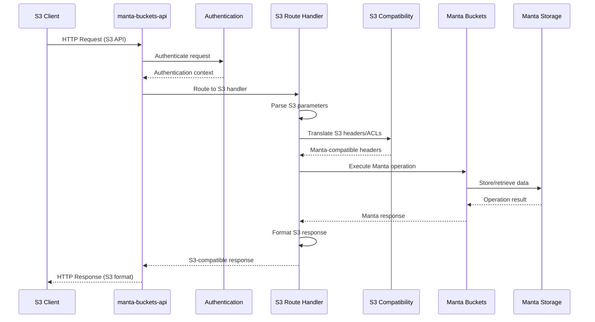
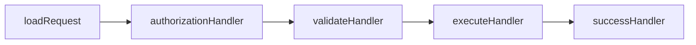
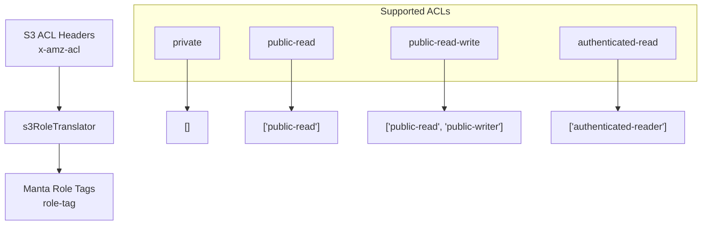
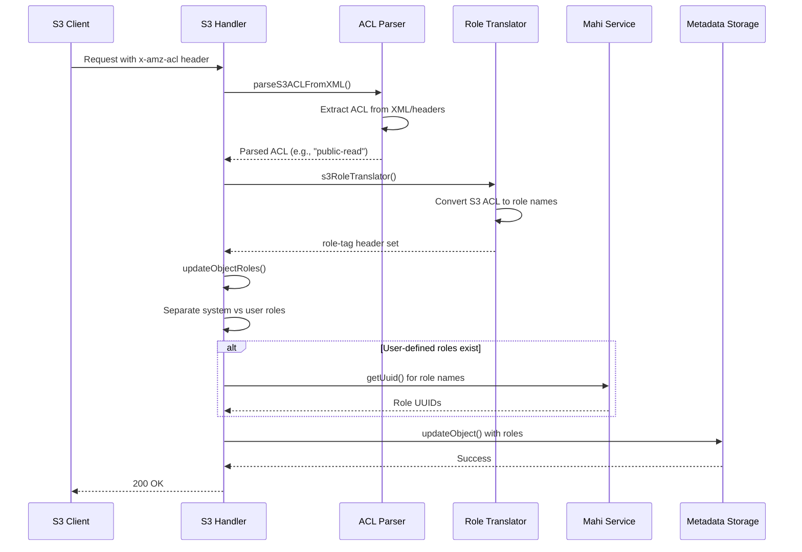
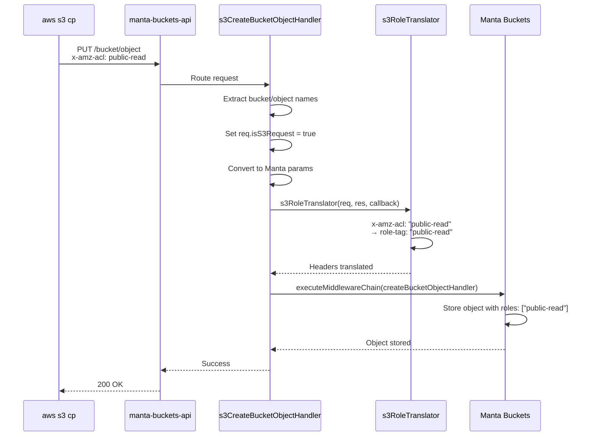
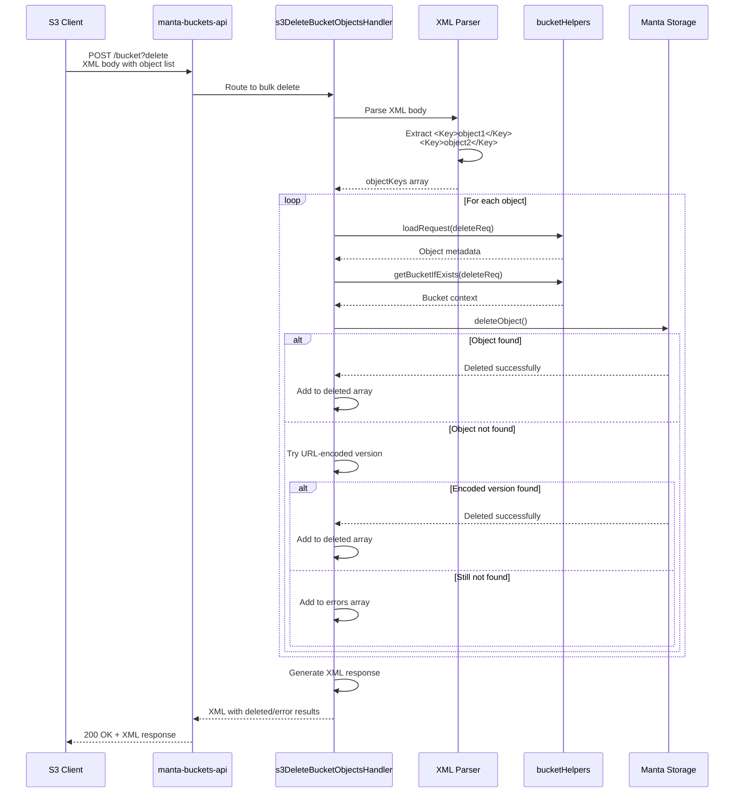
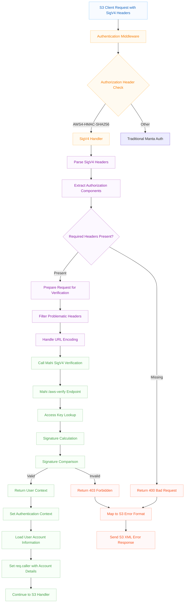

# S3-to-Manta Architecture

This document explains how S3 requests are processed and translated to Manta operations in the manta-buckets-api.

## Overview

The manta-buckets-api serves as a bridge between S3 clients and Manta storage, translating S3 API calls into equivalent Manta bucket operations. The system handles authentication, request routing, header translation, and response formatting to provide S3 compatibility.

## High-Level Architecture



## Request Processing Flow

### 1. S3 Request Lifecycle



### 2. Detailed Request Processing Steps

#### Step 1: Request Routing
- Incoming HTTP requests are routed based on method and path
- S3-specific routes are handled by functions in `s3-routes.js`
- Each S3 operation has a dedicated handler function

#### Step 2: Parameter Translation
S3 parameters are converted to Manta format:
```javascript
// S3 format
req.params.bucket -> req.params.bucket_name
req.params['*'] -> req.params.object_name
req.caller.account.login -> req.params.account
```

#### Step 3: Header Translation
S3 headers are translated to Manta equivalents:
- `x-amz-acl` → `role-tag` (via s3RoleTranslator)
- `x-amz-meta-*` → `m-*` (metadata headers)

#### Step 4: Middleware Chain Execution
Each operation executes a chain of middleware functions:



## Component Details

### S3 Route Handlers (`s3-routes.js`)

The main S3 route handlers include:

#### Bucket Operations
- `s3ListBucketsHandler()` - List all buckets
- `s3CreateBucketHandler()` - Create bucket
- `s3HeadBucketHandler()` - Get bucket metadata  
- `s3DeleteBucketHandler()` - Delete bucket
- `s3ListBucketObjectsHandler()` - List objects in bucket
- `s3ListBucketObjectsV2Handler()` - List objects (API v2)

#### Object Operations
- `s3CreateBucketObjectHandler()` - Upload object
- `s3GetBucketObjectHandler()` - Download object
- `s3HeadBucketObjectHandler()` - Get object metadata
- `s3DeleteBucketObjectHandler()` - Delete object
- `s3DeleteBucketObjectsHandler()` - Bulk delete objects

#### ACL Operations
- `s3SetBucketACLHandler()` - Set bucket ACL
- `s3GetBucketACLHandler()` - Get bucket ACL
- `s3SetObjectACLHandler()` - Set object ACL
- `s3GetObjectACLHandler()` - Get object ACL

### S3 Compatibility Layer (`s3-compat.js`)

Handles translation between S3 and Manta concepts:

#### Role Translation


#### Metadata Translation
- S3 `x-amz-meta-*` headers ↔ Manta `m-*` headers
- Content-Type preservation
- ETag generation

### ACL Processing Flow



## Data Flow Examples

### Example 1: S3 Object Upload with Public Read ACL



### Example 2: S3 Bulk Delete Objects



## Error Handling

### Authentication Errors
- Missing or invalid authentication → 401 Unauthorized
- Insufficient permissions → 403 Forbidden

### S3-specific Error Handling
- Invalid bucket names → InvalidBucketName error
- Object not found → NoSuchKey error (with encoding fallbacks)
- Bucket already exists → BucketAlreadyExists (handled specially for ACL updates)

### Error Response Format
Errors are converted to S3-compatible XML format:
```xml
<?xml version="1.0" encoding="UTF-8"?>
<Error>
  <Code>NoSuchKey</Code>
  <Message>The specified key does not exist.</Message>
  <RequestId>...</RequestId>
</Error>
```

## Key Features

### 1. Header Translation
- Bidirectional conversion between S3 and Manta headers
- Metadata preservation and format conversion
- Content-Type handling

### 2. ACL System Integration
- S3 canned ACLs mapped to Manta roles
- Support for both system and user-defined roles
- XML ACL parsing for complex permissions

### 3. Encoding Handling
- Multiple encoding attempts for object keys
- URL encoding/decoding for special characters
- Space and parentheses handling

### 4. Response Formatting
- XML response generation for S3 compatibility
- Proper HTTP status codes
- S3-compatible error messages

### Supported Operations

#### Bucket Operations
- **ListBuckets**: `GET /` → Lists all buckets for the authenticated account
- **CreateBucket**: `PUT /:bucket` → Creates a new bucket
- **ListBucketObjects**: `GET /:bucket` → Lists objects in a bucket (S3 API v1)
- **ListBucketObjectsV2**: `GET /:bucket?list-type=2` → Lists objects in a bucket (S3 API v2)
- **HeadBucket**: `HEAD /:bucket` → Checks if bucket exists
- **DeleteBucket**: `DELETE /:bucket` → Deletes an empty bucket

#### Object Operations
- **CreateBucketObject**: `PUT /:bucket/:object` → Uploads an object to a bucket
- **GetBucketObject**: `GET /:bucket/:object` → Downloads an object from a bucket
- **HeadBucketObject**: `HEAD /:bucket/:object` → Gets object metadata
- **DeleteBucketObject**: `DELETE /:bucket/:object` → Deletes an object from a bucket

### Addressing Styles

Currently only S3 Path-style addressing is supported:

- **Path-style**: `https://domain.com/bucket/object`
- **Virtual-hosted**: `https://bucket.domain.com/object`

The system automatically detects the addressing style based on the Host header and request path,
but currently virtual-hosted style is disabled.

### Response Format Translation

#### Bucket Listings
Manta's JSON streaming format is converted to S3's XML format:
```xml
<ListAllMyBucketsResult xmlns="http://s3.amazonaws.com/doc/2006-03-01/">
  <Owner>
    <ID>account-uuid</ID>
    <DisplayName>account-login</DisplayName>
  </Owner>
  <Buckets>
    <Bucket>
      <Name>bucket-name</Name>
      <CreationDate>2023-01-01T00:00:00.000Z</CreationDate>
    </Bucket>
  </Buckets>
</ListAllMyBucketsResult>
```

#### Object Listings
Object lists are converted to S3 XML format with support for both v1 and v2 APIs:
```xml
<ListBucketResult xmlns="http://s3.amazonaws.com/doc/2006-03-01/">
  <Name>bucket-name</Name>
  <KeyCount>1</KeyCount>
  <Contents>
    <Key>object-key</Key>
    <LastModified>2023-01-01T00:00:00.000Z</LastModified>
    <ETag>"etag-value"</ETag>
    <Size>1024</Size>
    <StorageClass>STANDARD</StorageClass>
  </Contents>
</ListBucketResult>
```

#### Error Responses
Manta errors are translated to S3 XML error format:
```xml
<Error>
  <Code>NoSuchBucket</Code>
  <Message>The specified bucket does not exist.</Message>
  <RequestId>request-id</RequestId>
</Error>
```

### Header Translation

- **Metadata headers**: `m-*` → `x-amz-meta-*`
- **Standard headers**: `content-type`, `content-length`, `etag`, `last-modified` are preserved
- **S3-specific headers**: `x-amz-request-id`, `x-amz-id-2` are added automatically

### Authentication

S3 compatibility requires AWS Signature Version 4 (SigV4) authentication. Traditional Manta authentication methods are not supported for S3 endpoints.

#### AWS Signature Version 4 (SigV4) Authentication

The Manta Buckets API implements full AWS SigV4 authentication compatibility through integration with the Mahi authentication service. This enables standard AWS tools and SDKs to authenticate seamlessly with Manta's bucket storage.

##### SigV4 Authentication Flow



##### Implementation Details

**Key Components:**

1. **SigV4 Detection** (`lib/auth.js:sigv4Handler`)
   - Identifies requests with `AWS4-HMAC-SHA256` authorization scheme
   - Validates presence of required headers (`Authorization`, `x-amz-date`)
   - Filters problematic headers that cause verification issues

2. **Mahi Integration** (`node_modules/mahi/lib/client.js`)
   - **Signature Verification**: `verifySigV4()` calls `/aws-verify` endpoint
   - **Access Key Lookup**: `getUserByAccessKey()` retrieves user credentials
   - **Account Resolution**: Maps AWS access keys to Manta accounts

3. **Authentication Context** (`lib/auth.js:loadCaller`)
   ```javascript
   req.auth = {
       accountid: result.userUuid,
       accessKeyId: result.accessKeyId,
       method: 'sigv4',
       signature: {
           verified: true,
           keyId: result.accessKeyId
       }
   };
   ```

**Required SigV4 Headers:**
- `Authorization: AWS4-HMAC-SHA256 Credential=...`
- `x-amz-date: 20231201T120000Z` (or standard `Date` header)
- `x-amz-content-sha256: <payload-hash>` (for POST/PUT requests)
- `Host: <endpoint-hostname>`

**Signature Calculation Process:**
1. **Canonical Request**: Normalize HTTP method, URI, query parameters, headers, and payload
2. **String to Sign**: Create standardized string with algorithm, timestamp, scope, and canonical request hash
3. **Signing Key**: Derive signing key from secret access key, date, region, and service
4. **Signature**: Calculate HMAC-SHA256 of string-to-sign using signing key

**Error Handling:**
- `InvalidSignature` → 403 Forbidden with S3 XML error format
- `AccessKeyNotFound` → 403 Forbidden (mapped to InvalidSignature for security)
- `RequestTimeTooSkewed` → 403 Forbidden with time skew error
- `MissingHeaders` → 400 Bad Request

**Security Features:**
- **Time-based Validation**: Requests must be within acceptable time window
- **Replay Protection**: Signatures include timestamp and are single-use
- **Secure Key Storage**: Access keys managed through Mahi service
- **Audit Logging**: All authentication attempts are logged for security monitoring

##### Configuration

SigV4 authentication is configured through the Mahi client setup:

```javascript
// main.js - Mahi client configuration
var mahiClient = mahi.createClient({
    url: 'http://mahi.service.consul:8080',
    log: bunyan.createLogger({name: 'mahi'}),
    typeTable: apertureConfig.typeTable
});
```

**Environment Variables:**
- `MAHI_URL` - Mahi authentication service endpoint
- `APERTURE_URL` - Aperture authorization service endpoint  
- `KEYAPI_URL` - Key management service endpoint

##### Testing SigV4 Authentication

The test suite (`test/s3-compat-test.sh`) validates SigV4 authentication with:
- **AWS CLI Integration**: Standard AWS CLI commands with custom endpoint
- **Credential Validation**: Access key and secret key verification
- **Error Scenarios**: Invalid signatures, missing headers, time skew
- **Multi-operation Flows**: End-to-end workflows with authentication
