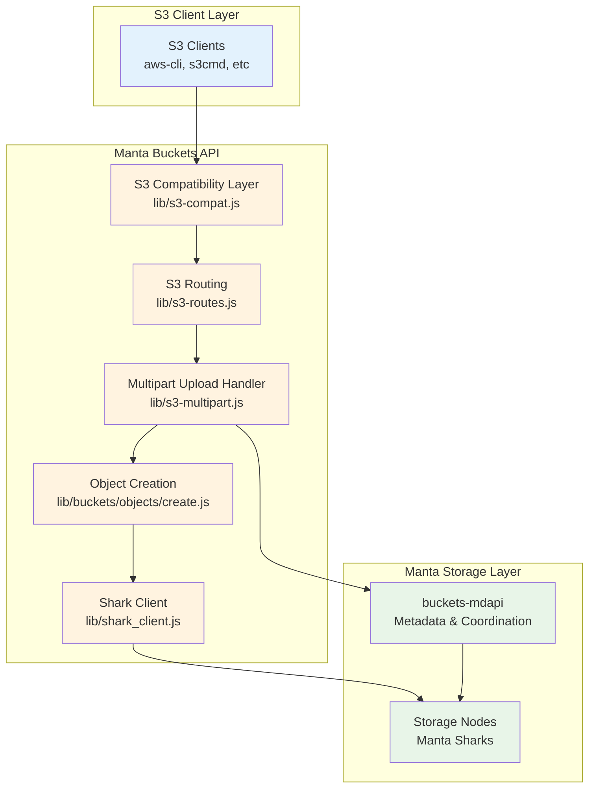
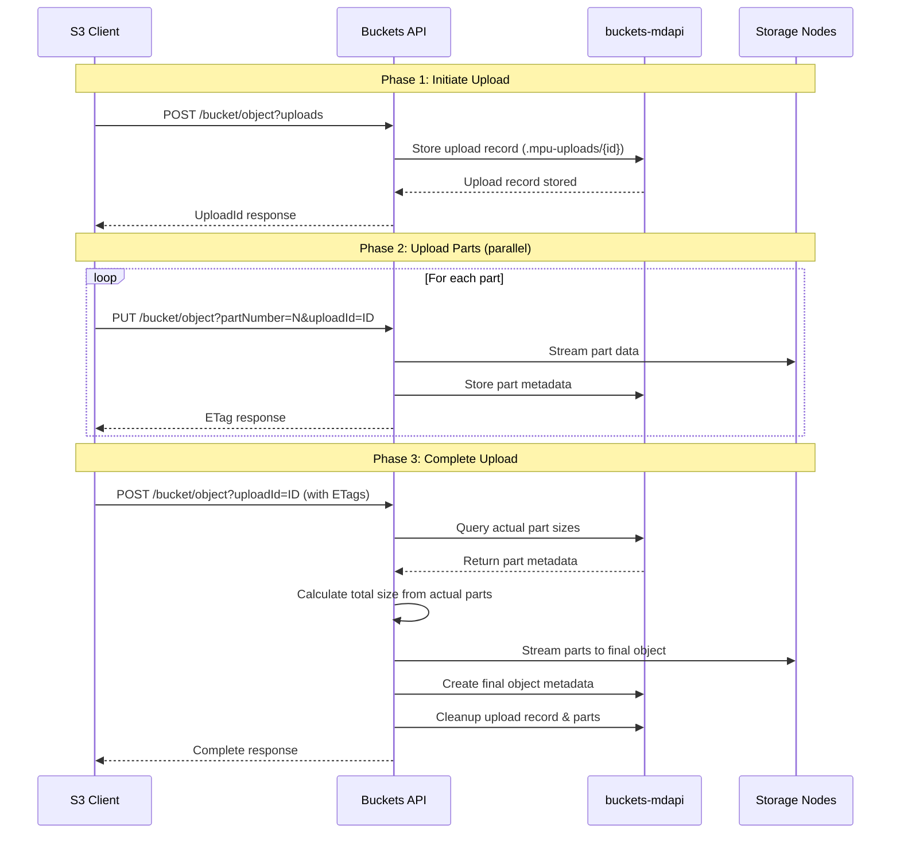
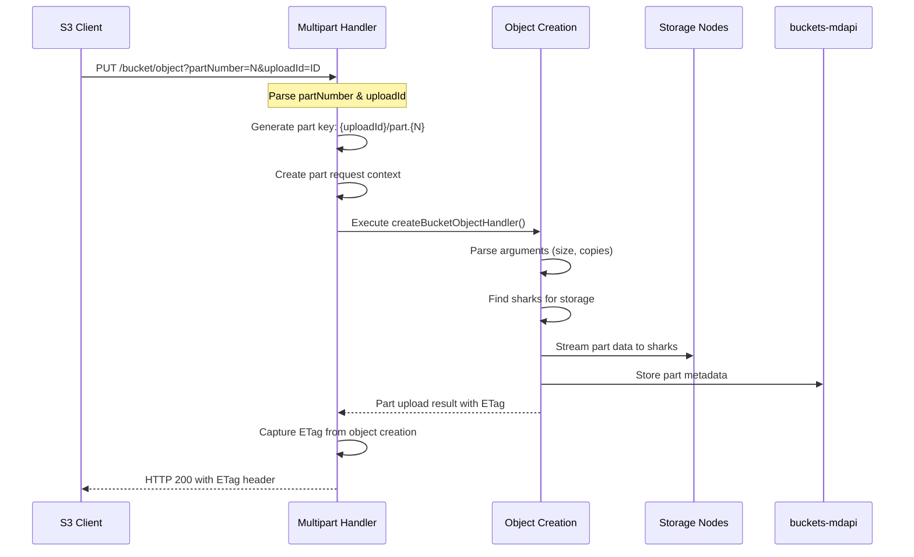
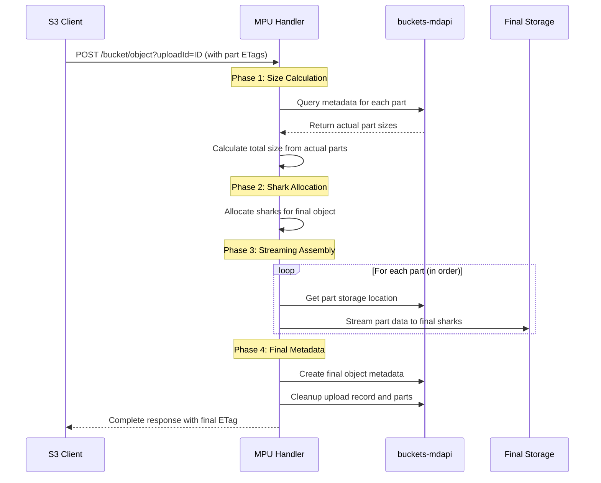
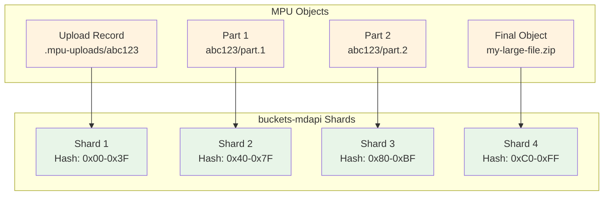

# Multipart Upload (MPU) Design

This document describes the architecture and implementation of S3 Multipart Upload support in Manta Buckets API, with detailed coverage of the role of buckets-mdapi and how objects are streamed and stored.

## Table of Contents

- [Overview](#overview)
- [Architecture Components](#architecture-components)
- [Upload Record Management](#upload-record-management)
- [Part Upload Process](#part-upload-process)
- [Complete Upload Process](#complete-upload-process)
- [Object Streaming and Storage](#object-streaming-and-storage)
- [buckets-mdapi Integration](#buckets-mdapi-integration)
- [Error Handling and Cleanup](#error-handling-and-cleanup)
- [Performance Considerations](#performance-considerations)
- [Implementation Files](#implementation-files)

## Overview

The Manta Buckets API implements AWS S3-compatible multipart upload functionality that enables large object uploads through a three-phase process:

1. **Initiate**: Create upload session and obtain upload ID
2. **Upload Parts**: Stream individual parts to Manta storage
3. **Complete**: Assemble parts into final object using actual size calculation

Unlike traditional S3 implementations that estimate part sizes, Manta's implementation queries buckets-mdapi for actual uploaded part metadata, ensuring accurate object assembly regardless of client-side size estimates.

## Architecture Components

### Core Components



### Data Flow Overview



## Upload Record Management

### Upload Record Structure

Upload state is tracked through special objects in buckets-mdapi with the key pattern `.mpu-uploads/{uploadId}`:

```javascript
{
  "uploadId": "uuid-generated-id",
  "bucket": "bucket-name", 
  "key": "object-key",
  "account": "owner-uuid",
  "initiated": "2025-01-01T00:00:00.000Z",
  "parts": {},  // Part tracking (currently minimal)
  "status": "initiated"
}
```

### Upload Record Lifecycle

1. **Creation**: During initiate operation, stored as JSON object in buckets-mdapi
2. **Access**: Retrieved during part upload and completion operations  
3. **Cleanup**: Automatically removed after successful completion or explicit abort

**Key Implementation Details:**

- Upload records are stored as regular objects in the bucket namespace
- The `.mpu-uploads/` prefix prevents conflicts with user objects
- JSON serialization enables structured data storage within Manta's object model
- Upload ID generation uses UUID v4 for uniqueness across the cluster

## Part Upload Process

### Part Storage Strategy

Each part is stored as an individual object in Manta storage with a deterministic naming scheme:

```
Part Key Pattern: {uploadId}/part.{partNumber}
Metadata Location: buckets-mdapi (distributed by hash)
Physical Storage: Manta sharks (allocated per-part)
```

### Part Upload Flow



### Part Metadata in buckets-mdapi

Each part is stored with complete metadata in buckets-mdapi:

```javascript
{
  "id": "part-object-id",
  "name": "upload-id/part.123", 
  "content_length": 5242880,  // Actual size
  "content_md5": "abc123...",
  "content_type": "application/octet-stream",
  "modified": "2025-01-01T00:00:00.000Z",
  "sharks": [                 // Storage locations
    {"manta_storage_id": "shark1.domain.com", ...},
    {"manta_storage_id": "shark2.domain.com", ...}
  ]
}
```

**Critical Design Points:**

- **Actual Size Storage**: Unlike S3's size estimation, Manta stores actual part sizes in metadata
- **Deterministic Naming**: Part names follow predictable patterns for discovery during completion
- **Distributed Metadata**: Parts are distributed across buckets-mdapi shards by hash
- **Shark Allocation**: Each part gets its own shark allocation for independent storage

## Complete Upload Process

### Size Calculation Strategy

The completion process implements **actual size calculation** rather than size estimation:

```javascript
function calculateActualTotalSize(req, uploadId, partETags, callback) {
    var totalSize = 0;
    
    // Query buckets-mdapi for each part's actual metadata
    vasync.forEachParallel({
        func: function(partETag, next) {
            var partNumber = partETags.indexOf(partETag) + 1;
            var partObjectName = uploadId + '/part.' + partNumber;
            
            // Query actual part metadata from buckets-mdapi
            client.getObject(owner, bucketId, partObjectName, ..., 
                function(getErr, result) {
                    totalSize += result.content_length || 0;
                    next();
                });
        },
        inputs: partETags
    }, function(err) {
        callback(null, totalSize);  // Return actual total size
    });
}
```

### Assembly Process

The assembly process streams parts directly to final storage without intermediate buffering:



## Object Streaming and Storage

### Memory-Efficient Streaming

The implementation prioritizes memory efficiency by streaming parts directly rather than buffering:

```javascript
function streamPartsToFinalSharks(req, partPaths, finalSharks, finalObjectId, callback) {
    var totalBytes = 0;
    var md5Hash = crypto.createHash('md5');
    
    // Stream each part in sequence to final sharks
    vasync.forEachPipeline({
        func: function(partPath, next) {
            // Create readable stream from part's shark locations
            var partStream = createPartReadStream(partPath);
            
            // Stream directly to final sharks while updating hash
            partStream.on('data', function(chunk) {
                totalBytes += chunk.length;
                md5Hash.update(chunk);
            });
            
            streamToSharks(partStream, finalSharks, finalObjectId, next);
        },
        inputs: partPaths
    }, function(err) {
        callback(null, {
            totalBytes: totalBytes,
            md5: md5Hash.digest('base64'),
            sharks: finalSharks
        });
    });
}
```

### Shark Allocation Strategy

**Per-Part Allocation (Upload Phase):**
- Each part gets independent shark allocation
- Enables parallel uploads without coordination
- Part-specific replication settings

**Final Object Allocation (Complete Phase):**
- Single shark set allocated for final object
- Consistent with normal object creation flow
- Metadata location matches storage location exactly

### Storage Layout

```
Individual Parts (during upload):
├── upload-id-1/part.1 → sharks: [A1, A2] 
├── upload-id-1/part.2 → sharks: [B1, B2]
└── upload-id-1/part.N → sharks: [N1, N2]

Final Object (after complete):
└── bucket/object-key → sharks: [X1, X2] (all parts streamed here)
```

## buckets-mdapi Integration

### Role of buckets-mdapi

buckets-mdapi serves multiple critical functions in the MPU implementation:

1. **Upload Record Storage**: Persistent state management
2. **Part Metadata Management**: Actual size and location tracking  
3. **Object Metadata Creation**: Final object record creation
4. **Distributed Coordination**: Shard-aware metadata distribution

### Metadata Distribution



### buckets-mdapi Operations

**During Initiate:**
```javascript
// Store upload record
client.createObject(owner, bucketId, '.mpu-uploads/abc123', 
    uploadRecordObjectId, uploadRecordContent.length, uploadRecordMD5,
    'application/json', {}, [], {}, vnodeLocation, {}, requestId, callback);
```

**During Part Upload:**
```javascript
// Standard object creation through existing pipeline
client.createObject(owner, bucketId, 'abc123/part.1',
    partObjectId, partSize, partMD5, partContentType, 
    partHeaders, partSharks, {}, vnodeLocation, {}, requestId, callback);
```

**During Complete (Size Query):**
```javascript
// Query actual part metadata
client.getObject(owner, bucketId, 'abc123/part.1', 
    vnodeLocation, {}, requestId, function(err, partMetadata) {
        var actualPartSize = partMetadata.content_length;
        // Use actual size in total calculation
    });
```

**During Complete (Final Object):**
```javascript
// Create final object metadata with actual total size
client.createObject(owner, bucketId, 'my-large-file.zip',
    finalObjectId, actualTotalSize, finalMD5,
    contentType, headers, finalSharks, {}, vnodeLocation, {}, requestId, callback);
```

### Cleanup Operations

```javascript
// Remove upload record
client.deleteObject(owner, bucketId, '.mpu-uploads/abc123', 
    vnodeLocation, {}, requestId, uploadRecordCallback);

// Remove individual parts (background cleanup)
partETags.forEach(function(etag, index) {
    var partName = uploadId + '/part.' + (index + 1);
    client.deleteObject(owner, bucketId, partName, 
        partVnodeLocation, {}, requestId, partCleanupCallback);
});
```

## Error Handling and Cleanup

### Error Scenarios

1. **Part Upload Failures**: Individual parts fail without affecting other parts
2. **Size Calculation Failures**: Missing or corrupted part metadata
3. **Assembly Failures**: Streaming or final object creation errors
4. **Network Failures**: Partial uploads requiring retry/cleanup

### Cleanup Strategy

**Automatic Cleanup (Success Path):**
- Upload record deleted after successful completion
- Part objects marked for background cleanup
- Final object metadata created with proper references

**Manual Cleanup (Failure/Abort Path):**
- Explicit abort operations remove upload record immediately
- Part cleanup happens asynchronously to avoid blocking
- Failed uploads can be resumed if upload record exists

### Error Response Compatibility

All error responses maintain S3 API compatibility:

```xml
<?xml version="1.0" encoding="UTF-8"?>
<Error>
  <Code>NoSuchUpload</Code>
  <Message>The specified multipart upload does not exist.</Message>
  <UploadId>abc123</UploadId>
  <RequestId>req-456</RequestId>
</Error>
```

## Performance Considerations

### Memory Efficiency

- **Streaming Architecture**: No intermediate buffering of large parts
- **On-demand Assembly**: Parts streamed directly during completion
- **Bounded Memory**: Memory usage independent of part count/size

### Network Efficiency

- **Parallel Part Uploads**: Multiple parts uploaded simultaneously
- **Direct Streaming**: No additional hops during assembly
- **Resumable Uploads**: Failed parts can be re-uploaded independently

### Storage Efficiency

- **Actual Size Calculation**: Eliminates size estimation errors
- **Distributed Metadata**: Metadata distributed across buckets-mdapi shards
- **Background Cleanup**: Non-blocking cleanup of temporary parts

### Scalability Characteristics

- **Upload Concurrency**: Limited by client, not by server resources
- **Part Count Scaling**: Linear performance with part count
- **Size Scaling**: Memory usage independent of total object size
- **Metadata Scaling**: Distributed across buckets-mdapi cluster

## Implementation Files

### Core Implementation

- **`lib/s3-multipart.js`**: Main multipart upload implementation
  - S3 API handlers for initiate, upload part, complete, abort
  - Upload record management and size calculation
  - Streaming assembly and cleanup logic

- **`lib/s3-compat.js`**: S3 request detection and parsing
  - Multipart operation detection from query parameters
  - Request context setup for multipart operations

- **`lib/s3-routes.js`**: S3 routing and middleware setup
  - Route multipart operations to appropriate handlers
  - Middleware chain configuration

### Supporting Components

- **`lib/buckets/objects/create.js`**: Object creation pipeline
  - Reused for individual part uploads
  - Shark allocation and streaming logic

- **`lib/shark_client.js`**: Storage node communication
  - Streaming interface to Manta storage nodes
  - Error handling and retry logic

- **`lib/buckets_mdapi_client.js`**: buckets-mdapi integration
  - Client creation and connection management
  - Metadata operation abstraction

### Configuration and Utilities

- **`lib/buckets/buckets.js`**: Bucket helpers and utilities
  - Bucket loading and validation
  - Request context setup

- **`lib/auth.js`**: Authentication and authorization
  - S3 SigV4 authentication integration
  - Permission validation for multipart operations

This comprehensive design enables Manta to provide S3-compatible multipart upload functionality while leveraging its distributed storage architecture and metadata system for superior accuracy and performance compared to traditional estimation-based approaches.