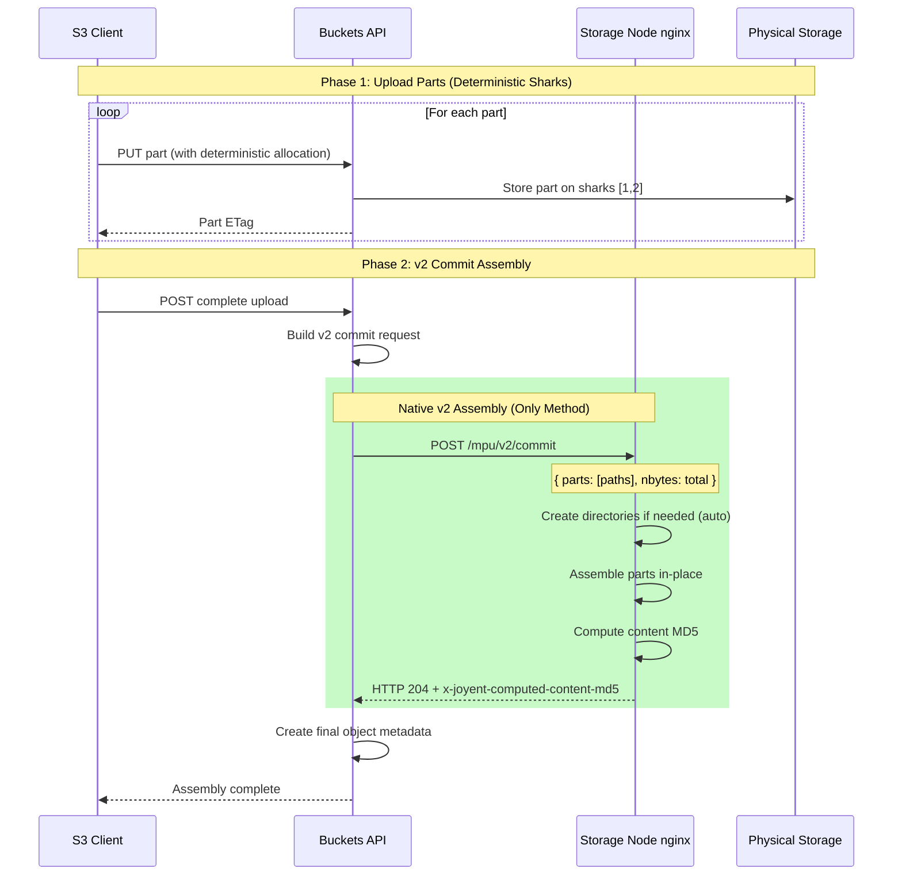
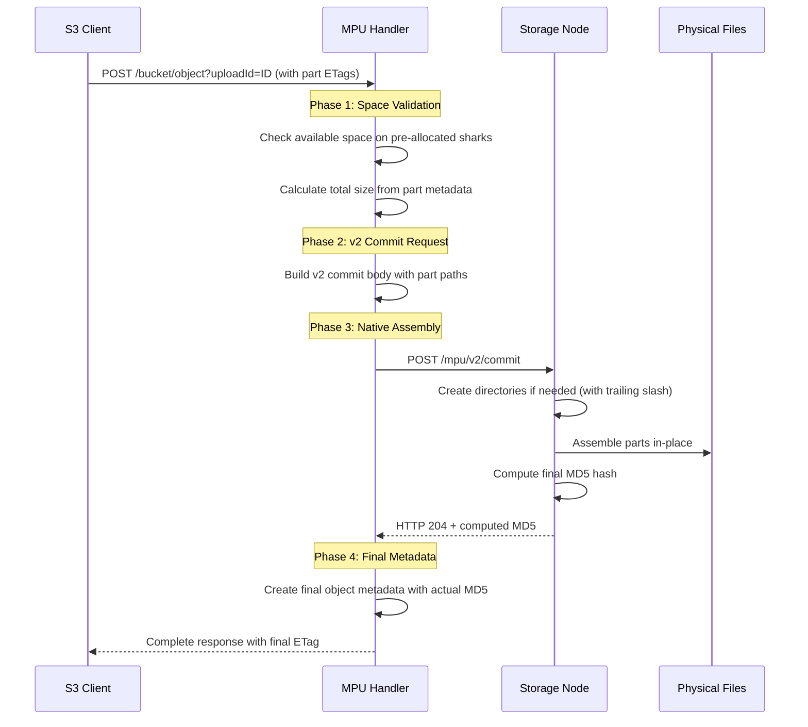

# Multipart Upload (MPU) Design

This document describes the architecture and implementation of S3 Multipart Upload support in Manta Buckets API, using native v2 commit for optimal performance and simplified architecture.

> **Architecture Update (2025)**: This implementation has been simplified to use **native v2 commit exclusively**. The previous streaming assembly fallback through buckets-mdapi has been removed to reduce complexity and improve performance. All multipart uploads now use nginx-based assembly at the storage layer.

## Table of Contents

- [Overview](#overview)
- [Architecture Components](#architecture-components)
- [Upload Record Management](#upload-record-management)
- [Part Upload Process](#part-upload-process)
- [Complete Upload Process](#complete-upload-process)
- [Object Streaming and Storage](#object-streaming-and-storage)
- [buckets-mdapi Integration](#buckets-mdapi-integration)
- [Distributed Locking](#distributed-locking)
- [Error Handling and Cleanup](#error-handling-and-cleanup)
- [Performance Considerations](#performance-considerations)
- [Implementation Files](#implementation-files)

## Overview

The Manta Buckets API implements AWS S3-compatible multipart upload functionality that enables large object uploads through a three-phase process:

1. **Initiate**: Create upload session and obtain upload ID
2. **Upload Parts**: Stream individual parts to Manta storage
3. **Complete**: Assemble parts into final object using actual size calculation

Unlike traditional S3 implementations that estimate part sizes, Manta's implementation queries buckets-mdapi for actual uploaded part metadata, ensuring accurate object assembly regardless of client-side size estimates.

## Architecture Components

### Core Components


### Data Flow Overview


## Upload Record Management

### Upload Record Structure

Upload state is tracked through special objects in buckets-mdapi with the key pattern `.mpu-uploads/{uploadId}`:

```javascript
{
  "uploadId": "uuid-generated-id",
  "bucket": "bucket-name", 
  "key": "object-key",
  "account": "owner-uuid",
  "initiated": "2025-01-01T00:00:00.000Z",
  "parts": {},  // Part tracking (currently minimal)
  "status": "initiated"
}
```

### Upload Record Lifecycle

1. **Creation**: During initiate operation, stored as JSON object in buckets-mdapi
2. **Access**: Retrieved during part upload and completion operations  
3. **Cleanup**: Automatically removed after successful completion or explicit abort

**Key Implementation Details:**

- Upload records are stored as regular objects in the bucket namespace
- The `.mpu-uploads/` prefix prevents conflicts with user objects
- JSON serialization enables structured data storage within Manta's object model
- Upload ID generation uses UUID v4 for uniqueness across the cluster

## Part Upload Process

### Part Storage Strategy

Each part is stored as an individual object in Manta storage with a deterministic naming scheme:

```
Part Key Pattern: {uploadId}/part.{partNumber}
Metadata Location: buckets-mdapi (distributed by hash)
Physical Storage: Manta sharks (allocated per-part)
```

### Part Upload Flow


### Part Metadata in buckets-mdapi

Each part is stored with complete metadata in buckets-mdapi:

```javascript
{
  "id": "part-object-id",
  "name": "upload-id/part.123", 
  "content_length": 5242880,  // Actual size
  "content_md5": "abc123...",
  "content_type": "application/octet-stream",
  "modified": "2025-01-01T00:00:00.000Z",
  "sharks": [                 // Storage locations
    {"manta_storage_id": "shark1.domain.com", ...},
    {"manta_storage_id": "shark2.domain.com", ...}
  ]
}
```

**Critical Design Points:**

- **Actual Size Storage**: Unlike S3's size estimation, Manta stores actual part sizes in metadata
- **Deterministic Naming**: Part names follow predictable patterns for discovery during completion
- **Distributed Metadata**: Parts are distributed across buckets-mdapi shards by hash
- **Shark Allocation**: Each part gets its own shark allocation for independent storage

## Complete Upload Process

### Single Assembly Method

Manta's multipart upload implementation uses **Native Mako v2 Commit exclusively** for optimal performance:

1. **Native Mako v2 Commit** (only): Uses nginx-based assembly at storage node level
2. **No Fallback**: Streaming assembly has been removed for simplicity and performance

### Deterministic Shark Pre-allocation

#### Why Deterministic Allocation is Required

Traditional multipart uploads suffered from **distributed part placement** - each part was allocated to different sharks dynamically, making **native v2 commit impossible**. The v2 commit endpoint requires all parts to be located on the same set of storage nodes for efficient assembly.

#### Architecture Overview


#### Implementation: dcSharkMap Access

```javascript
// Get ALL available storage nodes instead of filtered subset
var storinfo = req.storinfo;
var isOperator = req.caller.account.isOperator;
var sharkMap = isOperator ? storinfo.operatorDcSharkMap : storinfo.dcSharkMap;

// Extract all sharks from all datacenters
var allSharks = [];
Object.keys(sharkMap).forEach(function (datacenter) {
    var dcSharks = sharkMap[datacenter];
    if (Array.isArray(dcSharks)) {
        allSharks = allSharks.concat(dcSharks);
    }
});

// Sort ALL sharks by name for deterministic selection
var sortedSharks = allSharks.slice().sort(function (a, b) {
    return a.manta_storage_id.localeCompare(b.manta_storage_id);
});

// Take first N sharks based on durability level
var selectedSharks = sortedSharks.slice(0, durabilityLevel);

// All parts will use these identical sharks
req.preAllocatedSharks = selectedSharks;
```

#### Why storinfo.choose() Wasn't Sufficient

The `storinfo.choose()` method is designed for **load balancing** and returns different shark subsets on each call:

- **Purpose**: Distributes load across storage nodes
- **Behavior**: Returns random/rotating subsets based on utilization
- **Result**: Different sharks for each MPU part → v2 commit impossible

We needed access to the **complete storage topology** (`dcSharkMap`) to implement **consistent selection**.

#### Shark Selection Algorithm

```javascript
// Deterministic selection ensuring identical results across all parts
function selectDeterministicSharks(allSharks, durabilityLevel) {
    // 1. Sort by storage node ID (ascending alphabetical order)
    var sortedSharks = allSharks.slice().sort(function (a, b) {
        return a.manta_storage_id.localeCompare(b.manta_storage_id);
    });
    
    // 2. Take first N sharks (always same result)
    return sortedSharks.slice(0, durabilityLevel);
    
    // Example result for durability=2:
    // ["1.stor.coal.joyent.us", "2.stor.coal.joyent.us"] 
    // ^ Always identical across all parts
}
```

### Native Mako v2 Commit Process

#### Why v2 Commit is Preferred

**Performance Benefits:**
- **10-100x faster**: Assembly happens at storage node level
- **No data streaming**: Eliminates API layer bottleneck  
- **Storage-native operations**: Uses optimized nginx assembly
- **Reduced latency**: Single HTTP request vs complex streaming

**Architecture Benefits:**
- **Storage efficiency**: Parts assembled in-place without data movement
- **Memory efficiency**: No streaming through API memory buffers
- **Network efficiency**: Eliminates redundant data transfers

#### v2 Commit Implementation Flow



#### v2 Commit Request Format

```javascript
var v2CommitBody = {
    version: 2,
    nbytes: 1073741824,                    // Total file size
    owner: "owner-uuid",
    bucketId: "bucket-uuid", 
    objectId: "final-object-uuid",
    objectHash: "md5-hash-of-object-name",
    uploadId: "mpu-upload-id",
    parts: [
        {
            partNumber: 1,
            path: "/manta/v2/owner/bucket/prefix/objectId,nameHash",
            etag: "\"part-etag\"",           // Part verification
            size: 15728640
        }
        // ... more parts
    ]
};

// Sent to: POST /mpu/v2/commit on target storage node
```

#### Response Handling

```javascript
// Success: HTTP 204 with custom header
{
    statusCode: 204,
    headers: {
        "x-joyent-computed-content-md5": "zVc8+qzgfnlJvAxGAokE/w=="
    }
}

// Extract ETag from Manta-specific header
var etag = res.headers.etag || 
           res.headers.md5 || 
           res.headers['x-joyent-computed-content-md5'];
```

### Space Validation Process

Before v2 commit is attempted, the system validates available storage space to prevent failures:

```javascript
function validateSharkSpaceForV2Commit(req, partPaths, finalSizeBytes, callback) {
    var finalSizeMB = Math.ceil(finalSizeBytes / 1048576);
    
    // Get shark information from pre-allocated sharks
    var samplePart = partPaths[0];
    var sharkMap = req.storinfo.dcSharkMap;
    
    // Check each pre-allocated shark's current available space
    var insufficientSharks = [];
    samplePart.sharks.forEach(function (shark) {
        var sharkId = shark.manta_storage_id;
        var availableMB = currentSharkSpaces[sharkId] || 0;
        
        if (availableMB < finalSizeMB) {
            insufficientSharks.push({
                shark: sharkId,
                availableMB: availableMB,
                requiredMB: finalSizeMB,
                deficitMB: finalSizeMB - availableMB
            });
        }
    });
    
    if (insufficientSharks.length > 0) {
        var error = new StorinfoNotEnoughSpaceError(finalSizeMB, 
            'Insufficient space for v2 commit');
        return callback(error);
    }
    
    callback(); // Success - proceed with v2 commit
}
```

### Size Calculation Strategy

The completion process implements **actual size calculation** rather than size estimation by querying part metadata from buckets-mdapi.

### V2 Commit Assembly Process

The v2 commit process handles assembly entirely at the storage layer using nginx:



## Object Assembly and Storage

### Native v2 Commit Assembly

The implementation uses nginx-based assembly at the storage layer for optimal performance:

```javascript
function tryV2CommitOnSharks(req, sharks, commitBody, owner, callback) {
    // Execute v2 commit on all target sharks in parallel for replication
    vasync.forEachParallel({
        func: function (shark, next) {
            var client = sharkClient.getClient({
                shark: shark,
                log: req.log
            });

            var opts = {
                objectId: commitBody.objectId,
                owner: owner,
                requestId: req.getId(),
                path: '/mpu/v2/commit',
                headers: { 'content-type': 'application/json' }
            };

            // Send v2 commit request to nginx on storage node
            client.post(opts, commitBody, function (postErr, postReq, res) {
                if (postErr || !res || res.statusCode !== 204) {
                    return next(postErr || new Error('v2 commit failed'));
                }

                // Extract computed MD5 from nginx response
                var etag = res.headers.etag ||
                           res.headers['x-joyent-computed-content-md5'];

                next(null, { etag: etag, shark: shark.manta_storage_id });
            });
        },
        inputs: sharks
    }, callback);
}
```

### Shark Allocation Strategy

**Per-Part Allocation (Upload Phase):**
- Each part gets independent shark allocation
- Enables parallel uploads without coordination
- Part-specific replication settings

**Final Object Allocation (Complete Phase):**
- Single shark set allocated for final object
- Consistent with normal object creation flow
- Metadata location matches storage location exactly

### Storage Layout

```
Individual Parts (during upload):
├── upload-id-1/part.1 → sharks: [A1, A2] 
├── upload-id-1/part.2 → sharks: [B1, B2]
└── upload-id-1/part.N → sharks: [N1, N2]

Final Object (after complete):
└── bucket/object-key → sharks: [X1, X2] (all parts streamed here)
```

## buckets-mdapi Integration

### Role of buckets-mdapi

buckets-mdapi serves multiple critical functions in the MPU implementation:

1. **Upload Record Storage**: Persistent state management
2. **Part Metadata Management**: Actual size and location tracking  
3. **Object Metadata Creation**: Final object record creation
4. **Distributed Coordination**: Shard-aware metadata distribution

### Metadata Distribution


### buckets-mdapi Operations

**During Initiate:**
```javascript
// Store upload record
client.createObject(owner, bucketId, '.mpu-uploads/abc123', 
    uploadRecordObjectId, uploadRecordContent.length, uploadRecordMD5,
    'application/json', {}, [], {}, vnodeLocation, {}, requestId, callback);
```

**During Part Upload:**
```javascript
// Standard object creation through existing pipeline
client.createObject(owner, bucketId, 'abc123/part.1',
    partObjectId, partSize, partMD5, partContentType, 
    partHeaders, partSharks, {}, vnodeLocation, {}, requestId, callback);
```

**During Complete (Size Query):**
```javascript
// Query actual part metadata
client.getObject(owner, bucketId, 'abc123/part.1', 
    vnodeLocation, {}, requestId, function(err, partMetadata) {
        var actualPartSize = partMetadata.content_length;
        // Use actual size in total calculation
    });
```

**During Complete (Final Object):**
```javascript
// Create final object metadata with actual total size
client.createObject(owner, bucketId, 'my-large-file.zip',
    finalObjectId, actualTotalSize, finalMD5,
    contentType, headers, finalSharks, {}, vnodeLocation, {}, requestId, callback);
```

### Cleanup Operations

```javascript
// Remove upload record
client.deleteObject(owner, bucketId, '.mpu-uploads/abc123', 
    vnodeLocation, {}, requestId, uploadRecordCallback);

// Remove individual parts (background cleanup)
partETags.forEach(function(etag, index) {
    var partName = uploadId + '/part.' + (index + 1);
    client.deleteObject(owner, bucketId, partName, 
        partVnodeLocation, {}, requestId, partCleanupCallback);
});
```

## Distributed Locking

### Purpose and Need

The distributed locking system prevents **data corruption** during multipart upload completion in production environments where multiple `manta-buckets-api` instances handle concurrent requests.

#### Race Condition Scenarios

Without distributed locking, concurrent completion requests for the same upload ID could:

- Read the same part list simultaneously
- Both start assembling the final object  
- Create corrupted or inconsistent final objects
- Cause undefined behavior in the distributed storage system

#### Why Traditional Locking Isn't Sufficient

- **Multiple API Instances**: Production deployments run multiple `manta-buckets-api` instances
- **Client Retries**: S3 clients may retry completion requests on timeout
- **Network Partitions**: Temporary failures can lead to duplicate completion attempts
- **Process Isolation**: In-memory locks don't coordinate across process boundaries

### Architecture

#### Lock Storage Strategy

The distributed locking system uses `buckets-mdapi` objects as coordination primitives:

```javascript
Lock Object Path: .mpu-locks/{uploadId}.lock
Lock Headers: {
  'x-lock-instance': 'requestId-timestamp',
  'x-lock-hostname': 'api-instance-hostname', 
  'x-lock-expires': '2025-01-01T12:00:00.000Z',
  'x-lock-operation': 'complete-multipart'
}
Lock Content: JSON metadata with acquisition details
```

#### Atomic Operations

The system leverages `buckets-mdapi`'s atomic compare-and-swap semantics:

1. **Lock Creation**: `createObject` atomically creates lock object
   - Returns `ObjectExistsError` if lock already exists
   - Only one instance can successfully create the lock
   
2. **Ownership Verification**: Check `x-lock-instance` header matches
   - Prevents accidental release by wrong instance
   - Validates ownership before critical operations

3. **Lock Release**: `deleteObject` atomically removes lock
   - Includes ownership verification before deletion
   - Safe cleanup even with concurrent operations

### Implementation Flow

#### Lock Acquisition Process


#### Lock Algorithm

```javascript
DistributedLockManager.prototype.acquireLock = function(uploadId, callback) {
    var self = this;
    var lockKey = '.mpu-locks/' + uploadId + '.lock';
    var instanceId = self.req.getId() + '-' + Date.now();
    var maxRetries = 150; // 75 seconds max wait
    var retryInterval = 500; // 500ms between attempts
    
    function attemptLock() {
        // Step 1: Try atomic lock creation
        client.createObject(owner, bucketId, lockKey, lockObjectId,
            lockContent, headers, [], {}, vnodeLocation, {},
            function(createErr, result) {
                
                if (!createErr) {
                    // Success: Lock acquired
                    return callback(null, {
                        lockKey: lockKey,
                        instanceId: instanceId,
                        objectId: lockObjectId
                    });
                }
                
                if (createErr.name !== 'ObjectExistsError') {
                    return callback(createErr);
                }
                
                // Step 2: Lock exists, check if expired
                client.getObject(owner, bucketId, lockKey, vnodeLocation,
                    function(getErr, existingLock) {
                        
                        if (getErr) return callback(getErr);
                        
                        var expires = new Date(existingLock.headers['x-lock-expires']);
                        var now = new Date();
                        
                        if (now > expires) {
                            // Step 3: Lock expired, attempt takeover
                            return attemptLockTakeover();
                        }
                        
                        // Step 4: Lock active, retry after backoff
                        if (currentRetry++ < maxRetries) {
                            setTimeout(attemptLock, retryInterval);
                        } else {
                            callback(new Error('Lock acquisition timeout'));
                        }
                    });
            });
    }
    
    attemptLock();
};
```

### Lock Lifecycle Management

#### Lock Parameters

```javascript
var DistributedLockManager = {
    lockTimeout: 90000,    // 90 seconds lease duration
    retryInterval: 500,    // 500ms between acquisition attempts  
    maxRetries: 150,       // 75 second maximum wait time
    renewalThreshold: 30   // Renew when 30 seconds remaining
};
```

#### Lease-Based Expiration

- **Prevents Deadlocks**: Crashed instances can't hold locks indefinitely
- **Automatic Recovery**: Expired locks are automatically available for takeover
- **Conservative Timing**: 90-second lease provides buffer for assembly operations
- **Renewal Support**: Long-running operations can extend lock duration

#### Instance Identification

```javascript
var instanceId = req.getId() + '-' + Date.now();
// Example: "86856bf0-4270-4e66-b2c7-8160872657a1-1756732031871"

var lockData = {
    instanceId: instanceId,
    hostname: os.hostname(),
    processId: process.pid,
    acquired: new Date().toISOString(),
    expires: new Date(Date.now() + lockTimeout).toISOString(),
    operation: 'complete-multipart'
};
```

### Safety Guarantees

#### Ownership Verification

```javascript
// Before releasing lock, verify ownership
var actualInstanceId = currentLock.headers['x-lock-instance'];
if (actualInstanceId !== expectedInstanceId) {
    var ownershipErr = new Error('Lock not owned by this instance');
    ownershipErr.name = 'LockOwnershipError';
    return callback(ownershipErr);
}
```

#### Error Recovery

- **Lock Release Failures**: Non-critical - lease expiration provides cleanup
- **Network Partitions**: Retry logic handles temporary connectivity issues
- **Process Crashes**: Lease expiration ensures locks don't persist indefinitely
- **Concurrent Access**: Atomic operations prevent race conditions

#### Observability

```javascript
// Comprehensive logging for debugging
req.log.info({
    uploadId: uploadId,
    lockKey: lockInfo.lockKey,
    instanceId: lockInfo.instanceId,
    hostname: lockData.hostname,
    acquired: lockData.acquired
}, 'S3_MPU_LOCK: Successfully acquired distributed lock');

req.log.warn({
    lockKey: lockKey,
    expectedOwner: instanceId,
    actualOwner: actualInstanceId,
    actualHostname: currentLock.headers['x-lock-hostname']
}, 'S3_MPU_LOCK: Attempted to release lock owned by different instance');
```

### Production Benefits

#### Data Integrity
- **Prevents Corruption**: Ensures only one instance assembles final object
- **Atomic Completion**: Complete operation is serialized across instances
- **Consistent State**: Upload records and parts cleaned up atomically

#### High Availability
- **Instance Failures**: Lease expiration enables automatic recovery
- **Network Issues**: Retry logic handles temporary failures gracefully
- **Load Balancing**: Works across any number of API instances

#### Performance
- **Non-blocking**: Other operations continue while lock acquisition retries
- **Memory Efficient**: No in-memory coordination required
- **Scalable**: Leverages existing `buckets-mdapi` distribution

#### Operational Excellence
- **Comprehensive Logging**: Full visibility into lock operations
- **Error Handling**: Graceful degradation on lock failures
- **Monitoring**: Lock acquisition times and failure rates observable

The distributed locking system ensures that Manta's multipart upload implementation maintains data integrity and consistency in production environments while providing the scalability and reliability required for enterprise storage workloads.

## Error Handling and Cleanup

### Error Scenarios

1. **Part Upload Failures**: Individual parts fail without affecting other parts
2. **Size Calculation Failures**: Missing or corrupted part metadata
3. **Assembly Failures**: Streaming or final object creation errors
4. **Network Failures**: Partial uploads requiring retry/cleanup

### Cleanup Strategy

**Automatic Cleanup (Success Path):**
- Upload record deleted after successful completion
- Part objects marked for background cleanup
- Final object metadata created with proper references

**Manual Cleanup (Failure/Abort Path):**
- Explicit abort operations remove upload record immediately
- Part cleanup happens asynchronously to avoid blocking
- Failed uploads can be resumed if upload record exists

### Error Response Compatibility

All error responses maintain S3 API compatibility:

```xml
<?xml version="1.0" encoding="UTF-8"?>
<Error>
  <Code>NoSuchUpload</Code>
  <Message>The specified multipart upload does not exist.</Message>
  <UploadId>abc123</UploadId>
  <RequestId>req-456</RequestId>
</Error>
```

## Performance Considerations

### Memory Efficiency

- **Streaming Architecture**: No intermediate buffering of large parts
- **On-demand Assembly**: Parts streamed directly during completion
- **Bounded Memory**: Memory usage independent of part count/size

### Network Efficiency

- **Parallel Part Uploads**: Multiple parts uploaded simultaneously
- **Direct Streaming**: No additional hops during assembly
- **Resumable Uploads**: Failed parts can be re-uploaded independently

### Shark Client Connection Timeout Configuration

Multipart upload operations require increased connection timeouts compared to regular object uploads due to their assembly operations during v2 commit:

**Regular Object Uploads:**
- Contact sharks in parallel to replicate data
- Simple data streaming operations
- Standard connection timeouts are typically sufficient

**Multipart Upload v2 Commit:**
- Contacts ALL sharks in the replica set simultaneously for assembly operations
- Each shark performs complex assembly of multiple parts into final object
- Assembly operations take longer than simple data streaming
- Requires longer timeouts to handle the increased processing overhead

The shark client connection timeout is configured in `shark_client.js` with a default of 10,000ms (10 seconds):

```javascript
// For mpu we need more time as we are contacting a shark per
// replica, then merging all the parts. Increasing this default value
// helped to mitigate timeouts
this.connectTimeout = options.connectTimeout || 10000;
```

This increased timeout helps prevent connection failures when storage nodes are performing the more complex multipart assembly operations compared to simple data streaming.

### Storage Efficiency

- **Actual Size Calculation**: Eliminates size estimation errors
- **Distributed Metadata**: Metadata distributed across buckets-mdapi shards
- **Background Cleanup**: Non-blocking cleanup of temporary parts

### Scalability Characteristics

- **Upload Concurrency**: Limited by client, not by server resources
- **Part Count Scaling**: Linear performance with part count
- **Size Scaling**: Memory usage independent of total object size
- **Metadata Scaling**: Distributed across buckets-mdapi cluster

## Implementation Files

### Core Implementation

- **`lib/s3-multipart.js`**: Main multipart upload implementation
  - S3 API handlers for initiate, upload part, complete, abort
  - Upload record management and cleanup logic

- **`lib/s3-multipart-v2.js`**: Native v2 commit implementation  
  - v2 commit request building and execution
  - Space validation before assembly
  - nginx integration for native assembly

- **`lib/s3-compat.js`**: S3 request detection and parsing
  - Multipart operation detection from query parameters
  - Request context setup for multipart operations

- **`lib/s3-routes.js`**: S3 routing and middleware setup
  - Route multipart operations to appropriate handlers
  - Middleware chain configuration

### Supporting Components

- **`lib/buckets/objects/create.js`**: Object creation pipeline
  - Reused for individual part uploads
  - Shark allocation and streaming logic

- **`lib/shark_client.js`**: Storage node communication
  - Streaming interface to Manta storage nodes
  - Error handling and retry logic

- **`lib/buckets_mdapi_client.js`**: buckets-mdapi integration
  - Client creation and connection management
  - Metadata operation abstraction

### Configuration and Utilities

- **`lib/buckets/buckets.js`**: Bucket helpers and utilities
  - Bucket loading and validation
  - Request context setup

- **`lib/auth.js`**: Authentication and authorization
  - S3 SigV4 authentication integration
  - Permission validation for multipart operations

## Dependencies

### Required Components for Native v2 Commit

The native Mako v2 commit functionality requires specific infrastructure components to be deployed and configured:

#### Mako (Storage Node Service)
- **Purpose**: Manta's storage node daemon that manages object storage operations
- **Role in MPU**: Provides the storage-layer infrastructure for multipart object assembly
- **Requirements**: 
  - Must be running on all storage nodes in the Manta deployment
  - Handles physical file storage and retrieval operations
  - Manages storage node health and capacity reporting

#### Nginx MPU Module
- **Purpose**: Custom nginx module that provides native multipart upload assembly capabilities
- **Role in MPU**: Enables high-performance assembly of multipart uploads at the storage layer
- **Requirements**:
  - Must be compiled into nginx on all storage nodes
  - Provides the `/mpu/v2/commit` endpoint used by the buckets API
  - Handles in-place assembly of part files into final objects
  - Computes and returns content MD5 checksums via `x-joyent-computed-content-md5` header

#### Configuration Requirements
- **Endpoint Availability**: The `/mpu/v2/commit` endpoint must be accessible on all storage nodes
- **Performance Settings**: Nginx must be configured with appropriate timeouts and buffer sizes for large file assembly
- **Error Handling**: Proper error response formats for assembly failures and validation errors

#### Error Behavior
If native v2 commit is unavailable or fails:
- **No Fallback**: The system returns an error immediately (no streaming assembly)
- **Space Validation**: Pre-flight space checks prevent most failures
- **Directory Creation**: nginx automatically creates required directory structure
- **Simplified Architecture**: Single assembly method reduces complexity and maintenance
